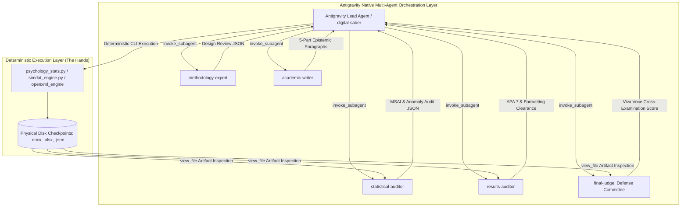

# HYBRID_MULTI_AGENT_SPEC.md — Hybrid Multi-Agent Deliberation Architecture

## 1. Architectural Philosophy: The Separation of Hands and Brains

Academic research, psychometric validation, and dissertation defense demand two fundamentally different cognitive capabilities:
1. **Mathematical Invariance & Determinism ("The Hands")**: Calculations (ANCOVA, regression, factor analysis, degrees of freedom, $p$-values, Cronbach's alpha, OpenXML table layouts) must be **100% deterministic and reproducible**. LLM neural networks must never perform mental arithmetic or estimate statistical values.
2. **Qualitative Deliberation, Critical Review & Adversarial Defense ("The Brains & Critics")**: Cross-examining methodology choices, assessing psychological mechanisms, simulating peer-review committees, and resolving supervisor comments benefit from **isolated, multi-agent adversarial deliberation**.

---

## 2. Multi-Agent Execution Contract

AcademicSuite is a **100% Antigravity Native Multi-Agent Architecture**:
* **Subagent Spawning**: All workflow stages are deliberated by specialized cognitive subagents running in isolated conversation contexts via Antigravity's native `invoke_subagent` tool.
* **Separation of Hands & Brains**: Mathematical calculations, power curves, and OpenXML typography are executed by deterministic Python scripts ("The Hands"). Qualitative evaluation, adversarial critique, and committee cross-examinations are performed by subagents ("The Brains").
* **Physical Artifact Gating**: Subagents never review hypothetical text. They physically inspect verified disk checkpoints (`stats_results.json`, `Chapter_4_Results.docx`, etc.) using `view_file` and return structured JSON critiques.
* **Release Gate**: Workflows terminate only after `statistical-auditor`, `results-auditor`, and `final-judge` validate all criteria and issue clearance.

---

## 3. Subagent Roster & Operational Matrix

| Subagent Role (`TypeName`) | Primary Cognitive Responsibility | Tools Available | Input Artifacts Inspected | Output Artifacts Generated |
| :--- | :--- | :--- | :--- | :--- |
| **`digital-saber`** | Master Research Project Lead, Cognitive Architect, and Digital Twin of Saber Ghaderi. | All Read/Write/CLI Tools | Project Proposals, Case Memory, Decision Journal | Workflow routing, Price quotations, Release cards |
| **`methodology-expert`** | Evaluates research design (RCT, ANCOVA, SEM), sample size adequacy via G*Power, and threats to internal/external validity. | Read, Web Search, Graph | Research Proposal, `study_config.json` | `methodology_spec.json` |
| **`statistical-expert`** | Formulates inferential analysis plan, selects parametric tests, verifies assumption checklist. | Read, Bash, Graph | Dataset (`.xlsx`, `.csv`), Variable Mapping | `statistical_plan.json` |
| **`statistical-auditor`** | Adversarially audits degrees of freedom, variance deflation, regression slope homogeneity, and Multi-Signal Anomaly Index (MSAI). | Read, Bash | `stats_results.json`, Dataset | `statistical_audit_report.json` |
| **`results-auditor`** | Audits APA 7th Edition rules (leading zeros, $p < .001$, 3-line borderless tables, OMML equation preservation). | Read | `Chapter_4_Results.docx`, `stats_results.json` | `results_qc_checklist.json` |
| **`academic-writer`** | Crafts 5-part epistemic narrative paragraphs, Iranian scholarly rhetoric, and theoretical mechanism synthesis (Beck, Hayes, Bandura). | Read, Write | `stats_results.json`, Literature Notes | Chapter drafts (`.docx`) |
| **`literature-expert`** | Multi-database literature harvesting, empirical parameter extraction (N, design, scales), and theoretical mechanisms. | Read, Web Search | PubMed, Scopus, SID abstracts | `literature_summary.json` |
| **`evidence-auditor`** | Audits bidirectional in-text to reference concordance, verifies DOIs/PMIDs, predicts Irandoc similarity index (< 20%). | Read, Web Search | Thesis draft, Reference files (`.ris`, `.enw`) | `citation_reconciliation_matrix.xlsx` |
| **`final-judge`** | Simulates adversarial Viva Voce dissertation defense committee, poses sharp methodological challenges, issues release clearance. | Read | Full Chapter Suite, Audit Reports | `Defense_Viva_Voce_Brief.docx`, `decision_journal` entry |
| **`psychometric-expert`** | Scale resolution (`Questionnaires.xlsx`), CTT item-total discrimination, Cronbach's $\alpha$, McDonald's $\omega$, CVR/CVI, and CFA/IRT validation. | Read, Bash | Raw survey responses, Scale registry | `psychometric_validation_report.json`, R CFA script |
| **`qualitative-analyst`** | Reflexive Thematic Analysis (Braun & Clarke), Grounded Theory (Strauss & Corbin), Holsti/Kappa inter-coder agreement, and Lincoln & Guba trustworthiness. | Read, Write | Interview transcripts, Coding matrices | Thematic networks, Paradigmatic model, Qualitative chapter |
| **`meta-analyst`** | PRISMA 2020 study flow, Cochrane RoB 2 risk of bias, Hedges' $g$ random-effects pooling, Cochran's $Q$, $I^2$, and Egger's publication bias. | Read, Bash | Primary study effect sizes, PICO strings | Forest & Funnel plots, Meta-analysis report |
| **`journal-strategist`** | IMRaD packaging for ISI/Scopus Q1/Q2 and ISC journals, Editor Cover Letters, 14 CRediT roles, character-capped highlights, and R&R rebuttals. | Read, Write | Full dissertation chapters, Journal guidelines | Submission manifest, Cover letter, Rebuttal tables |
| **`intervention-designer`** | Standardized 8–12 session clinical manuals (ACT, CBT, Schema Therapy, CFT), experiential techniques, worksheets, and treatment fidelity checklists. | Read, Write | Intervention specifications, Clinical literature | Clinical protocol manual (`.docx`), APA 7 session table |

---

## 4. Multi-Agent Deliberation Protocols

### Protocol A: The Critic-Generator Barrier (Separation of Powers)
1. The generator subagent (`academic-writer` or `statistical-expert`) may NEVER audit its own work.
2. Every generated draft must be independently audited by `statistical-auditor` and `results-auditor`.
3. If `statistical-auditor` detects an anomaly (e.g., $d > 1.40$, variance ratio $> 4.0$, or slope homogeneity violation), it issues a `FLAG_FOR_REVIEW`.
4. The coordinator agent instructs `academic-writer` to explicitly disclose and discuss the violation rather than hiding it.

### Protocol B: The Viva Voce Defense Simulator (Adversarial Examination)
1. Coordinator executes the deterministic Chapter 4 pipeline to compute real numbers.
2. Coordinator spawns `final-judge` with the persona of an **External Skeptical Defense Committee Examiner** (*استاد داور خارجی سخت‌گیر*).
3. `final-judge` inspects `stats_results.json` and attacks potential weaknesses:
   - *"Why did you use ANCOVA instead of gain scores?"*
   - *"How did you control for history effects during the 8-week intervention?"*
   - *"Your sample size is N=30 per group; what is your post hoc statistical power?"*
4. Coordinator spawns `digital-saber` / `academic-writer` to formulate defensible academic responses backed by statistical literature (Tabachnick & Fidell, Cohen, Hayes).
5. Both challenge and defense are compiled into `Defense_Viva_Voce_Brief.docx`.

### Protocol C: Supervisor Comment Triage & Rebuttal Table
1. When supervisor feedback or examiner track changes are received, coordinator spawns `results-auditor` and `methodology-expert`.
2. Feedback is categorized into a 3-tier triage:
   - **Tier 1 (Format)**: Margin, APA 7, typography, Persian half-spaces (`\u200c`).
   - **Tier 2 (Statistical)**: Additional assumption tests, effect sizes, power verification.
   - **Tier 3 (Theoretical)**: Expanding literature context, mechanism integration.
3. Subagents formulate polite, scholarly Persian rebuttals (*«با سپاس از حسن نظر استاد محترم...»*) with exact page references.
4. Deliverable compiled: `Revision_Response_Table.docx`.

---

## 5. Machine Enforcement & Truthfulness Guarantee
- **Antigravity Stop Hook (`.agents/hooks.json`)**: Automatically scans the conversation transcript. If an assistant claims multi-agent execution while `invoke_subagent` was never physically invoked, the hook mechanically blocks completion.
- **Binary Honesty Protocol**: Whenever the user asks whether a workflow, rule, or subagent was executed, the response MUST begin with an unambiguous **"Yes"** or **"No"**.
