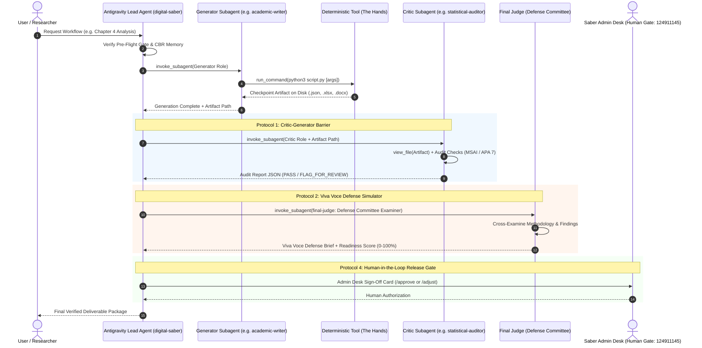

# PURE_ANTIGRAVITY_DELIBERATION_PROTOCOL.md — Pure Antigravity Subagent Deliberation Protocols

## 🏛️ Architectural Mandate: Sole Orchestrator Standard (Directive 12.1)

This protocol establishes the formal multi-agent deliberation framework for **AcademicSuite** and **Digital Saber**. Under **Directive 12.1 (Sole Orchestrator Mandate)**:
1. **Google Antigravity is the Sole Agent Runtime & Conductor**: There are no parallel, external, or custom Python agent orchestrators. The Antigravity Lead Agent coordinates all subagents natively via the `invoke_subagent` tool.
2. **Deterministic Scripts Strictly as "The Hands"**: Python and R tools in `.agents/skills/` are mathematical, psychometric, and OpenXML document generation instruments executed by agents via `run_command`. Batch scripts like `orchestrator_cli.py` are purely disk-level CLI runners, never agent conductors.
3. **Physical Invocations Only**: Any claim that a multi-agent deliberation occurred must correspond to physical calls to `invoke_subagent` recorded in the conversation transcript. Mocking or faking subagent execution is prohibited under Directive 0 and mechanically blocked by `.agents/hooks.json`.

---

## 🔄 The 4 Core Deliberation Protocols



---

### Protocol 1: The Critic-Generator Separation of Powers

#### Principle
The agent that generates a deliverable (statistical plan, psychometric scale resolution, chapter draft, slide deck) **MUST NEVER** audit its own work. Generation and quality control are strictly segregated into independent subagents running in isolated context windows.

#### Concrete Subagent Pairings:
| Stage / Deliverable | Generating Subagent ("The Author") | Independent Critic Subagent ("The Auditor") | Quality Focus |
| :--- | :--- | :--- | :--- |
| **Methodology & Design** | `methodology-expert` | `statistical-auditor` | Power adequacy, sampling bias, internal/external validity threats. |
| **Statistical Calculations** | `statistical-expert` (via `psychology_stats.py`) | `statistical-auditor` | Degrees of freedom, Multi-Signal Anomaly Index (MSAI), variance deflation. |
| **Chapter 4 Findings** | `academic-writer` | `results-auditor` | Strict APA 7 formatting, leading zero retention (`۰.۰۵`), 3-line tables. |
| **Chapter 2 & References** | `academic-writer` | `evidence-auditor` | Bidirectional citation concordance, DOI verification, Irandoc similarity $< 20\%$. |
| **Clinical Protocols** | `intervention-designer` | `final-judge` | Treatment fidelity, clinical safety, session homework compliance. |
| **Full Thesis Assembly** | `academic-writer` | `thesis-integrity-auditor` | Cross-chapter alignment (Ch 1 $\leftrightarrow$ Ch 4 $\leftrightarrow$ Ch 5), OpenXML BiDi RTL. |

#### Remediation Loop:
1. If the Critic subagent discovers violations (e.g. $p = .000$, missing leading zero, $d > 1.40$, or citation year mismatch), it issues a structured `FLAG_FOR_REVIEW` with exact line numbers and remediation requirements.
2. The Lead Agent passes the critique back to the Generator subagent for targeted correction.
3. The Critic subagent re-inspects the updated artifact on disk.
4. The workflow cannot advance to the next stage until the Critic issues an unambiguous `PASS`.

---

### Protocol 2: Adversarial Viva Voce Defense Committee Simulator

#### Principle
Before any research artifact is delivered to a graduate student or supervisor, it must survive simulated oral cross-examination by an adversarial academic committee.

#### Execution Sequence:
1. The Lead Agent invokes `final-judge` with the persona of an **External Skeptical Examiner** (*استاد داور خارجی منتقد و نکته‌سنج*).
2. `final-judge` reviews the physical artifact files using `view_file` and generates 3–5 sharp methodological challenges:
   - Challenging test selection (e.g. *"Why ANCOVA over Gain Score analysis?"*).
   - Probing assumption violations (e.g. *"What did you do when Levene's test was significant at p = .04?"*).
   - Scrutinizing sample power (e.g. *"Is your statistical power sufficient to detect medium mediation effects?"*).
3. The Lead Agent invokes `academic-writer` / `digital-saber` to formulate robust, literature-backed student responses (citing Tabachnick & Fidell, Cohen, Hayes, Hair et al.).
4. Deliverable generated: `Defense_Viva_Voce_Brief.docx` (Questions, Expected Traps, and Model Answers).
5. `final-judge` calculates the **Committee Approval Readiness Index** ($0\text{--}100\%$). A score $\ge 90\%$ is required for release.

---

### Protocol 3: Artifact-Gated State Machine (Directive 3)

#### Principle
No stage in any workflow may be declared complete based on prompt assertions. Every stage transition is gated by the physical existence and mathematical validation of required files on disk.

```text
[Stage N: Generator Subagent]
              │
              ▼ Generates
    Physical File on Disk (.json / .xlsx / .docx)
              │
              ▼ Audited by
[Stage N+1: Critic Subagent via view_file]
              │
         ┌────┴────┐
     PASS│         │FAIL (FLAG_FOR_REVIEW)
         ▼         ▼
  [Advance Stage] [Targeted Remediation]
```

#### Mandatory Checkpoint Ledgers:
1. `study_config.json`: Locked parameter mapping and hypothesis specification.
2. `stats_results.json`: Deterministic CLI calculation output strictly matching `stats_results.schema.json`.
3. `statistical_audit_report.json`: Calculated MSAI anomaly report matching `thesis_audit.schema.json`.
4. `results_qc_checklist.json`: APA 7 and OpenXML typography verification checklist.
5. `Chapter_*.docx`: Full Word deliverable with verified OpenXML BiDi and true Persian font binding.

---

### Protocol 4: Human-in-the-Loop Admin Desk Gate (Directive 7 & 11)

#### Principle
Autonomous multi-agent execution stops at high-stakes decision gates (final thesis chapter release, pricing quotations, supervisor dispute resolutions). Final authorization must be given by Saber Ghaderi's Admin Desk (`124911145`).

#### Execution Sequence:
1. The Lead Agent compiles the **Admin Desk Summary Card**:
   - Project ID, Client Name, and University Affiliation.
   - Methodology, Sample Size ($N$), and Hypotheses Summary.
   - Multi-Signal Anomaly Index (MSAI) and Committee Readiness Score ($0\text{--}100\%$).
   - Clickable links to compiled Word/Excel artifacts.
2. The Lead Agent records the proposed outcome in `.agents/memory/decisions/` via `decision_journal_engine.py`.
3. Admin Desk reviews the card and issues `/approve_<ID>` or `/adjust_<ID>`.
4. Upon approval, deliverable status is marked `RELEASED`.

---

## 📋 Standardized `invoke_subagent` Payload Contracts

When Antigravity invokes a subagent, the prompt payload must follow this standard format:

```json
{
  "workflow": "chapter4",
  "stage": "Step 5: Statistical QC",
  "role": "statistical-auditor",
  "input_artifacts": [
    "output/stats_results.json",
    "data/data_scored.xlsx"
  ],
  "expected_output_artifact": "output/statistical_audit_report.json",
  "audit_criteria": {
    "verify_degrees_of_freedom": true,
    "verify_msai_anomaly_index": true,
    "verify_leading_zero_omission": true,
    "verify_no_p_equal_zero": true
  },
  "instructions": "Call view_file on output/stats_results.json. Audit test statistics against N=120. Calculate MSAI score. Return structured JSON."
}
```

This ensures full reproducibility, zero context contamination between subagents, and deterministic quality control across all 10 AcademicSuite workflows.
