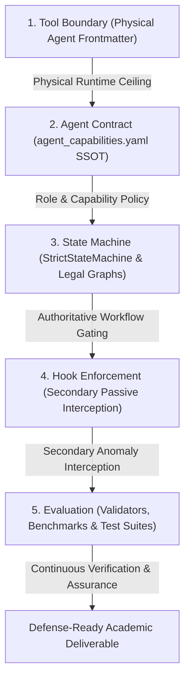

# ENFORCEMENT_HIERARCHY.md — Five-Layer Architectural Enforcement Hierarchy

## 1. Architectural Philosophy: The Five-Layer Order

Earlier architectural iterations accumulated excessive responsibility in lifecycle hooks. When hooks attempt to orchestrate workflows, manage stages, simulate subagents, or execute multi-agent pipelines, the architecture becomes opaque, fragile, and prone to stealth bypasses.

AcademicSuite enforces a strict **Five-Layer Order** where each layer has an unambiguous, non-overlapping responsibility:

---

## 2. Layer Definitions & Scope Boundaries

### Layer 1: Tool Boundary (Physical Runtime Constraint)
- **Mechanism**: The `tools:` array in each agent's frontmatter definition (`.agents/agents/<agent-name>/agent.md`).
- **Authority**: The Antigravity agent runtime only equips the agent with tools explicitly declared in its frontmatter.
- **Invariance**: If a tool (e.g. `run_command`, `write_to_file`) is absent from an agent's frontmatter, the model runtime **cannot physically call it**.
- **Role Separation**:
  - `academic-orchestrator`: Possesses ONLY inspection and coordination tools (`invoke_subagent`, `manage_subagents`, `view_file`, `list_dir`, `grep_search`, `find_by_name`, `ask_question`). Possesses ZERO execution or file mutation tools.
  - Non-executing authorities and auditors (`methodology-expert`, `statistical-expert`, `results-auditor`, `statistical-auditor`, `final-judge`, `evidence-auditor`): Possess ZERO execution tools.
  - Execution workers (`statistics-agent`, `data-agent`, `data-curator`): Possess `run_command` and file generation tools.
  - Document drafter (`academic-writer`): Possesses document generation and styling tools, but ZERO statistical execution tools.

### Layer 2: Agent Contract (Machine-Checkable Capability Policy)
- **Mechanism**: `contracts/agents/agent_capabilities.yaml` and `contracts/agents/capability_policy.py`.
- **Authority**: Single Source of Truth (SSOT) defining required, allowed, and forbidden capabilities for all 28 persistent cognitive agents.
- **Taxonomy**: Distinguishes **Direct Execution** (`run_command`) vs. **Indirect Execution** (`call_mcp_tool`, `define_subagent`, `manage_task`, `schedule`).
- **Invariance**: No agent may declare or be granted permissions contradicting this contract. Validated deterministically by `validators/agent_capability_validator.py`.

### Layer 3: State Machine (Authoritative Lifecycle & Transition Governance)
- **Mechanism**: `StrictStateMachine` in `scripts/academic_state_manager.py`.
- **Authority**: The state machine is the **sole authoritative conductor** of milestone progression, stage lifecycles, and artifact dependencies.
- **Directed Graph**: Enforces the fail-closed legal transition graph:
  $$\text{STAGE\_LOCKED} \rightarrow \text{STAGE\_READY} \rightarrow \text{STAGE\_RUNNING} \rightarrow \text{STAGE\_VALIDATING} \rightarrow \text{STAGE\_AWAITING\_APPROVAL} \rightarrow \text{STAGE\_APPROVED}$$
- **Invariance**: Stages cannot skip states, cannot proceed without prerequisite deliverables, and cannot transition to `STAGE_APPROVED` without explicit human approval recorded in `approvals.json`.

### Layer 4: Hook Enforcement (Secondary Passive Interception & ASAM Architecture)
- **Mechanism**:
  1. **Agent-Scoped Hooks (ASAM)**: Dedicated `hooks.json` and `guard.py` co-located inside each agent directory (`.agents/agents/<agent-name>/`), declared via `hooks: - .agents/agents/<agent-name>/hooks.json` in `agent.md`.
  2. **Dual-Track Decoupled Gate (`.agents/hooks.json`)**: Separates Track 1 Developer Safety (`track1_developer_dispatcher.py`) from Track 2 Academic Governance (`track2_academic_dispatcher.py`).
- **Role**: **Secondary defense**. Hooks intercept tool invocations and turn completion to catch anomalies, policy violations, and feedback events.
- **Direct Resolution**: Zero shortpaths and zero symlinks; full canonical paths ensure reliable cross-platform execution.
- **Strict Non-Orchestrator Invariant**: Hooks MUST NOT act as the primary orchestrator, MUST NOT simulate agent delegation, MUST NOT replace `invoke_subagent`, and MUST NOT run workflows or statistical scripts.

### Layer 5: Evaluation (Continuous Verification & Quality Assurance)
- **Mechanism**: Deterministic validators (`validators/agent_capability_validator.py`, `validators/provenance_validator.py`, `validators/result_consistency/validator.py`) and architecture test suites (`tests/architecture/`, `tests/test_*.py`).
- **Authority**: Continuously checks that all agents, contracts, state transitions, and generated artifacts satisfy institutional and mathematical quality gates.

---

## 3. Hook Responsibilities as Secondary Enforcement

Hooks serve as secondary enforcement by actively detecting **five specific conditions**:

### 1. Unauthorized Tool Attempt (`PreToolUse` via `SafetyHooks`)
Hooks intercept and deny tool calls when an agent attempts an action forbidden by its contract:
- **Direct Execution**: Any attempt by `academic-orchestrator` or non-executing agents to call `run_command`.
- **Indirect Execution**: Any attempt by non-executing agents to invoke execution-capable MCP servers (`call_mcp_tool`), dynamically define subagents (`define_subagent`), inject shell input (`manage_task send_input`), or schedule background jobs (`schedule`).
- **Unauthorized Mutation**: Any attempt by `academic-orchestrator` or read-only auditors to call `write_to_file`, `replace_file_content`, or other mutation tools.
- **Worker Delegation**: Any attempt by specialist worker agents to invoke secondary subagents (`invoke_subagent`) or exceed nesting depth $\ge 3$.
- **Destructive Commands & Immutability**: Any destructive command (`rm -rf`), raw dataset tampering (`01_raw_inputs/`), outside-workspace path, or non-ASCII filename (Directive 6).

### 2. Invalid State Transition (`PreToolUse` & `Stop` via `IntegrityHooks` / `SafetyHooks`)
Hooks intercept attempts to bypass or violate the state machine:
- **Illegal Target State**: Any recorded or attempted transition that violates `STAGE_LEGAL_TRANSITIONS` (e.g. `STAGE_LOCKED` directly to `STAGE_APPROVED`, or skipping `STAGE_RUNNING`/`STAGE_VALIDATING`).
- **Unapproved Completion**: Any stage marked `STAGE_APPROVED` that lacks an authoritative approval record in `approvals.json`.
- **Unmet Prerequisite**: Any stage entering `STAGE_READY` or `STAGE_RUNNING` whose upstream dependencies are not in `STAGE_APPROVED`.
- **Bypass Attempts**: Direct file mutation or CLI commands attempting to alter state files outside `StrictStateMachine`.

### 3. Missing Artifact (`Stop` via `IntegrityHooks`)
Hooks verify physical file existence on disk before allowing turn completion:
- **Triad Artifact Invariant (Directive 3)**: Every empirical micro-stage and individual hypothesis must possess all 3 physical artifacts on disk: `.docx` (Word), `.md` (Markdown), and `.json` (Structured Data).
- **Manifest Deliverables**: Every output artifact declared in a stage's `manifest.json` must exist on disk and possess non-zero byte size ($> 0$ bytes).

### 4. Invalid Provenance (`Stop` via `IntegrityHooks`)
Hooks verify that deliverables have an unbroken, un-tampered cryptographic pedigree:
- **Input Integrity**: Declared input artifacts in `manifest.json` must match their SHA-256 hashes on disk. If an input file has mutated, provenance is invalidated.
- **Deliverable Integrity**: Output artifacts must match the SHA-256 hashes recorded in `manifest.hashes`. If a deliverable was modified outside its declared generator, completion is denied.
- **Dependency Provenance**: Upstream dependency manifest hashes must match.
- **Truth in Verification (Directive 0)**: Claims in assistant responses that a "multi-agent pipeline" ran are verified against the transcript. If `invoke_subagent` was called 0 times, completion is mechanically blocked.
- **Binary Honesty Protocol (Directive 0)**: Compliance queries must begin with an unambiguous "Yes" or "No".

### 5. Feedback Event (`PreInvocation`, `PostToolUse`, `Stop` via `LearningHooks`)
Hooks passively capture behavioral signals for continuous learning:
- **User Corrections**: Detects user critique, correction, or rejection in user turns and transcript records, emitting structured `USER_CORRECTION` events.
- **Validation Failures**: Intercepts `overall_verdict: FAIL` reports and records failure incidents in the pitfalls registry and experience recorder.
- **Execution Trajectories**: Logs factual tool execution traces (`TOOL_CALLED`, `TOOL_RETURNED`, `COMMAND_FINISHED`, `AGENT_RETURNED`) without accessing private chain-of-thought.
- **Bounded Adaptive Briefing**: Injects ephemeral reminders and targeted context at the execution boundary.

---

## 4. What Hooks Must NEVER Do (Negative Invariants)

| Prohibited Hook Behavior | Architectural Rationale |
| :--- | :--- |
| **Acting as Primary Orchestrator** | Orchestration belongs to the agent (`academic-orchestrator`) and state machine (`StrictStateMachine`). Hooks must never initiate workflow stages. |
| **Simulating Agent Delegation** | Hooks must never mock or fabricate subagent responses. All delegation must occur natively via `invoke_subagent`. |
| **Replacing `invoke_subagent`** | Hooks must never intercept a task and execute it behind the scenes instead of delegating to the proper subagent. |
| **Running the Whole Workflow** | Hooks must never execute batch scripts, run regression models, or compile documents. Execution belongs strictly to specialist workers ("The Hands"). |
| **Mutating State Behind the Scenes** | Hooks must never silently advance or approve state machine milestones. Transitions require explicit state machine calls and approvals. |
