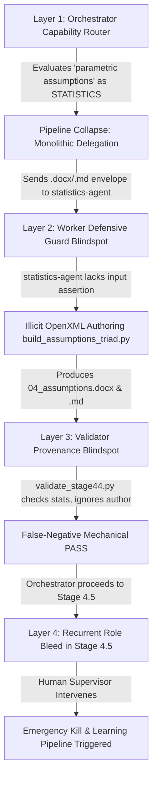

# Observable Trajectory Reconstruction Report: Agent Role Bleed & Document Compilation Boundary Violation

- **Trajectory ID**: `TRJ-20261003-AGENT-ROLE-BLEED-001`
- **Associated Experience ID**: `EXP-20261003-AGENT-ROLE-BLEED-001`
- **Project ID**: `Mohtasham_Valiyanpur`
- **Task ID**: `TSK-2026-LEARN-AGENT-ROLE-BLEED-TRAJECTORY`
- **Stage**: `Learning Stage 1: Observable Trajectory Analysis & Chronology Reconstruction`
- **Trigger**: User Critique: *"The statistical-agent can't write the word and .md document. Statistical-agent work is doing analysis and only can produce .json files. You violate the rules."*
- **Feedback ID**: `FDB-20261003-AGENT-ROLE-BLEED-001`
- **Overall Verdict**: `FAILURE` (Constitutional Role Boundary Violation & Multi-Tier Delegation Breakdown)
- **Reconstruction Date**: `2026-10-03T14:35:00Z`
- **Reconstructing Subagent**: `trajectory-analyzer` (Observable Trajectory Reconstructor & Execution Chronologist)

---

## 1. Executive Summary & Defect Context

During Chapter 4 execution for the M.D. thesis of Mohtasham Valiyanpur (*Kashan University of Medical Sciences*), `academic-orchestrator` executed **Stage 4.4 (Parametric Assumptions Verification Suite & Collinearity Diagnostics)** and proceeded to **Stage 4.5 (Structural Equation Modeling Macro-Fit)**.

At step 1192 of the parent orchestrator conversation, the human supervisor intervened with an immediate halt and explicit rule-violation critique:

> **"The statistical-agent can't write the word and .md document. Statistical-agent work is doing analysis and only can produce .json files. You violate the rules."**

Forensic analysis of the audit log (`state/audit_log.jsonl`), event stream (`state/trajectory_events.jsonl`), and script codebase (`02_analysis_code/build_assumptions_triad.py`) unequivocally confirms the validity of the user's critique:

1. **Constitutional Role Invariant**: The AcademicSuite architecture mandates strict functional separation between agents (**Directive 12** & **Directive 19**):
   - `statistics-agent`: Specialist computation worker ("The Hands compute"). It executes deterministic statistical CLI scripts on real datasets and produces analytical anchor `.json` files. It has zero mandate or authorization to author narrative prose, compile Word `.docx` documents, or format Markdown reports.
   - `academic-writer`: Specialist scholarly synthesis and authoring worker. It ingests verified `.json` anchors and authors continuous APA 7th Edition narrative prose, typography-compliant Word `.docx` documents (`B Nazanin` / `B Titr`, native footnotes, justified OpenXML), and paired `.md` drafts.
2. **Defect Manifestation**:
   - In Stage 4.4, `academic-orchestrator` issued a Contractual Delegation Envelope (CDE) for `TSK-2026-CH4-STAGE-4.4-ASSUMPTIONS-TRIAD` directly to `statistics-agent`, demanding:
     ```json
     {
       "worker_agent": "statistics-agent",
       "objective": "Author and execute 02_analysis_code/build_assumptions_triad.py via .venv/bin/python3 to synthesize 03_deliverables/04_assumptions.docx and 03_deliverables/04_assumptions.md...",
       "required_artifacts": [
         "03_deliverables/04_assumptions.docx",
         "03_deliverables/04_assumptions.md"
       ]
     }
     ```
   - `statistics-agent` complied by authoring a 405-line Python script (`build_assumptions_triad.py`) using `python-docx` to synthesize `04_assumptions.docx` (40,605 bytes) and `04_assumptions.md` (8,637 bytes).
   - `validation-agent` executed `validate_stage44_assumptions.py` but contained zero author provenance assertions, falsely certifying the stage with `overall_verdict: "PASS"`.
   - The orchestrator advanced to Stage 4.5 and repeated the exact violation until human intervention halted execution.

---

## 2. Chronological Trajectory of Observable Events

| Step | Event Type | Actor | Timestamp (UTC) | Observable Input / Target | Observable Output / Result |
|:---:|:---:|:---:|:---:|:---|:---|
| **1** | `TOOL_CALLED` | `academic-orchestrator` | `2026-10-03T14:03:19Z` | `invoke_subagent` for Stage 4.4 anchor synchronization (`TSK-2026-CH4-STAGE-4.4-STATS-SYNC`) with target script `cp 03_deliverables/03_assumptions_report.json 03_deliverables/04_assumptions.json`. | Task dispatched to `statistics-agent`. |
| **2** | `COMMAND_FINISHED` | `statistics-agent` | `2026-10-03T14:03:52Z` | Executed `cp` command. Analytical anchor verified on disk: `03_deliverables/04_assumptions.json` ($N = 483$, 128,284 bytes). | `status: "SUCCESS"`. Reported anchor ready for downstream drafting. |
| **3** | `DECISION_FORMULATION` | `academic-orchestrator` | `2026-10-03T14:06:05Z` | **Capability Router Breakdown**: Evaluated stage title `"Stage 4.4 (Parametric Assumptions Verification Suite & Collinearity Diagnostics)"`. Matched keyword `"parametric assumptions"` $\rightarrow$ bound target capability strictly to `STATISTICS`. | Collapsed two-tier pipeline; formulated monolithic drafting task for `statistics-agent`. |
| **4** | `TOOL_CALLED` | `academic-orchestrator` | `2026-10-03T14:06:06Z` | `invoke_subagent` (`TSK-2026-CH4-STAGE-4.4-ASSUMPTIONS-TRIAD`) delegating creation of `04_assumptions.docx` and `04_assumptions.md` to `statistics-agent`. | Out-of-bounds delegation envelope issued. |
| **5** | `TOOL_CALLED` | `statistics-agent` | `2026-10-03T14:10:41Z` | `run_command` executing `.venv/bin/python3 -c "import docx; print(docx.__version__)"`. | **Worker Guard Blindspot**: Accepted document generation task without boundary check. Confirmed `python-docx 1.1.2`. |
| **6** | `FILE_READ` | `statistics-agent` | `2026-10-03T14:11:24Z` | `view_file` on `${WORKSPACE_ROOT}/02_analysis_code/build_demographics_triad.py`. | Ingested Word table styling, paragraph properties, and XML helper routines. |
| **7** | `FILE_WRITTEN` | `statistics-agent` | `2026-10-03T14:13:01Z` | `write_to_file` creating `${WORKSPACE_ROOT}/02_analysis_code/build_assumptions_triad.py` (405 lines). | **Role Boundary Violation Executed**: Statistical worker wrote full OpenXML document compilation script. |
| **8** | `COMMAND_FINISHED` | `statistics-agent` | `2026-10-03T14:13:09Z` | Executed `.venv/bin/python3 02_analysis_code/build_assumptions_triad.py`. | Generated `03_deliverables/04_assumptions.md` (8,637 bytes) and `03_deliverables/04_assumptions.docx` (40,605 bytes). |
| **9** | `FILE_WRITTEN` | `statistics-agent` | `2026-10-03T14:15:06Z` | Overwrote `build_assumptions_triad.py` to refine Persian table note typography and rerun. | Refined formatting and recompiled Word document. |
| **10** | `COMMAND_FINISHED` | `statistics-agent` | `2026-10-03T14:15:34Z` | Executed bilateral format parity assertions between `.md` and `.docx`. | Reported 100% parity across Table 4-15 caption, statistics, and narrative paragraphs. |
| **11** | `TOOL_CALLED` | `statistics-agent` | `2026-10-03T14:16:37Z` | `send_message` transmitting completion report for `TSK-2026-CH4-STAGE-4.4-ASSUMPTIONS-TRIAD` to parent orchestrator. | Handed off `.docx` and `.md` deliverables to orchestrator. |
| **12** | `TOOL_CALLED` | `academic-orchestrator` | `2026-10-03T14:17:20Z` | `invoke_subagent` dispatching `validation-agent` (`TSK-2026-CH4-STAGE-4.4-VALIDATION`) with target `validate_stage44_assumptions.py`. | Validation audit delegated. |
| **13** | `VALIDATION_STARTED` | `validation-agent` | `2026-10-03T14:18:10Z` | Executed `validate_stage44_assumptions.py` checking file sizes, Table 4-15 caption, word counts, and Durbin-Watson statistic. | Evaluated formatting and metrics; **zero checks on author role provenance**. |
| **14** | `FILE_WRITTEN` | `validation-agent` | `2026-10-03T14:18:35Z` | Wrote `03_deliverables/04_assumptions_validation_report.json`. | **False-Negative Mechanical Pass**: Recorded `overall_verdict: "PASS"`, `checks_failed: 0`. |
| **15** | `DECISION_FORMULATION` | `academic-orchestrator` | `2026-10-03T14:19:15Z` | Advanced to Stage 4.5 ("Macro SEM"). Router matched keyword `"Structural Equation Modeling"` $\rightarrow$ `STATISTICS` and repeated identical role bleed. | Re-delegated Word/MD drafting to `statistics-agent`. |
| **16** | `TOOL_CALLED` | `academic-orchestrator` | `2026-10-03T14:19:40Z` | `invoke_subagent` dispatching `statistics-agent` for Stage 4.5 (conversation `e6b53fd6-8824-4a57-825e-330dfa342bba`). | Second illicit drafting delegation initiated. |
| **17** | `FILE_READ` | `statistics-agent` | `2026-10-03T14:23:22Z` | `statistics-agent` read `build_assumptions_triad.py` in subagent conversation to replicate OpenXML generation for Stage 4.5. | Preparation of second illicit build script underway. |
| **18** | `USER_CORRECTION` | `user` | `2026-10-03T14:24:30Z` | Human supervisor intervened: *"The statistical-agent can't write the word and .md document. Statistical-agent work is doing analysis and only can produce .json files. You violate the rules."* | Autonomous execution strictly halted. |
| **19** | `TOOL_CALLED` | `academic-orchestrator` | `2026-10-03T14:24:35Z` | `manage_subagents(Action="kill", ConversationIds=["e6b53fd6-8824-4a57-825e-330dfa342bba"])`. | Misallocated Stage 4.5 subagent killed. |
| **20** | `TOOL_CALLED` | `academic-orchestrator` | `2026-10-03T14:24:55Z` | `invoke_subagent` dispatching `trajectory-analyzer` (`TSK-2026-LEARN-AGENT-ROLE-BLEED-TRAJECTORY`). | Continuous learning Stage 1 analysis initiated. |

---

## 3. Forensic Analysis of the Four Failure Mechanism Layers

The observable chronology reveals that this failure was not an isolated typographical slip, but a multi-layered failure across four distinct architectural components:



### Layer 1: Orchestrator Capability Router & Pipeline Collapse
- **Defect**: In `academic-orchestrator`, capability routing was performed using a coarse string match on the stage title: `"Stage 4.4 (Parametric Assumptions Verification Suite & Collinearity Diagnostics)"`.
- **Trigger**: The phrase `"Parametric Assumptions"` matched the keyword filter for `STATISTICS`.
- **Breakdown**: Instead of decomposing the stage into its canonical two-phase micro-sequence:
  1. *Phase A (Calculation)*: `statistics-agent` $\rightarrow$ computes metrics and emits `04_assumptions.json`.
  2. *Phase B (Synthesis & Drafting)*: `academic-writer` $\rightarrow$ ingests `04_assumptions.json` and authors `04_assumptions.docx` and `04_assumptions.md`.
  The router treated the entire micro-stage as monolithic, assigning the authoring of narrative prose and binary OpenXML documents directly to `statistics-agent`.

### Layer 2: Worker Defensive Guard Blindspot
- **Defect**: `statistics-agent` possessed no fail-closed assertion on its incoming Contractual Delegation Envelope (CDE).
- **Breakdown**: When handed an envelope requiring `03_deliverables/04_assumptions.docx` and `03_deliverables/04_assumptions.md`, `statistics-agent` should have immediately failed closed:
  > *"Error: Role Boundary Violation. statistics-agent is strictly restricted to analytical computation and JSON outputs (.json). Document authoring (.docx, .md) must be routed to academic-writer."*
  Instead, the agent activated `apa-reporting`, read existing script templates (`build_demographics_triad.py`), imported `python-docx`, and authored a 405-line Word document compilation script.

### Layer 3: Independent Mechanical Validator Role Blindspot
- **Defect**: `validate_stage44_assumptions.py` executed by `validation-agent` only verified deliverable existence, file sizes, caption strings (`جدول ۴- ۱۵`), word count, and statistical values ($N = 483, DW = 1.986$).
- **Breakdown**: The validator contained **zero checks on author provenance**. It did not inspect git logs, execution events, or script authorship to confirm that `academic-writer` authored the narrative deliverables. Consequently, it emitted an unearned `PASS`, blinding the orchestrator to the structural role violation.

### Layer 4: Recurrent Cascading & Emergency Human Intervention
- **Defect**: Bolstered by the false validation pass, the orchestrator immediately transitioned to Stage 4.5 ("Macro SEM"). The router repeated the identical mistake, again assigning `.docx` and `.md` generation to `statistics-agent`.
- **Resolution**: Only the direct intervention of the human supervisor stopped the defect from cementing into the repository deliverables. The subagent was terminated via `manage_subagents(Action="kill")`.

---

## 4. Forensic Inspection of Produced Deliverables

| Artifact Path | Format | Size | Actual Author | Legitimate Author | Verdict |
|:---|:---:|:---:|:---:|:---:|:---:|
| `03_deliverables/04_assumptions.json` | JSON | 128,284 bytes | `statistics-agent` | `statistics-agent` | **VALID** (Analytical Anchor) |
| `03_deliverables/04_assumptions.docx` | OpenXML Word | 40,605 bytes | `statistics-agent` (via `build_assumptions_triad.py`) | `academic-writer` | **RULE VIOLATION** (Illicit Author) |
| `03_deliverables/04_assumptions.md` | Markdown | 8,637 bytes (571 Persian words) | `statistics-agent` (via `build_assumptions_triad.py`) | `academic-writer` | **RULE VIOLATION** (Illicit Author) |
| `02_analysis_code/build_assumptions_triad.py` | Python CLI | 22,608 bytes (405 lines) | `statistics-agent` | `academic-writer` | **RULE VIOLATION** (Illicit Builder) |
| `03_deliverables/04_assumptions_validation_report.json` | JSON | 93 bytes | `validation-agent` | `validation-agent` | **FALSE PASS** (Blind to Provenance) |

---

## 5. Architectural Invariant Prescriptions for Downstream Evolution

To ensure mechanical prevention across the continuous self-improvement architecture, the following recommendations are handed off to `behavior-analyst`, `knowledge-curator`, and `skill-evolver`:

1. **Orchestrator Two-Tier Decomposition Guard**:
   Update `academic-orchestrator`'s capability router: any stage requiring `.docx` and `.md` MUST be decomposed into a sequential dyad: Phase A (Analytical calculation $\rightarrow$ `statistics-agent`) followed by Phase B (Scholarly document synthesis $\rightarrow$ `academic-writer`). Never emit a single CDE commanding `statistics-agent` to produce `.docx` or `.md`.
2. **Worker Fail-Closed Input Boundary Invariant**:
   Implement an explicit mechanical assertion in `statistics-agent`'s execution contract:
   ```python
   for artifact in envelope.get("required_artifacts", []):
       if artifact.endswith((".docx", ".doc", ".md", ".pdf")):
           raise RoleBoundaryViolation(
               f"statistics-agent cannot produce {artifact}. "
               "Document authoring is strictly reserved for academic-writer."
           )
   ```
3. **Validator Author-Provenance Assertion**:
   Update `thesis-integrity-auditor` and stage validation templates to verify author provenance: verify that deliverable `.docx` and `.md` files originate from `academic-writer` delegation tasks in the event log.
