# AcademicSuite — Target Architecture & Antigravity Compatibility Specification

**Document Version:** 1.0.0 (Target Architecture)  
**Operative Date:** September 2026 (1405 SH)  
**System Status:** Authoritative Target Architecture  

---

## 🏛️ Foundational Architectural Rule
> **From this point forward: No new agent, Skill, framework, or orchestration abstraction is added unless it fills a documented architectural gap.**  
> **This prevents AcademicSuite from continuing to grow horizontally.**

---

## 1. Architectural Philosophy: Native Antigravity Alignment

The primary technical objective of the **Target Architecture** is to establish a seamless, thin compatibility boundary with Google Antigravity. Rather than attempting to wrap, emulate, or replace Antigravity's agent runtime, AcademicSuite functions as a collection of:
1. **Declarative Antigravity-Native Agents & Subagents** (`.agents/agents/`)
2. **On-Demand Progressive Disclosure Skills** (`.agents/skills/`)
3. **Deterministic Mathematical & Document Engines** (`scripts/` and skill `scripts/`)
4. **Lifecycle Hooks & OS Security Gates** (`.agents/hooks.json` and POSIX permissions)
5. **Fail-Closed Artifact Verification Contracts** (`contracts/` and `validators/`)

```text
+-----------------------------------------------------------------------------------+
|                        GOOGLE ANTIGRAVITY AGENT RUNTIME                           |
|                                                                                   |
|  [ Antigravity Session ] <---> [ Native invoke_subagent ] <---> [ Subagents ]     |
|          |                                                             |          |
|          | Context / Memory                                            | Tools    |
|          v                                                             v          |
|  [ Progressive Skills ]                                        [ Built-in Tools ] |
|   .agents/skills/<name>/SKILL.md                               - run_command      |
|                                                                - view_file        |
|                                                                - write_to_file    |
+----------------------------------------+------------------------------------------+
                                         |
                                         | Execution Boundary (run_command / CLI)
                                         v
+-----------------------------------------------------------------------------------+
|                         ACADEMICSUITE DETERMINISTIC "HANDS"                       |
|                                                                                   |
|   +--------------------------+  +-------------------------+  +-----------------+  |
|   | Statistical Engines      |  | Psychometrics & Sizing  |  | OpenXML Word    |  |
|   | - run_regression.py      |  | - gpower_engine.py      |  | - build_triad   |  |
|   | - run_sem.py             |  | - psychometrics.py      |  | - assemble_docx |  |
|   +--------------------------+  +-------------------------+  +-----------------+  |
+----------------------------------------+------------------------------------------+
                                         |
                                         | Output Verification Boundary
                                         v
+-----------------------------------------------------------------------------------+
|                         INDEPENDENT FAIL-CLOSED VALIDATION                        |
|                                                                                   |
|   +---------------------------------------------------------------------------+   |
|   | validators/run_all_validators.py                                          |   |
|   | - data_integrity          - statistical_assumptions                       |   |
|   | - numerical_consistency   - result_consistency                            |   |
|   | - reporting_consistency   - longitudinal_modmed                           |   |
|   +---------------------------------------------------------------------------+   |
|                                                                                   |
|          Generates: Synchronized Triad Artifacts (.docx + .md + .json)            |
+-----------------------------------------------------------------------------------+
```

---

## 2. The Six-Part Functional Separation Invariant

To guarantee architectural stability, eliminate hallucinations, and prevent horizontal sprawl, AcademicSuite strictly enforces the six-part separation of concerns across every research engagement:

```text
+──────────────────────+─────────────────────────────────────────────────────────────+
| Layer                | Operational Scope & Invariant Ownership                     |
+──────────────────────+─────────────────────────────────────────────────────────────+
| 1. Agent             | DECIDES: Reasoning role, delegation, context,               |
|                      | decision-making, responsibility, communication              |
+──────────────────────+─────────────────────────────────────────────────────────────+
| 2. Skill             | INSTRUCTS: Domain knowledge, decision trees,                |
|                      | execution instructions, reusable procedures, APA formats    |
+──────────────────────+─────────────────────────────────────────────────────────────+
| 3. Script            | COMPUTES: Deterministic calculation, data transformation,   |
|                      | file generation, OpenXML compilation, hashing               |
+──────────────────────+─────────────────────────────────────────────────────────────+
| 4. Hook              | ENFORCES: Synchronous interception, safety gates,           |
|                      | tamper prevention, honesty audits, tool execution control   |
+──────────────────────+─────────────────────────────────────────────────────────────+
| 5. State Machine     | AUTHORIZES TRANSITION: Milestone progression gating,        |
|                      | immutable event timeline logging, state persistence         |
+──────────────────────+─────────────────────────────────────────────────────────────+
| 6. Artifact Manifest | DEFINES COMPLETION: Schema contract validation,             |
|                      | required triad files (.docx+.md+.json), affirmative evidence |
+──────────────────────+─────────────────────────────────────────────────────────────+
```

---

## 3. The Native-Agent Contract

AcademicSuite defines agents purely as Antigravity-compatible Markdown files. There is **zero proprietary Python agent runtime** or wrapper class.

### 3.1 The Minimal Agent Contract
An agent is valid in Antigravity when it contains only:
```markdown
---
name: sample-agent
description: Clear, actionable description of role and delegation triggers.
---

# Agent Instructions

Detailed behavioral instructions, domain principles, and workflows.
```

### 3.2 The Progressive Capability Contract
As needs expand, the following official Antigravity fields may be added:
```markdown
---
name: statistical-expert
description: Advanced quantitative modeling authority for SEM, CFA, mediation, moderation.
role: Statistical Modeling & Latent Structural Analysis Authority
model: pro
mainAgent: true
subagent: true
tools:
  - run_command
  - view_file
  - write_to_file
  - replace_file_content
  - list_dir
  - grep_search
  - find_by_name
skills:
  - sem
  - cfa
  - mediation
  - moderation
  - regression
  - statistical-data-analyst
agents:
  - statistics-agent
  - psychometric-expert
inheritCustomizations: true
---
```

### 3.3 Strict Frontmatter Policy Elimination
- **`commandExecutionPolicy` is strictly forbidden in frontmatter**.
- Antigravity's agent loader rejects frontmatter with unknown fields, hiding the agent from the IDE dropdown and subagent registry.
- Security is instead enforced through the multi-layered security architecture described in Section 5.

---

## 4. Subagent & MainAgent Semantics

In Antigravity:
- **`mainAgent: true`**: Agent appears in the primary workspace agent selector / chat interface.
- **`subagent: true`**: Agent appears in the available subagents registry for the `invoke_subagent` tool.
- **`mainAgent: true, subagent: true`** (Dual-Role Authority): Specialist authorities (such as `methodology-expert`, `statistical-expert`, `academic-writer`) can be selected by the user for direct interactive chat OR spawned dynamically by `academic-orchestrator` as subagents.
- **`mainAgent: false, subagent: true`** (Pure Specialist Subagent): Pure workers and critics (such as `statistics-agent`, `data-curator`, `results-auditor`) are invoked solely by orchestrators and authorities.

---

## 5. Multi-Layered Defense-in-Depth Security

In place of unsupported frontmatter policy flags, execution restrictions are enforced mechanically across four independent layers:

```text
Layer 1: Antigravity Platform & IDE Permissions
   │     Workspace settings, user confirmation prompts on untrusted commands.
   ▼
Layer 2: POSIX / OS Least-Privilege File Permissions
   │     scripts/permission_manager.py marks raw datasets as 0444 (Read-Only).
   ▼
Layer 3: Constitutional Lifecycle Hooks (.agents/hooks.json)
   │     PreToolUse blocks destructive shell commands, non-ASCII filenames, and dataset mutation.
   │     Stop hook inspects transcript.jsonl to enforce Binary Honesty and invoke_subagent truth.
   ▼
Layer 4: Deterministic Scripts & Agent Instructions
         Domain scripts fail-closed on unauthorized inputs; agent contracts forbid out-of-scope actions.
```

---

## 6. The Triad Artifact Invariant & Stage-Gate Granularity

Under Constitutional Directive 3:
1. **Zero Monolithic Generations**: Generating an entire chapter or dissertation in a single un-audited prompt is strictly forbidden.
2. **Synchronized Triad Artifacts**: Every micro-stage and individual hypothesis must produce three synchronized physical files on disk:
   - **`.json`**: Exact numerical parameters, test statistics, and audit flags.
   - **`.md`**: Human-readable narrative, APA 7 tables, and statistical interpretations for immediate diffing.
   - **`.docx`**: Institutional OpenXML document with RTL typography, Persian font bindings (`B Nazanin` / `B Titr`), decoupled LTR numbers, and native Word OMML math equations.
3. **One-Hypothesis-One-Stage**: Every hypothesis in Chapter 4 and Chapter 5 has an independent micro-stage directory (`06_hypothesis_1.docx`, `06_hypothesis_1.md`, `06_hypothesis_1.json`).

---

## 7. Continuous Learning & Self-Improvement Boundaries

The self-improvement subsystem (`learning/` and `contracts/evolution/`) operates under strict containment:
1. **Zero Runtime Self-Modification**: Learning subagents cannot directly mutate active skill files (`SKILL.md`) or agent specifications (`agent.md`).
2. **Candidate Mutation Protocol**: Improvements are drafted as structured candidates (`improvement_candidate.schema.json`) and benchmarked against frozen evaluation suites (`evaluation_case.schema.json`).
3. **Human-in-the-Loop Promotion**: Promotion requires explicit verification by `evaluation-agent` and final human approval. 

---

## 8. Capability-Driven Orchestration Architecture (Phase 3)

### 8.1 Resolution Architecture
AcademicSuite replaces static linear progression chains (`stage 1 → stage 2 → ... → statistics-agent`) with dynamic, capability-based resolution:

```text
Task Prompt
     │
     ▼
Research Objective & Empirical Design Derivation
     │  - study_type: RCT, correlational_structural, scale_validation, qualitative, meta_analysis
     │  - group_structure: multi-group, single-group, factorial
     │  - temporal_dynamics: repeated measures, cross-sectional, single-point
     │  - waves: follow-up, pre-post, cross-sectional
     │  - factors: ["RCT", "multi-group", "repeated measures", "follow-up"]
     ▼
Required Capabilities Matrix
     │  - design-methodology
     │  - longitudinal-analysis
     │  - assumption-checking
     │  - effect-size
     │  - post-hoc/comparison
     │  - statistical-execution
     │  - results-writing
     │  - audit
     ▼
Dynamic Antigravity Subagent Team Assembly
     │  - Lead Orchestrator: academic-orchestrator
     │  - Minimal Assembled Subagents: [methodology-expert, data-curator, statistical-expert,
     │                                  statistics-agent, academic-writer, statistical-auditor,
     │                                  academic-challenger, validation-agent]
     │  - Pruned Agents: Explicitly accounts for and excludes unneeded workspace agents
     │                   with documented scientific rationale
     ▼
Native Antigravity Execution via `invoke_subagent`
```

### 8.2 Architectural Invariants
1. **Deterministic Resolver as "The Hands"**: `scripts/academic_task_router.py` and `scripts/capability_resolver.py` compute design parameters, capability requirements, and team compositions deterministically. They never execute agents or simulate orchestration.
2. **Antigravity as Sole Conductor**: `academic-orchestrator` is the sole orchestrator, dynamically invoking only the resolved subagent roles via native `invoke_subagent`.
3. **Fail-Closed Safety**: Out-of-domain, non-academic, or unsupported requests are blocked with `status: BLOCKED` and `escalation_required: true`. Ambiguous requests return candidate capabilities and clarification prompts rather than guessing.

---

## 9. The Methodology Decision Layer & The 8-Step Decision Ladder (Phase 4)

### 9.1 The 8-Step Ladder
AcademicSuite elevates methodology into an autonomous decision layer that precedes and constrains all inferential computation:

```text
1. Research Question
       ↓
2. Empirical Design
       ↓
3. Estimand Definition
       ↓
4. Candidate Methods Evaluation
       ↓
5. Assumption Diagnostics Checklist
       ↓
6. Method Selection & Refutation Matrix
       ↓
7. Execution Specification (Execution Contract)
       ↓
8. Statistical Executor ("The Hands")
```

### 9.2 The Methodology Decision Record (MDR) Contract
All methodological reasoning is codified into a binding contract:
`contracts/methodology_decision_record.schema.json`.

An MDR contains:
- **`research_question`**: The exact empirical inquiry.
- **`design`**: Formal empirical architecture (`study_type`, `group_structure`, `temporal_dynamics`, `waves`, `factors`).
- **`estimand`**: The target causal/statistical parameter (ATE, CATE, indirect effect, factor loading).
- **`candidate_methods`**: Comparative assessment of candidate analytical strategies with pros, cons, and suitability.
- **`assumptions`**: Diagnostic checklist with test methods, thresholds, and pre-specified violation remediation fallbacks.
- **`selected_method`**: Formally chosen model family and execution script.
- **`rejected_methods`**: Literature-grounded refutation matrix citing peer-reviewed methodological precedents:
  - Rejecting gain-score t-tests due to Lord's paradox (Lord, 1967; Vickers & Altman, 2001).
  - Rejecting post-test only ANOVA due to baseline variance neglect and power loss (Cohen, 1988).
  - Rejecting Baron & Kenny regression due to deflated statistical power (Hayes, 2018).
  - Rejecting Sobel tests due to skewed product distributions (Preacher & Hayes, 2004).
  - Rejecting median splits due to 35-50% power loss (MacCallum et al., 2002).
- **`execution_contract`**: The binding execution contract passed downstream to `statistics-agent` and `StatisticalPipelineEngine`.

### 9.3 Inviolable Execution Decoupling
1. **The Executor Never Invents Methodology**: `statistics-agent` receives the `execution_contract` and executes deterministically. It has zero authority to select, alter, or invent statistical models.
2. **Method Lock Enforcement**: `StatisticalPipelineEngine` validates the plan against `methodology_decision_record.schema.json` and raises `MethodMismatchError` or `MethodologyViolationError` if any deviation from the contract is attempted.

---

## 10. The Deterministic Statistical Execution Subsystem (Phase 5)

### 10.1 The 4-Tier Cognitive & Computational Boundary
AcademicSuite enforces an unbending separation between cognitive reasoning, deterministic computation, academic rhetoric, and adversarial validation:

```text
┌───────────────────────────────────────────────────────────────────────────────┐
│ Tier 1: LLM Reasoning ("What should be done?")                                 │
│ - Agents: statistical-expert, methodology-expert                              │
│ - Generates: Methodology Decision Record (MDR) & StatisticalExecutorContract  │
└──────────────────────────────────────┬────────────────────────────────────────┘
                                       │ Binding 7-Part Input Contract
                                       ▼
┌───────────────────────────────────────────────────────────────────────────────┐
│ Tier 2: Deterministic Computation ("What are the actual numbers?")            │
│ - Agents / Engines: statistics-agent, StatisticalPipelineEngine, Python/R     │
│ - Computes: Exact test statistics, df, p-values, effect sizes, CIs, diagnostics│
│ - Invariant: Zero LLM mental arithmetic; zero synthetic statistics in prod     │
└──────────────────────────────────────┬────────────────────────────────────────┘
                                       │ Verified 7-Part Output Package
                                       ▼
┌───────────────────────────────────────────────────────────────────────────────┐
│ Tier 3: Scholarly Drafting ("What do verified numbers mean?")                 │
│ - Agents: academic-writer                                                     │
│ - Generates: APA 7 narrative, table interpretations, Chapter 4/5 drafts       │
│ - Invariant: Numbers strictly extracted from Tier 2 JSON; zero hallucinations │
└──────────────────────────────────────┬────────────────────────────────────────┘
                                       │ Draft Artifacts (.docx, .md, .json)
                                       ▼
┌───────────────────────────────────────────────────────────────────────────────┐
│ Tier 4: Adversarial Audit ("Are those claims actually supported?")            │
│ - Agents: statistical-auditor, validation-agent                               │
│ - Audits: Reported claims vs. JSON, df vs. N, assumption compliance, MSAI     │
└───────────────────────────────────────────────────────────────────────────────┘
```

### 10.2 The 7-Part Input & Output Contract Architecture
Every statistical execution is governed by two formal JSON schemas:
1. **Input Contract (`contracts/statistical_executor_contract.schema.json`)**:
   - `DATA`: File path, format, SHA-256 data hash, data mode (`production`, `demo`, `test`, `simulation`), and `is_synthetic` flag.
   - `VARIABLE MAP`: Explicit assignment of dependent, independent, covariates, moderators, mediators, cluster, and ID variables.
   - `DESIGN`: Study typology, between/within factors, and measurement timepoints.
   - `METHOD SPECIFICATION`: Model family, exact method name, computational engine, and model formula.
   - `ASSUMPTIONS`: Formal list of parametric assumptions to verify before inferential testing.
   - `PARAMETERS`: Confidence level (0.95), alpha (0.05), bootstrap resamples (5,000), random seed, and missing data strategy.
   - `OUTPUT CONTRACT`: Target deliverables, table formats, effect size metrics, CI types, and decimal precision rules.
2. **Output Result Package (`contracts/statistical_execution_result.schema.json`)**:
   - `RESULT JSON`: Model name, sample size $N$, primary test statistic ($F, t, \chi^2$), degrees of freedom ($df_1, df_2$), exact $p$-value, and execution status.
   - `TABLES`: APA 7th Edition formatted markdown tables.
   - `DIAGNOSTICS`: Parametric assumption test statistics, $p$-values, and pass/fail indicators.
   - `EFFECT SIZES`: Standardized effect sizes ($\eta_p^2, d, R^2, \beta$).
   - `CONFIDENCE INTERVALS`: Parameter bounds and bootstrap BCa intervals.
   - `MODEL INFORMATION`: Convergence status, iteration count, and log-likelihood/AIC/BIC.
   - `PROVENANCE`: Input contract hash, data file hash, script path, execution timestamp, and runtime environment details.

### 10.3 Anti-Synthetic & Zero-Default-Sample Invariants
1. **Production Fail-Closed Guard**: In `production` mode, `StatisticalPipelineEngine` mechanically blocks missing datasets (`MissingProductionDataError`) and any attempt to substitute demo/sample fixtures (`ProductionSampleFallbackBlockedError`).
2. **Zero Synthetic Statistics**: Under no circumstance may arbitrary or hardcoded values (`effect_size = 0.25`, `CI = [0.10, 0.40]`) be emitted in production mode.
3. **Explicit Simulation Flags**: Datasets or models intended for psychometric simulation or benchmark testing must explicitly declare `is_synthetic: true` and `data_mode: "simulation"` or `"test"`.

### 10.4 Cryptographic Provenance & Computational Reproducibility
Every statistical result is cryptographically linked to the exact input data, execution contract, script identity, and python runtime environment via SHA-256 hashes, ensuring 100% auditable academic provenance.

---

## 11. Elimination of Synthetic Data Escape Routes & Universal Fail-Closed Policy (Phase 6)

### 11.1 The Four-Tier Architectural Classification
To ensure complete transparency and prevent latent data contamination, all data artifacts and execution pathways across AcademicSuite belong strictly to one of four tiers:
1. **`TEST FIXTURE`**: Deterministic synthetic inputs used exclusively inside `tests/` suites and test harnesses.
2. **`DEMO`**: Educational demonstrations permitting bundled example payloads ONLY when `--mode demo` is explicitly provided.
3. **`SIMULATION`**: Monte Carlo psychometric simulation workflows requiring explicit `--mode simulation` and tagged with `"is_synthetic": True` and `"data_mode": "simulation"`.
4. **`PRODUCTION`**: Live thesis and dissertation consulting workflows strictly requiring real, physically verified empirical data on disk.

### 11.2 Universal Fail-Closed Policy (`missing empirical input → BLOCKED`)
In production mode, any attempt to run without empirical data or fall back to bundled sample fixtures is mechanically blocked:
- **Presentation Builder (`persian-defense-presentation-builder/main.py`)**: Added `--mode {production, demo, test, simulation}`. In production mode, missing inputs or pointers to sample fixtures (`sample_*.json`, `/examples/`) trigger `CRITICAL SAFETY VIOLATION` and exit code 1 (`BLOCKED`).
- **Intervention Compiler (`compile_intervention_protocol.py`)**: Added `--mode` parameter. In production mode, unprovided payloads or pointers to sample fixtures raise `MissingProductionDataError` or `ProductionSampleFallbackBlockedError`.
- **Dual Loop Self-Improvement Engine (`academic_dual_loop_engine.py`)**: Fast loop and slow loop require real physical experiences and artifact outputs in production mode. Synthesis of mock experiences (`fast_loop_project`, `duration_seconds: 1.0`, `effect_size: 0.25`) is strictly BLOCKED.
- **Script Execution Guard (`script_execution_guard.py`)**: Added `is_synthetic: bool = False` check and internal JSON inspection. Production mode blocks any payload containing sample markers or `"is_synthetic": True`.
- **Batch Orchestrator (`orchestrator_cli.py`)**: Purges `default_sample` fallbacks and inspects incoming payloads for internal synthetic flags in production mode.

---

## 12. Formal State Machine Engine & Transition Validation Pipeline (Phase 7)

### 12.1 The Two-Tier State Hierarchy
AcademicSuite replaces ad-hoc stage mutation with a formal, deterministic state machine implemented in `scripts/academic_state_manager.py` (`StrictStateMachine` and `request_transition()`):

```text
Project States:
  PROJECT_CREATED  ───────────────────────────────────►  PROJECT_APPROVED
        │                                                     ▲
        ▼                                                     │
  PROJECT_REJECTED                                 (All stages APPROVED)

Stage States (Per Micro-Stage):
  STAGE_LOCKED  ──►  STAGE_READY  ──►  STAGE_RUNNING  ──►  STAGE_VALIDATING  ──►  STAGE_AWAITING_APPROVAL  ──►  STAGE_APPROVED
       ▲                  ▲                 │                      │                        │
       │                  │                 ▼                      ▼                        ▼
       │                  └───────  STAGE_FAILED  ◄────────  STAGE_FAILED             STAGE_REJECTED
       │                                    ▲
       │                                    │
       └───────────────────────────  STAGE_BLOCKED
```

### 12.2 Legal Directed Transition Graphs (Fail-Closed Table)
Any transition not present in the transition graph is mechanically rejected with `InvalidStateTransitionError`:
- **`STAGE_LOCKED`** $\rightarrow$ `{STAGE_READY, STAGE_BLOCKED}`
- **`STAGE_READY`** $\rightarrow$ `{STAGE_RUNNING, STAGE_BLOCKED}`
- **`STAGE_RUNNING`** $\rightarrow$ `{STAGE_VALIDATING, STAGE_FAILED, STAGE_BLOCKED}`
- **`STAGE_VALIDATING`** $\rightarrow$ `{STAGE_AWAITING_APPROVAL, STAGE_FAILED, STAGE_BLOCKED}`
- **`STAGE_AWAITING_APPROVAL`** $\rightarrow$ `{STAGE_APPROVED, STAGE_REJECTED}`
- **`STAGE_APPROVED`** $\rightarrow$ `{STAGE_RUNNING}` (explicit re-execution / iteration)
- **`STAGE_REJECTED`** $\rightarrow$ `{STAGE_READY, STAGE_LOCKED}`
- **`STAGE_FAILED`** $\rightarrow$ `{STAGE_READY, STAGE_BLOCKED}`
- **`STAGE_BLOCKED`** $\rightarrow$ `{STAGE_READY, STAGE_LOCKED}`
- **`PROJECT_CREATED`** $\rightarrow$ `{PROJECT_APPROVED, PROJECT_REJECTED}`

### 12.3 The 6-Step `request_transition()` Validation Pipeline
Every stage progression or state change must execute through `request_transition()`:
```text
request_transition(project_path, target_id, target_state, actor, rationale, authorization)
        ↓
1. Validate Transition (current_state -> target_state is legal in directed graph)
        ↓
2. Validate Prerequisites (all upstream dependency stages are STAGE_APPROVED)
        ↓
3. Validate Artifacts (required input/output and triad artifacts verified on disk)
        ↓
4. Validate Authorization (granted approval in approvals.json + passing validation report)
        ↓
5. Commit Transition (atomically update stage status, history, and auto-unlock downstream)
        ↓
6. Emit Event (append durable schema-valid event to events.jsonl with hash and details)
```

### 12.4 Complete Elimination of Direct `set_stage` Mutations in Production
In production mode (`mode="production"`), direct mutation of stage gates via `set_stage()` is strictly prohibited and raises `DirectStageMutationBlockedError`. All progression must occur via `request_transition()` or the CLI subcommand `request-transition`.

---

## 13. Authoritative Stage Manifests & Cross-Artifact Agreement Subsystem (Phase 8)

### 13.1 The Manifest-First Principle
In AcademicSuite, a stage is never deemed complete because a single file or intermediate output was detected. Instead, every academic stage must produce an authoritative, cryptographically binding `manifest.json` governed by `contracts/stage_manifest.schema.json`.

```text
stage_directory/
    ├── manifest.json       <-- Authoritative manifest (governing schema, hashes, provenance)
    ├── result.json         <-- Machine-readable statistical parameters
    ├── result.md           <-- Scholarly narrative & APA 7 markdown tables
    ├── result.docx         <-- Institutional OpenXML Word document
    └── validation.json     <-- Adversarial validation report
```

### 13.2 Manifest Schema Specification (`contracts/stage_manifest.schema.json`)
The manifest explicitly codifies:
1. **`stage_id` & `project_id`**: Identifies the micro-stage within the study hierarchy.
2. **`producer`**: Records the responsible cognitive agent, computational script, and CLI invocation.
3. **`inputs`**: Array of input artifacts with their exact SHA-256 cryptographic hashes at consumption time.
4. **`required_artifacts`**: Declared deliverables, mechanically enforcing the Triad Invariant (`stats_json`, `narrative_markdown`, `openxml_word`) for hypothesis and findings micro-stages.
5. **`dependencies`**: Upstream stages with prerequisite manifest paths and SHA-256 hashes.
6. **`hashes`**: Key-value table mapping every artifact on disk to its SHA-256 hash.
7. **`validation_requirements`**: Declared validator suite, expected verdict (`PASS`), and cross-agreement flag.
8. **`status`**: Lifecycle enum (`IN_PROGRESS`, `GENERATED`, `VALIDATED`, `APPROVED`, `REJECTED`, `FAILED`).
9. **`timestamps`**: `created_at`, `completed_at`, `validated_at`, `approved_at`.
10. **`cross_agreement`**: Embedded audit evidence proving numerical concordance across `.json`, `.md`, and `.docx`.

### 13.3 Cross-Artifact Agreement Gating
Under Directive 19 and Directive 3, human-readable prose must never contradict verified machine statistics. `scripts/stage_manifest_engine.py` integrates directly with `validators/result_consistency/validator.py` to extract parameters from JSON and audit their occurrence in Markdown and DOCX:
- Sample size $N$
- Test statistics ($F, t, z$)
- $p$-values and prohibited $p = .000$ checks
- Standardized ($\beta$) and unstandardized ($B$) coefficients
- Effect sizes ($d, \eta_p^2$) and variance explained ($R^2$)
- SEM / CFA Goodness-of-Fit indices (CFI, TLI, RMSEA, SRMR)
Any numeric contradiction triggers a fail-closed `ManifestCrossAgreementError`.

### 13.4 State Machine Enforcement
In `StrictStateMachine.request_transition()`:
- Transitions to `STAGE_VALIDATING`, `STAGE_AWAITING_APPROVAL`, or `STAGE_APPROVED` strictly require an authoritative `manifest.json`.
- `verify_stage_manifest()` validates input hashes, deliverable existence, non-zero file sizes, hash matches, schema conformity, and cross-artifact concordance.
---

## 14. Fail-Closed Validation Subsystem & Sequential Gate Cascade (Phase 9)

### 14.1 Philosophy Shift: "UNVERIFIED Unless Every Required Condition Passes"
Legacy validation suites frequently suffer from permissive bias: treating missing prerequisites, missing manifests, or zero inspected parameters as a default "PASS unless an error was raised". Under Phase 9, AcademicSuite enforces a radical constitutional inversion:
> **An artifact or stage is strictly `UNVERIFIED` until affirmative, concrete empirical evidence demonstrates that every prerequisite, schema, artifact, number, narrative, and dependency gate has passed.**

### 14.2 4-Tier Verdict Taxonomy
Binary `PASS` / `FAIL` is replaced by an unambiguous 4-tier status taxonomy codified in `contracts/validation_report.schema.json`:
1. **`UNKNOWN` / `UNVERIFIED`**: Initial state or check that was skipped, incomplete, or lacks positive empirical evidence. Zero audited numbers evaluates strictly to `UNKNOWN`, never silent `PASS`.
2. **`BLOCKED`**: Execution cannot proceed because an upstream prerequisite, required input dataset, authoritative manifest, or physical deliverable is missing from disk.
3. **`FAIL`**: Explicit violation of schema contracts, corrupted JSON, cryptographic SHA-256 hash mismatch, out-of-bounds statistic ($p > 1.0, \text{df} \le 0$), prohibited $p = .000$, Persian leading zero omission (`.۰۵`), forbidden robotic clichés, or numerical contradictions across formats.
4. **`PASS`**: Affirmative success awarded **only** when every sequential gate has executed and verified with concrete empirical evidence ($\text{total\_evidence} \ge 1$, $\text{checks\_failed} = 0$, $\text{checks\_blocked} = 0$).

### 14.3 The 6-Gate Sequential Cascade
Validation executes through a deterministic 6-gate cascade:

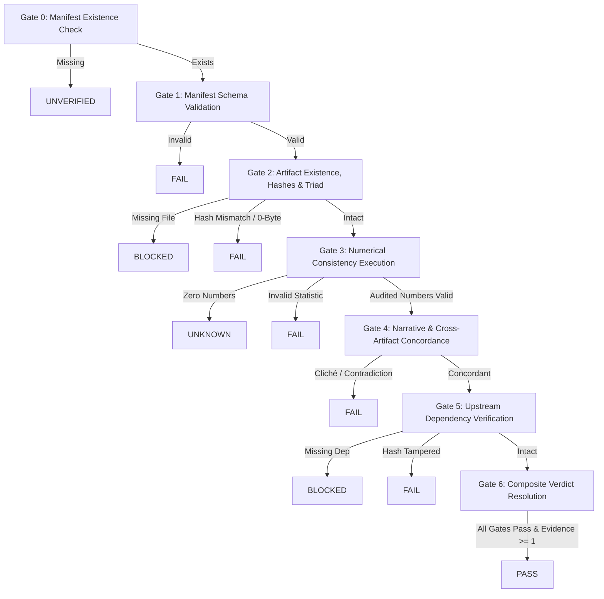

### 14.4 Affirmative Empirical Evidence Invariant
Under Directive 0 and Directive 2, an agent or validator may never issue a `PASS` verdict without affirmative empirical proof:
- In `validators/numerical_consistency/validator.py`: A JSON file with zero statistical parameters audited returns `UNKNOWN` with `evidence_items_audited = 0`.
- In `validators/reporting_consistency/validator.py`: Empty deliverables return `UNKNOWN`.
- In `validators/run_all_validators.py`: Composite `overall_verdict` can evaluate to `PASS` if and only if $\text{total\_evidence\_items\_evaluated} \ge 1$ and all individual checks evaluate to `PASS`.

### 14.5 High-Stakes Application to Chapter 4 & Chapter 5
This fail-closed architecture is crucial for graduate dissertation chapters:
- **Chapter 4 Findings**: Every hypothesis micro-stage must pass Gate 0 through Gate 6 independently before advancing to the next hypothesis.
- **Chapter 5 Discussion**: Theoretical mechanisms and literature concordance cannot be synthesized unless Chapter 4 findings manifests are cryptographically verified and immutable.

---

## 15. Cross-Artifact Triad Consistency Validation & Structured DOCX Compilation (Phase 10)

### 15.1 The 3-Way Discrepancy Prevention Invariant
In academic research, reporting must be mathematically unified across computational, preview, and publication formats. Under Directive 3 and Directive 5, every stage produces a Triad:
1. `result.json`: Machine-readable computational ground truth.
2. `result.md`: Human-readable Markdown narrative with APA 7 preview tables.
3. `result.docx`: Institutional Word document with strict Persian OpenXML typography.

If any format diverges (e.g., $\beta = .42$ in JSON, $\beta = .37$ in MD, and $\beta = .39$ in DOCX), the stage is instantly and automatically rejected with a `FAIL` verdict.

```mermaid
flowchart TD
    JSON["result.json (Ground Truth)\nβ = .42, M = 24.50, p = .001"]
    MD["result.md (Narrative & Tables)\nβ = .42, M = 24.50, p < .001"]
    DOCX["result.docx (OpenXML Document)\nβ = .42, M = 24.50, ۰.۰۰۱ > p"]

    VAL["validate_cross_artifacts()\n(3-Way Reconciler)"]

    JSON <-->|Exact Match |Δ| <= 0.01| VAL
    MD <-->|Table & Text Audit| VAL
    DOCX <-->|OpenXML Table & Text Audit| VAL

    VAL -->|All Match| PASS["PASS: Stage Authorized"]
    VAL -->|Any Mismatch (e.g. β = .39)| REJ["FAIL: Stage Automatically Rejected\n(ManifestCrossAgreementError)"]
```

### 15.2 Tightened Numerical Precision & Strict Identity
Legacy validation allowed loose tolerance ($|\Delta| \le 0.05$), creating a loophole where rounded or conflicting parameters could pass unnoticed. Under Phase 10:
- Standardized and unstandardized coefficients ($\beta, B$): strict $|\Delta| \le 0.01$ (with $|\Delta| \le 0.015$ ceiling for rounding).
- Test statistics ($t, F, z$): strict $|\Delta| \le 0.02$.
- Sample size ($N$): absolute integer identity.
- Confidence intervals ($[LL, UL]$): both lower and upper bounds must match within $|\Delta| \le 0.02$.
- Pairwise bidirectional cross-checking: Every parameter in Markdown must exist in Word DOCX, and every parameter in Word DOCX must exist in Markdown.

### 15.3 Deep Table-Level Concordance (`audit_table_concordance`)
Beyond unstructured narrative text, tabular reporting (such as Table 4.3 for ANOVA or regression) must agree cell-by-cell with machine-readable data:
- Sample size ($n$ or $N$)
- Mean ($M$)
- Standard deviation ($SD$)
- Significance level ($p$-value, respecting the Persian leading zero standard `۰.۰۰۱ > p`)
- Effect size ($d, \eta_p^2, \text{partial } \eta^2, R^2$)
- Confidence intervals ($[LL, UL]$)
Any contradiction between a table cell and the source JSON results in immediate `FAIL`.

### 15.4 Deterministic Structured DOCX Compiler (`scripts/structured_docx_generator.py`)
To prevent drift at the source, Word deliverables must never be manually typed or authored in isolation. The `structured_docx_generator.py` script serves as "The Hands":
- Compiles OpenXML Word documents directly from `result.json` and `result.md`.
- Enforces APA 7 3-line table layout (`<w:tblBorders>` top/bottom 0.75pt, header bottom 0.5pt, borderless inside).
- Injects `<w:tblPr><w:bidiVisual/></w:tblPr>` for native RTL table layout.
- Decouples statistical figures and negative signs to LTR (`Times New Roman`, `<w:rtl w:val="0"/>`).
- Binds genuine Persian typography (`B Titr` 14pt bold for headings, `B Nazanin` 13pt regular for justified body).

### 15.5 Authoritative Manifest Gating
During stage completion, `scripts/stage_manifest_engine.py` invokes `validate_cross_artifacts()`. If any numerical contradiction or table cell discrepancy is detected, the manifest engine raises `ManifestCrossAgreementError`, preventing stage closure and barring downstream progression in the State Machine.

---

## 16. Evidence Layer & 5-Link Claim Provenance Subsystem (Phase 11)

### 16.1 The 4-Tier Evidence Hierarchy
In graduate theses, journal manuscripts, discussion chapters, abstracts, and conclusions, authors make substantive scientific claims. Without a formal evidence layer, claims can quietly drift into broader generalizations than the empirical data supports, or cite modified/phantom statistics.

Phase 11 establishes an explicit 4-tier evidence layer:

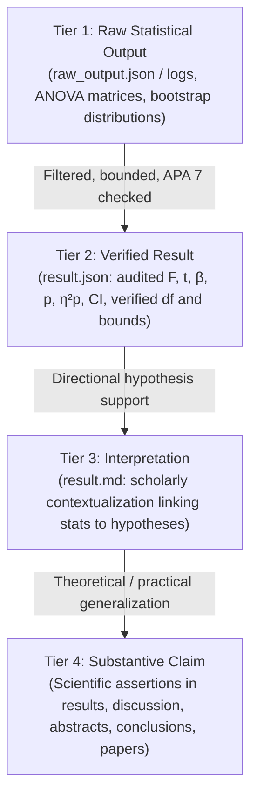

1. **Tier 1 (Raw Statistical Output)**: Unfiltered computational outputs from statistical packages or scripts (`raw_output.json`, log files).
2. **Tier 2 (Verified Result)**: Audited parameters in `result.json` satisfying degrees of freedom, admissible parameter bounds ($p \in [0, 1], R^2 \ge 0$), and APA 7 precision.
3. **Tier 3 (Interpretation)**: Contextualized scholarly statements linking verified numbers to directional hypotheses (`result.md`).
4. **Tier 4 (Claim)**: Substantive scientific assertions situated in thesis results, discussion, abstracts, conclusions, or journal manuscripts.

### 16.2 The Unbroken 5-Link Provenance Relationship
Every substantive scientific claim must declare an auditable, unbroken 5-link chain connecting the high-level assertion back to raw data bytes:

$$\text{claim} \longrightarrow \text{artifact} \longrightarrow \text{statistic} \longrightarrow \text{analysis} \longrightarrow \text{data}$$

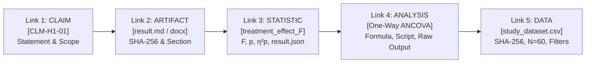

- **Link 1: Claim**: Claim ID (`CLM-...`), exact statement, claim type, target scope, and Tier 3 interpretation bridge.
- **Link 2: Artifact**: Physical deliverable path where the claim appears (`06_hypothesis_1.md`, `06_hypothesis_1.docx`), cryptographic SHA-256 hash, format, and section location.
- **Link 3: Statistic**: Parameter key, exact numerical metrics ($F, t, \beta, p, \eta_p^2, CI$), and `result.json` path and SHA-256 hash.
- **Link 4: Analysis**: Analysis ID, method name, model formula, script path, script SHA-256 hash, execution timestamp, and Tier 1 raw output path and hash.
- **Link 5: Data**: Raw dataset path, dataset SHA-256 hash, sample size ($N$), and filtering query.

### 16.3 Deterministic Engine ("The Hands") (`scripts/evidence_provenance_engine.py`)
- `build_claim_provenance(...)`: Constructs authoritative `claim_provenance.json` conforming to `contracts/claim_provenance.schema.json`.
- `trace_claim_provenance(claim_id, ...)`: Recursively resolves the 5-link chain from claim down to raw data, verifying file existence, cryptographic hashes, and numerical concordance.
- `verify_claim_provenance(...)`: Audits all 4 tiers and all declared claims, returning fail-closed `PASS` or `FAIL`.

### 16.4 Fail-Closed Provenance Validator (`validators/provenance_validator.py`)
Integrated into Gate 4 of `validators/run_all_validators.py` and `scripts/stage_manifest_engine.py`:
- Fails closed on any broken link (missing file, SHA-256 hash mismatch, statistical discrepancy).
- **Orphan Claim Detection**: Scans narrative deliverables (`.md`, `.docx`) for substantive empirical claims (e.g., hypothesis confirmation/rejection, statistical test reporting) that lack registered provenance in `claim_provenance.json`. Any orphan claim triggers immediate stage rejection (`FAIL`).

### 16.5 High-Stakes Application Scopes
The 5-link provenance subsystem is mandatory across 5 key academic scopes:
1. **Chapter 4 Findings**: Every hypothesis result must trace directly to deterministic test statistics and raw data.
2. **Chapter 5 Discussion**: Theoretical mechanisms and literature concordance assertions must trace to verified Chapter 4 findings.
3. **Thesis Abstracts**: High-level empirical summaries must trace directly to verified results without inflation.
4. **Conclusions & Implications**: Practical and clinical recommendations must cite only empirically supported findings.
5. **Journal Manuscripts**: Peer-review submissions carry complete provenance manifests for absolute reproducibility.

---

## 17. Separated Writing Architecture & Two-Stage QC Pipeline (Phase 12)

### 17.1 The Non-Statistician Invariant
The academic writer (`academic-writer`) must never become a second statistician. LLMs and writing agents are strictly barred from re-calculating values, altering parameters, rounding numbers outside contractual tolerances, or modifying statistical conclusions in their heads.

The writing architecture enforces an explicit 7-step pipeline:

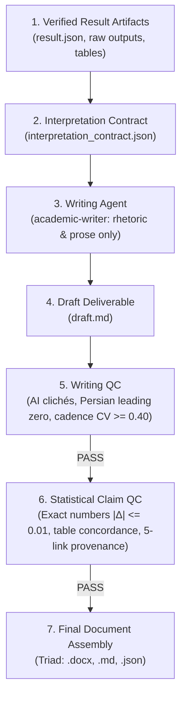

### 17.2 Chapter 4 Micro-Flow
$$\text{statistical result} \longrightarrow \text{table} \longrightarrow \text{interpretation} \longrightarrow \text{paragraph}$$
1. **Statistical Result**: Exact deterministic parameters ($F, t, \beta, p, \eta_p^2, CI$) extracted from `result.json`.
2. **Table**: Formatted APA 7 3-line table with decoupled LTR numbers and Persian headings.
3. **Interpretation**: Explicit verdict (`SUPPORTED` / `REJECTED`), magnitude benchmark, and mandated phrases.
4. **Paragraph**: Saber's 4-element anatomy:
   $$\text{Context} \longrightarrow \text{Data Highlights} \longrightarrow \text{Table Reference } (\text{جدول ۴-}X) \longrightarrow \text{Statistical Verdict}$$
   *(Strict prohibition: Zero external literature citations and zero psychological theory deep-dives in Chapter 4).*

### 17.3 Chapter 5 Micro-Flow
$$\text{verified finding} \longrightarrow \text{theoretical interpretation} \longrightarrow \text{comparison with literature} \longrightarrow \text{limitations} \longrightarrow \text{implications}$$
1. **Verified Finding**: Reference to Chapter 4 hypothesis, claim ID, and verified statistics.
2. **Theoretical Interpretation**: Grounding the finding in core psychological/behavioral theory (e.g. ACT Hexaflex, Schema modes).
3. **Comparison with Literature**: Concordance and discordance with empirical literature (2021–2026 window).
4. **Limitations**: Methodological, sampling, and measurement constraints.
5. **Implications**: Theoretical, practical, and clinical recommendations grounded strictly in verified findings.

### 17.4 Two-Stage QC Pipeline & Deterministic Assembly
- **Stage 1 (Writing QC)**: Scans for and eliminates robotic AI clichés («شایان ذکر است که», «پرواضح است که»), enforces Persian leading zero (`۰.۰۵`, `۰.۰۰۱ > p`, never `.۰۵` or `.۰۰۱`), and checks cadence variability ($CV \ge 0.40$).
- **Stage 2 (Statistical Claim QC)**: Verifies exact numerical identity ($|\Delta| \le 0.01$) against `result.json`, cell-by-cell table concordance, and 5-link claim provenance.
- **Assembly**: `scripts/writing_pipeline_engine.py` compiles the final audited Triad (`.docx`, `.md`, `.json`), ensuring 100% mathematical fidelity.

---

## 18. Formal Human Approval State & Cryptographic Approval Contracts (Phase 13)

### 18.1 Rebuilding Approval as an Explicit State (`STAGE_AWAITING_APPROVAL`)
In previous designs, human-in-the-loop verification relied on conversational prompt instructions (e.g., *"HALT and wait for user"*). This was inherently fragile and vulnerable to prompt bypassing during autonomous execution.

Phase 13 eliminates prompt-based halting by establishing human approval as an authoritative, reified state in the finite state machine (`StrictStateMachine` / `AcademicStateManager`):

```mermaid
flowchart TD
    RUN["Stage Execution\n(STAGE_RUNNING)"]
    VAL["Validation Gate\n(STAGE_VALIDATING)"]
    WAIT["Awaiting Approval\n(STAGE_AWAITING_APPROVAL)"]
    APP["Explicit Human Approval\n(approve_stage)"]
    DONE["Stage Approved\n(STAGE_APPROVED)"]
    UNLOCK["Downstream Stage Unlocked\n(STAGE_LOCKED -> STAGE_READY)"]
    REJ["Stage Rejected\n(STAGE_REJECTED)"]

    RUN -->|Execution complete| VAL
    VAL -->|validation_report.json PASS| WAIT
    WAIT -->|approve_stage (saber_admin)| APP
    WAIT -->|reject_stage| REJ
    APP -->|Emits MILESTONE_APPROVED| DONE
    DONE -->|State Machine Auto-Unlock| UNLOCK
```

### 18.2 Cryptographic Approval Record Contract (`contracts/approval_record.schema.json`)
Every stage entering `STAGE_AWAITING_APPROVAL` generates a formal cryptographic record conforming to `contracts/approval_record.schema.json`:
- `approval_id`: Unique identifier (e.g., `APP-06_hypothesis_1-20260919120000`).
- `stage_id`: Unique identifier of the stage awaiting approval.
- `project_id`: Project identifier.
- `artifact_hash`: Cryptographic SHA-256 hash of the stage manifest or primary deliverable on disk.
- `validation_hash`: Cryptographic SHA-256 hash of the passing validation report (`validation_report.json`).
- `requested_at`: ISO 8601 UTC timestamp of the request.
- `approved_by`: Identity of the human approving authority (e.g., `saber_admin`, `124911145`).
- `approved_at`: ISO 8601 UTC timestamp of the decision (null while pending).
- `decision`: Authoritative enum (`PENDING` | `APPROVED` | `REJECTED`).
- `status`: Lifecycle status (`PENDING` | `GRANTED` | `REJECTED`).
- `is_approved`: Boolean flag, strictly `false` by default, set to `true` only upon explicit grant.

### 18.3 Cryptographic Tamper Protection & Fail-Closed Gate
To guarantee that the files reviewed and approved are mathematically identical to the files executed on disk:
- When approval is requested, the SHA-256 hashes of the deliverable/manifest and `validation_report.json` are computed and sealed in the approval record.
- When `approve_stage` is invoked, `scripts/academic_approval_engine.py` re-computes both hashes directly from disk.
- If either file has been modified (tampered) in the interim, approval fails closed immediately, raising `ApprovalTamperError`.

### 18.4 Mechanical Downstream Gating & Automated Stage Unlocking
Downstream stages cannot rely on assumptions or verbal claims of approval:
- Any stage that depends on an upstream stage remains locked (`STAGE_LOCKED`).
- Attempting to transition a downstream stage while the upstream stage is in `STAGE_AWAITING_APPROVAL` raises `UnmetPrerequisiteError`.
- Upon successful execution of `approve_stage`:
  1. The upstream stage transitions to `STAGE_APPROVED`.
  2. The state machine emits `MILESTONE_APPROVED`.
  3. `StrictStateMachine` inspects all registered stages with `status == STAGE_LOCKED`. If all prerequisites for a locked stage are now `STAGE_APPROVED`, it automatically transitions that stage to `STAGE_READY` and emits `NEXT_STAGE_UNLOCKED`.

### 18.5 Deterministic Approval Engine ("The Hands") (`scripts/academic_approval_engine.py`)
Provides deterministic CLI operations for human approval management:
- `request`: Validates passing validation report, computes hashes, creates approval record, and transitions stage to `STAGE_AWAITING_APPROVAL`.
- `approve`: Verifies hashes, records human approver identity, transitions stage to `STAGE_APPROVED`, and auto-unlocks downstream stages.
- `reject`: Records human rejection, transitions stage to `STAGE_REJECTED`, and keeps downstream stages locked.
- `status`: Inspects active and historical approval records in the project state.

---

## 19. Tripartite Lifecycle Hook Architecture & Non-Orchestrator Invariant (Phase 14)

### 19.1 Architectural Division into Three Classes
In earlier designs, lifecycle governance was implemented via a single monolithic guard script (`transcript_and_rule_guard.py`), which led to conflation of security, artifact auditing, learning capture, and workflow control.

Under Phase 14, all lifecycle hooks are strictly divided into three distinct, specialized classes:

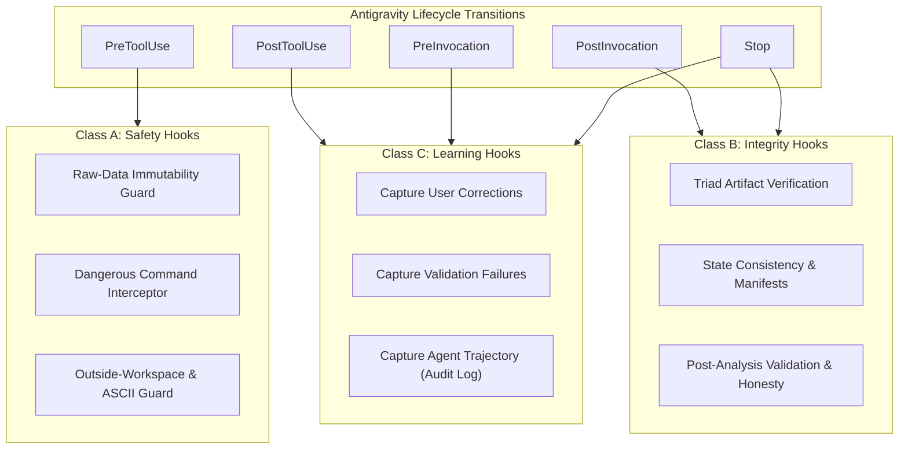

### 19.2 Class A: Safety Hooks (`.agents/hooks/safety_hooks.py`)
Executes synchronous interception before tool calls run (`PreToolUse`):
- **Raw-Data Protection**: Blocks file mutation tools (`write_to_file`, `replace_file_content`, `apply_diff`, etc.) and destructive shell commands (`rm`, `mv`, `>`, `sed -i`) targeting raw datasets (`/raw/`, `01_raw_inputs/`, `data_raw.*`).
- **Dangerous Command Protection**: Intercepts and denies destructive bash operations (`rm -rf .agents`, `rm -rf .git`, `rm -rf /`, fork bombs).
- **Outside-Workspace Protection**: Confines modifications strictly to declared workspace roots, enforces English-only ASCII filenames (Directive 6), and blocks unauthorized worker delegation and excessive subagent nesting depth ($\ge 3$).

### 19.3 Class B: Integrity Hooks (`.agents/hooks/integrity_hooks.py`)
Executes post-turn and post-analysis verification (`Stop`, `PostInvocation`):
- **Artifact Verification**: Enforces the Triad Artifact Invariant (.docx + .md + .json) across stage deliverables, and audits skill modularity ceilings (Directive 18: max 500 lines, 40,000 bytes).
- **State Consistency**: Verifies that deliverables and state transitions adhere to strict state machine rules without illegal or direct mutations.
- **Manifest Verification**: Confirms that completed stages possess an authoritative `manifest.json` on disk matching declared physical files.
- **Post-Analysis Validation & Honesty Gate**: Verifies that completed stages evaluate to `PASS` in validation reports, and enforces Directive 0 (Binary Honesty Protocol & Multi-Agent Truthfulness) on conversation transcripts.

### 19.4 Class C: Learning Hooks (`.agents/hooks/learning_hooks.py`)
Diagnostics, feedback capture, and lifecycle learning:
- **Capture User Correction**: Automatically scans user prompts in `PreInvocation` and `Stop` for critique and guidance, recording feedback via `AcademicCorrectionDetector` and `AcademicIntegratedLearningHub`.
- **Capture Validation Failure**: Intercepts validation failures and records causal incidents in `state/pitfalls.jsonl` and experience logs.
- **Capture Agent Trajectory**: Logs tool execution events and sanitized parameters in `state/audit_log.jsonl` during `PostToolUse`.

### 19.5 The Non-Orchestrator Invariant
Hooks strictly execute synchronous interception, constraint enforcement, diagnostic logging, and post-turn integrity audits.
**Hooks must NEVER act as the academic orchestrator:**
- Hooks must **never** mutate state machine milestone progression.
- Hooks must **never** select, dispatch, or sequence subagents.
- Hooks must **never** draft, synthesize, or re-write academic narrative deliverables.
Orchestration is the sole responsibility of the Antigravity Lead Agent (`academic-orchestrator`), supported by deterministic skill engines ("The Hands").

### 19.6 Unified Dispatcher & Backward-Compatible Facade
- `.agents/hooks/hook_dispatcher.py` routes incoming Antigravity events (`PreToolUse`, `PostToolUse`, `PreInvocation`, `PostInvocation`, `Stop`) strictly to Class A, B, and C modules.
- `.agents/verification/transcript_and_rule_guard.py` is maintained as a thin facade delegating to the tripartite classes, preserving 100% backward compatibility with existing tests and scripts.

---

## 20. Factual Event-Driven Trajectory Recording Architecture (Phase 15)

### 20.1 The Prohibition of Speculative Inference
Prior trajectory capture systems inferred tool executions and skill activations from milestone states (e.g., *"milestone X existed, therefore tool Y probably happened"*). This introduced hallucinated execution records into persistent memory, violating Directive 0 (Radical Honesty & Anti-Deception).

Under Phase 15, speculative trajectory inference is **strictly prohibited across AcademicSuite**:
- Trajectories must record **only observable, physical execution events** verified on disk or intercepted by lifecycle hooks.
- If a milestone or stage was verified without active tool executions, `tool_usages`, `skill_activations`, and `subagent_delegations` remain strictly empty (`[]`). Zero mock `run_command` or dummy script executions are permitted.

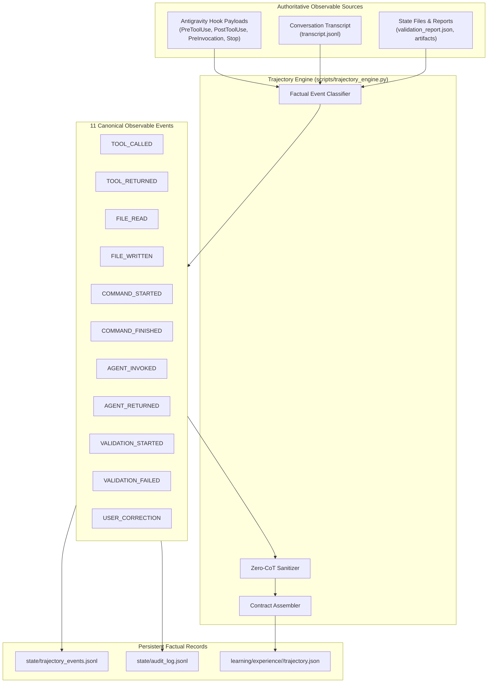

### 20.2 The 11 Canonical Observable Events
Execution telemetry is structured into 11 discrete, observable physical events:

| Event Type | Lifecycle Trigger | Description | Observable Metadata Captured |
|---|---|---|---|
| `TOOL_CALLED` | `PreToolUse` / transcript | Tool execution requested by model | Tool name, sanitized arguments, step index |
| `TOOL_RETURNED` | `PostToolUse` / transcript | Tool execution completed | Status (SUCCESS/ERROR), execution time, error |
| `FILE_READ` | `PreToolUse` (`view_file`, `read_resource`, etc.) | File inspection or reading tool invoked | Target file path, line range / offset |
| `FILE_WRITTEN` | `PreToolUse` / `PostToolUse` (`write_to_file`, `replace_file_content`) | File created or modified | File path, overwrite flag, content size |
| `COMMAND_STARTED` | `PreToolUse` (`run_command`) | Shell command process initiated | Command line, working directory (cwd) |
| `COMMAND_FINISHED` | `PostToolUse` (`run_command`) | Shell command process finished | Exit code, duration, status, error |
| `AGENT_INVOKED` | `PreToolUse` (`invoke_subagent`) | Subagent delegation initiated | Subagent type, role, prompt summary |
| `AGENT_RETURNED` | `PostToolUse` (`invoke_subagent`) | Subagent finished execution | Return status, error if any |
| `VALIDATION_STARTED` | `PreToolUse` (validator command) | Verification or audit script initiated | Validator name, command line, target stage |
| `VALIDATION_FAILED` | `PostToolUse` / `IntegrityHooks` | Verification check failed | Validator name, failed checks, evidence |
| `USER_CORRECTION` | `PreInvocation` / `Stop` / user turn | Human critique, correction, or revision directive | Clean user text, detected critique patterns |

### 20.3 Antigravity Hook Metadata as Source of Truth
Every event record captures execution metadata directly provided by the Antigravity runtime:
- **`conversationId`**: Unique session identifier.
- **`workspacePaths`**: List of active workspace roots.
- **`transcriptPath`**: Path to session `transcript.jsonl`.
- **`toolCall`**: Structured tool call payload (`name`, `args`).
- **`stepIdx`**: Trajectory step index.
- **`artifactDirectoryPath`**: Absolute path to session artifacts directory.
- **`modelName`**: Underlying AI model identifier.

### 20.4 Trajectory Engine (`scripts/trajectory_engine.py`)
The dedicated deterministic engine ("The Hands") for trajectory capture:
- **`record_event()`**: Atomically appends structured event records to `state/trajectory_events.jsonl` and mirrors to `state/audit_log.jsonl` and `.agents/memory/audit_log.jsonl`.
- **`extract_events_from_transcript()`**: Parses `transcript.jsonl` lines into the 11 factual events without inventing unobserved actions.
- **`build_trajectory_from_events()`**: Compiles valid `trajectory.json` artifacts conforming to `contracts/evolution/trajectory.schema.json`.
- **`sanitize_no_cot()`**: Enforces zero leakage of private chain-of-thought tokens (`chain_of_thought`, `thinking`, `internal_monologue`, `scratchpad`, `reasoning_tokens`).

### 20.5 Contract Schema & Integration
- `contracts/evolution/trajectory.schema.json` defines `action_type` with the 11 canonical events.
- `AcademicExperienceRecorder` (`record_from_milestone` and `record_from_stage`) delegates directly to `TrajectoryEngine`, ensuring that episodic memories in `learning/experience/<id>/trajectory.json` reflect 100% factual execution traces.

---

## 21. Deterministic Feedback Routing & Capability Targeting

### 21.1 The Feedback Routing Architecture
Under Phase 16, user corrections and teaching signals are deterministically routed to the responsible agent and capability without generic defaults. Defaulting unannotated feedback to `statistics-agent` is strictly prohibited.

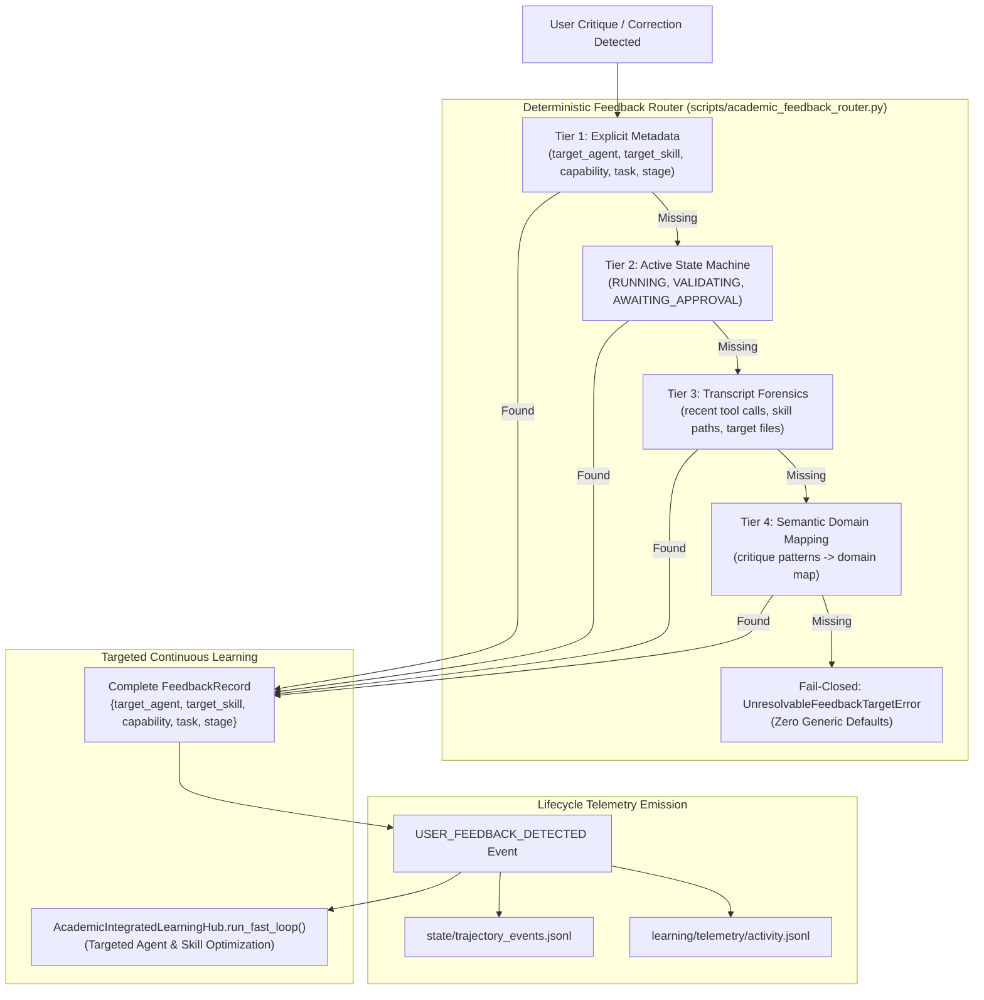

### 21.2 The 5-Field Target Contract
Every feedback record must strictly define:
1. `target_agent`: Assigned subagent role (`academic-writer`, `literature-expert`, `methodology-expert`, `results-auditor`, `data-curator`, `statistics-agent`, `validation-agent`, `academic-orchestrator`).
2. `target_skill`: Specific production skill (`chapter-4-writing`, `persian-literature-review-builder`, `methodology-review`, `apa-reporting`, `data-audit`, `statistical-data-analyst`, `thesis-integrity-auditor`, `academic-suite-orchestrator`).
3. `capability`: Canonical capability identifier (`academic_writing`, `literature_synthesis`, `research_methodology`, `apa_formatting`, `data_curation`, `statistical_modeling`, `research_integrity`, `workflow_orchestration`).
4. `task`: Associated milestone / task (`M1_DATA_CURATION`, `M2_LITERATURE`, `M3_METHODOLOGY`, `M4_CHAPTER4`, etc.).
5. `stage`: Associated micro-stage (`00_data_curation`, `02_literature_review`, `03_methodology`, `06_hypothesis_1`, etc.).

### 21.3 The 4-Tier Resolution Hierarchy
1. **Tier 1: Explicit Caller Metadata**: Checks incoming `metadata` dictionary for complete 5-field target specification.
2. **Tier 2: Active State Machine**: Inspects `state/current_state.json` for any milestone currently in `RUNNING`, `VALIDATING`, `AWAITING_APPROVAL`, or `READY`.
3. **Tier 3: Transcript Forensics**: Inspects `transcript.jsonl` in reverse order for recent tool invocations:
   - `run_command` targeting `.agents/skills/<skill>/`
   - `invoke_subagent` targeting specialist agents
   - `write_to_file` / `replace_file_content` targeting chapter/stage deliverables.
4. **Tier 4: Semantic Domain Mapping**: Classifies user critique against domain patterns (`WRITING_CORRECTION`, `EVIDENCE_CORRECTION`, `METHODOLOGY_CORRECTION`, `DATA_ANALYSIS_CORRECTION`, `QUALITY_STYLE_CORRECTION`, `RESEARCH_INTEGRITY_CORRECTION`, `PROCESS_CORRECTION`, `STATISTICAL_CORRECTION`).
5. **Fail-Closed Guarantee**: If all 4 tiers fail to resolve a verified target capability, the router raises `UnresolvableFeedbackTargetError`. Falling back to a generic default (`statistics-agent`) is strictly prohibited.

---

## 22. Idempotent Feedback Event Processing & `processed_event_ids`

### 22.1 Event Deduplication Architecture
Under Phase 17, feedback processing enforces standard event-processing hygiene. The ad-hoc `scan_transcript() -> process_user_turn()` pattern is replaced by an idempotent event pipeline where every feedback instance is identified by a unique `event_id` and verified against a persistent registry of `processed_event_ids`.

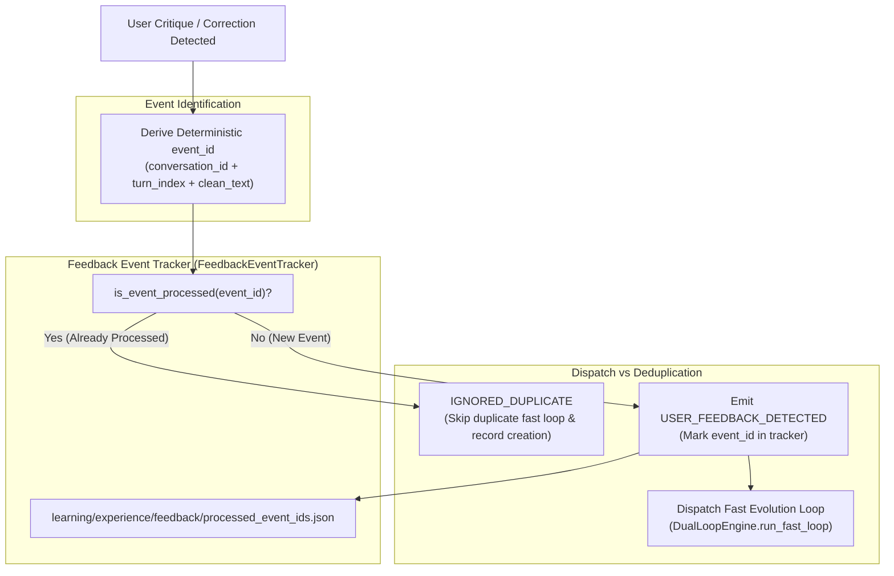

### 22.2 Deterministic `event_id` Derivation
Every feedback event is given a deterministic identifier:
```python
seed = f"{conversation_id}:{turn_index}:{clean_user_text}"
event_id = f"EVT-FDB-{sha256(seed)[:16].upper()}"
```
- **Same turn + same text**: Evaluates to the exact same `event_id`.
- **Different turn ($turn\_index_2 \ne turn\_index_1$)**: Evaluates to distinct `event_id`, allowing valid repetition tracking.
- **Explicit caller ID**: Direct pass-through of caller-supplied `event_id`.

### 22.3 The Persistent Event Store (`FeedbackEventTracker`)
- **Location**: `learning/experience/feedback/processed_event_ids.json`.
- **Atomicity**: Writes via process-safe temporary files (`.tmp.<pid>`) with atomic `os.replace`.
- **Cache Refresh**: If an `event_id` is not present in in-memory cache, `is_event_processed()` immediately reloads from disk to observe other processes/invocations.

### 22.4 Idempotency Across Multiple Invocations
- If `AcademicCorrectionDetector.scan_transcript()` runs before `AcademicIntegratedLearningHub.process_user_turn()`, the turn's `event_id` is registered and `process_user_turn()` returns `IGNORED_DUPLICATE`.
- If `process_user_turn()` runs first, subsequent `scan_transcript()` skips that turn.
- Rescanning an existing `transcript.jsonl` yields exactly 0 duplicate feedback records.

---

## 23. Closed Behavioral Evolution Architecture (Phase 18)

### 23.1 The 13-Stage Closed Behavioral Evolution Pipeline
Phase 18 establishes a complete, closed-loop behavioral evolution system driven by real observable behavior, eliminating mock benchmarks and unverified claims:

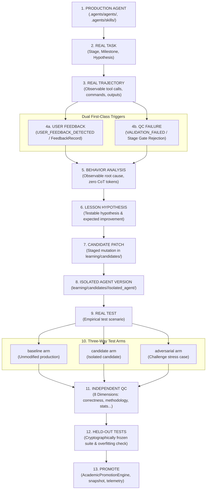

### 23.2 Dual First-Class Triggers
Both user critiques and automated quality control rejections trigger behavioral evolution symmetrically:
1. **User Feedback Trigger**: Ingests `USER_FEEDBACK_DETECTED` with deduplicated `event_id`, verified `target_agent`, `target_skill`, `capability`, `task`, and `stage`.
2. **QC Failure Trigger**: Ingests `VALIDATION_FAILED` containing validator diagnostics, failed assertions, and affected deliverable paths.

### 23.3 Observable-Only Behavior Analysis (`AcademicBehaviorAnalyzer`)
- **Zero Chain-of-Thought Invariant**: Strictly audits trajectory actions (`ordered_actions`) without guessing internal model thoughts or accessing private reasoning tokens.
- **Defect Pinpointing**: Maps trigger feedback to the specific step, command, or file write where the defect occurred.
- **Failure Signatures**: Deterministically classifies failure modes (`REPORTING_P_ZERO`, `MISSING_PERSIAN_LEADING_ZERO`, `DICHOTOMIZING_CONTINUOUS_VARIABLE`, `VIOLATED_ASSUMPTION_IGNORED`, etc.).
- **Contract Compliance**: Produces `BehaviorAnalysisReport` conforming to `contracts/evolution/behavior_analysis.schema.json`.

### 23.4 Isolated Agent Sandboxes (`AcademicIsolatedAgentSandbox`)
- **Staging Directory**: `learning/candidates/<candidate_id>/isolated_agent/`.
- **Production Non-Mutation Guarantee**: Clones the target agent/skill into the sandbox and applies candidate mutation patches (unified diff, full replacement, or parameter patch) strictly within the sandbox. Canonical production files in `.agents/agents/` and `.agents/skills/` remain 100% untouched.
- **Cryptographic Manifest**: Emits `isolated_manifest.json` tracking original and patched SHA-256 hashes.

### 23.5 Three-Way Test Arms (`baseline`, `candidate`, `adversarial`)
Evaluates candidate improvements across 3 explicit test arms:
1. **Baseline Arm**: Production agent/skill output on the test case.
2. **Candidate Arm**: Isolated candidate version output on the test case.
3. **Adversarial Arm**: Isolated candidate version output on an adversarial challenge case (e.g. median split temptation, missing waves, small sample).
- Compares:
  - `defect_resolved`: Did candidate resolve the baseline defect?
  - `candidate_outperformed_baseline`: Did candidate pass where baseline failed?
  - `adversarial_resilience_verified`: Did candidate survive the adversarial stress test?
  - `zero_regressions_verified`: Zero regressions on protected capabilities.
- Emits `ThreeWayEvaluationReport` conforming to `contracts/evolution/three_way_evaluation.schema.json`.

### 23.6 Independent QC & Cryptographic Held-Out Tests
- **Independent QC**: Audits the candidate across 8 independent quality dimensions: `correctness`, `methodology`, `statistical_validity`, `evidence_grounding`, `integrity`, `robustness`, `consistency`, `efficiency`.
- **Held-Out Generalization**: Evaluates candidate against cryptographically sealed test scenarios (`learning/evaluations/heldout/manifest.sha256`).
- **Overfitting Guard**: Computes the generalization ratio:
  $$\text{Ratio} = \frac{\text{Held-out Pass Rate}}{\max(0.01, \text{Training Pass Rate})}$$
  If $\text{Training Pass Rate} \ge 0.70$ and $\text{Ratio} < 0.70$, the candidate is flagged for overfitting and blocked from promotion.

### 23.7 Pareto-Governed Promotion (`AcademicPromotionEngine`)
- **Risk Taxonomy**:
  - *LOW-RISK* (exemplars, anti-patterns, minor clarifications): Auto-promoted when all evaluation gates pass.
  - *MEDIUM-RISK* (major skill/prompt modifications): Staged for human review (`STAGED_FOR_REVIEW`) until approved.
  - *HIGH-RISK* (permissions, hooks, contracts, validators): Hard-blocked from automated evolution.
- **Promotion Lifecycle**: Takes pre-promotion snapshots in `learning/promotions/snapshots/`, applies mutation to canonical production files, emits `PRM-*.json` promotion records, logs telemetry in `learning/telemetry/improvement_history.jsonl`, and executes post-promotion drift audits via `AcademicBehaviorDriftMonitor`.

---

## 24. Specialized Learning Roles & The Six Core Questions (Phase 19)

### 24.1 Cognitive Specialization & Antigravity Native Roles
Phase 19 establishes complete separation of cognitive responsibilities across AcademicSuite's six learning subagents in `.agents/agents/`. Rather than relying on Python classes or monolithic scripts, each role is a native Antigravity subagent governed by a dedicated system prompt (`agent.md`) and behavioral contract (`contract.md`).

Each subagent is designed to answer a single, unambiguous core question:

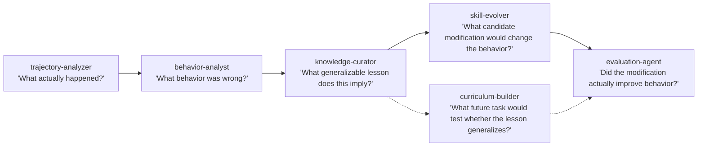

### 24.2 Operational Matrix & Least-Privilege Boundaries

| Subagent Role | Core Question Answered | Primary Cognitive Mission | Tools Available | Permissions & Boundaries |
| :--- | :--- | :--- | :--- | :--- |
| **`trajectory-analyzer`** | *"What actually happened?"* | Reconstructs observable tool calls, commands, and outputs from `transcript.jsonl` and hook telemetry. | `view_file`, `list_dir`, `grep_search`, `find_by_name` | **Read-Only**: Zero write, zero run tools. Strict Zero CoT policy. |
| **`behavior-analyst`** | *"What behavior was wrong?"* | Conducts causal root-cause analysis on triggers (`USER_FEEDBACK_DETECTED` / `VALIDATION_FAILED`), classifying failure signatures. | `view_file`, `list_dir`, `grep_search`, `find_by_name` | **Read-Only**: Zero write, zero run tools. Does not propose patches. |
| **`knowledge-curator`** | *"What generalizable lesson does this imply?"* | Distills persistent lessons, anti-patterns, and exemplars in `learning/knowledge/`. | `view_file`, `list_dir`, `grep_search`, `find_by_name`, `write_to_file` | **Staging Write-Only**: Cannot edit `.agents/skills/`. Zero command execution. Direct promotion forbidden. |
| **`skill-evolver`** | *"What candidate modification would change the behavior?"* | Proposes minimal, high-impact unified diffs (`improvement_candidate`) for target skills and scripts in branch workspaces. | `view_file`, `list_dir`, `grep_search`, `find_by_name`, `write_to_file` | **Staging Write-Only**: Branch workspace. Cannot overwrite canonical skills directly. Directive 18 ceilings enforced. |
| **`evaluation-agent`** | *"Did the modification actually improve behavior?"* | Independently benchmarks candidate mutations using 3-way evaluation arms and 8 dimensions. | `view_file`, `list_dir`, `grep_search`, `find_by_name`, `write_to_file`, `run_command` | **Execution-Enabled**: Branch workspace. Forbids unverified pass declarations and scalar scores. |
| **`curriculum-builder`** | *"What future task would test whether the lesson generalizes?"* | Architect graduated complexity benchmark tasks (L1–L4) and synthetic challenge datasets. | `view_file`, `list_dir`, `grep_search`, `find_by_name`, `write_to_file` | **Staging Write-Only**: Cannot execute tests or grade tasks. Directive 9 empirical decimal noise enforced. |

### 24.3 Sole Orchestrator Mandate & Functional Separation
1. **Directive 12.1 Compliance**: Antigravity is the sole agent orchestrator. Subagents are invoked via `invoke_subagent`. Python scripts in `.agents/skills/` and `scripts/` serve strictly as deterministic computational utilities ("The Hands").
2. **Directive 19 Compliance**: Clear separation across all six dimensions:
   - *Agent decides*: Subagents perform cognitive diagnosis, synthesis, and evaluation.
   - *Skill instructs*: Domain skills provide procedures and templates.
   - *Script computes*: Deterministic scripts compute statistical metrics and file diffs.
   - *Hook enforces*: Lifecycle hooks intercept events and enforce security boundaries.
   - *State machine authorizes*: State machines gate milestone and stage progression.
   - *Artifact manifest defines completion*: JSON schemas validate all handoff contracts.
3. **Formal Specification**: Detailed delegation protocols, sequential handoffs, and workspace isolation modes are codified in `learning/LEARNING_MULTI_AGENT_SPEC.md`.

---

## 25. Real Candidate Generation & The Seven Modification Categories (Phase 20)

### 25.1 The 5-Input, 2-Stage Pipeline Architecture
Phase 20 eliminates the legacy pattern of `evidence -> keyword match -> hard-coded mutation`. Instead, it establishes an authentic 5-input, 2-stage evolutionary pipeline that grounds every proposed modification in real observable execution data, concrete user/QC feedback, and the physical source code of the targeted component.

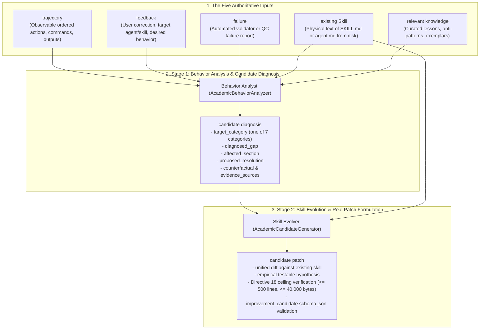

### 25.2 The Seven Target Modification Categories
Every proposed candidate patch must represent an actual, contextual modification targeting one of the seven control surfaces of the AcademicSuite cognitive architecture:

| Category | Description | Primary Target Component | Mutation Type | Target Schema Enum |
| :--- | :--- | :--- | :--- | :--- |
| **`agent instruction`** | Modifying agent system prompts, cognitive directives, academic tone, or persona rules. | `.agents/agents/<agent>/agent.md` | `INSTRUCTION_REFINEMENT` | `AGENT_SYSTEM_PROMPT` |
| **`Skill`** | Adding or refining step-by-step operational workflows, procedures, or CLI tool sequences. | `.agents/skills/<skill>/SKILL.md` | `MISSING_STEP_ADDITION` | `SKILL_PROCEDURAL_SPECIFICATION` |
| **`decision tree`** | Introducing or refining conditional decision logic, model comparisons (e.g. LMM vs RM-ANOVA), or statistical branch criteria. | `.agents/skills/<skill>/SKILL.md` | `DECISION_TREE_ADDITION` | `HEURISTIC_DECISION_RULE` |
| **`verification rule`** | Adding pre-flight gates, OpenXML typography audits, or post-execution verification checks. | `.agents/skills/<skill>/SKILL.md` | `VERIFICATION_CHECKPOINT` | `VALIDATOR_INSPECTION_RULE` |
| **`delegation rule`** | Codifying subagent delegation boundaries, orchestrator handoffs, and multi-agent coordination contracts. | `.agents/skills/<skill>/SKILL.md` | `DELEGATION_GUIDANCE` | `SKILL_PROCEDURAL_SPECIFICATION` |
| **`retrieval rule`** | Refining adaptive context lookup, questionnaire scoring key resolution, or exemplar matching. | `.agents/skills/<skill>/SKILL.md` | `RETRIEVAL_IMPROVEMENT` | `SKILL_PROCEDURAL_SPECIFICATION` |
| **`exception rule`** | Handling unengaged responses, boundary conditions, assumption violations, and missing data mechanisms. | `.agents/skills/<skill>/SKILL.md` | `CLARIFICATION_APPLICABILITY_EXCLUSIONS` | `SKILL_PROCEDURAL_SPECIFICATION` |

### 25.3 Dynamic Patch Synthesis & Elimination of Hardcoded Canned Text
- **Zero Hardcoded Canned Strings**: All hardcoded mutation templates (such as repeatedly recommending longitudinal mixed models regardless of the target domain) are permanently eliminated.
- **Context-Aware Section Resolution**: `AcademicBehaviorAnalyzer` inspects the real headings (`#`, `##`, `###`) of `existing_skill_content` to identify the exact section affected by the diagnosed gap.
- **Dynamic Text Construction**: `AcademicCandidateGenerator._build_mutation_content()` dynamically interpolates the target skill, affected section, diagnosed gap, root cause, and prescribed behavior into cohesive, scholarly Markdown instructions.
- **Valid Unified Diffs**: Diffs are synthesized using Python's `difflib.unified_diff`, ensuring they apply cleanly to the original file text without syntax corruption.

### 25.4 Directive 18 Ceilings Enforcement
- **Single-View Invariant**: Every modified skill or agent instruction is mechanically checked via `_verify_directive_18_ceilings(mutation_patch)`:
  - **Line Limit**: $\le 500$ lines (within Antigravity's 800-line tool window).
  - **Byte Limit**: $\le 40,000$ bytes (within Antigravity's 46,080-byte tool buffer).
- If a candidate mutation causes the file to exceed either threshold, `CandidateGenerationError` is raised immediately, preventing bloated skills from entering the evaluation pipeline.

### 25.5 Contract and Schema Compliance
- Every candidate record is validated against `contracts/evolution/improvement_candidate.schema.json` before staging.
- Diagnostic metadata (`candidate_diagnosis`, `analysis_id`, `trigger_type`) is retained in `metadata` for full auditability and trace linkage.

---

## 26. Physical Candidate Activation & Promotion Hash Verification (Phase 21)

### 26.1 The Physical Activation Mandate & The Target Hash Invariant
Phase 21 guarantees that a behavioral improvement candidate can never reach `PROMOTED` while the actual `SKILL.md` or `agent.md` on disk remains unchanged. Promotion physically writes the approved candidate version to disk and verifies the resulting cryptographic hash:

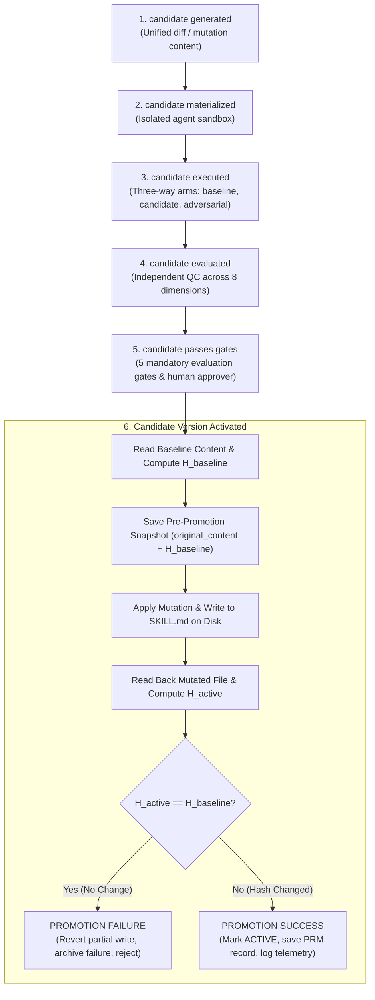

### 26.2 The Target Hash Verification Invariant
Whenever a candidate targets a `SKILL.md`, `agent.md`, or script file:
1. **Baseline Hash**: $H_{\text{baseline}} = \text{sha256}(C_{\text{baseline}})$.
2. **Physical Write**: The engine applies the candidate mutation and writes the result to the canonical target component on disk (`target_path`).
3. **Active Hash**: $H_{\text{active}} = \text{sha256}(C_{\text{active}})$.
4. **Invariant Check**:
   $$\text{If } H_{\text{active}} == H_{\text{baseline}} \implies \text{PROMOTION FAILURE}$$
   - The engine raises `PromotionHashMismatchError`.
   - The candidate is archived under `learning/archive/` with `failure_reason: "PROMOTION FAILURE: Target Skill hash did not change where a change was expected"`.
   - The candidate status is set to `PROMOTION_FAILED` and `decision: "REJECTED"`.
   - The candidate is **NEVER** marked `ACTIVE`.

### 26.3 Rollback Snapshots & Deterministic Rollback (`rollback_promotion`)
- **Pre-Promotion Snapshot**: Before any disk write, `AcademicPromotionEngine` creates `learning/promotions/snapshots/<snap_id>.json` containing the exact `original_content` and `original_hash`.
- **Deterministic Rollback**: Calling `rollback_promotion(promotion_id_or_snapshot_id)` reads the snapshot, writes `original_content` back to the target file, verifies that `sha256(restored) == original_hash`, and marks the candidate `ROLLED_BACK`.

### 26.4 Directive 18 Ceilings Enforcement During Activation
- Before writing mutated content to disk, `_verify_directive_18_ceilings()` checks:
  - **Line Limit**: $\le 500$ lines.
  - **Byte Limit**: $\le 40,000$ bytes.
- If a candidate causes a file to exceed either threshold, promotion aborts immediately with `PromotionFailureError`, preventing bloated instructions from entering active production.

### 26.5 Closed-Loop Evolution Integration
- In `AcademicRealBehaviorEvolution` (Stage 13), the engine verifies that `deployment["active_component_hash"] != deployment["baseline_component_hash"]`.
- If promotion fails, the 13-stage pipeline transitions to `PROMOTION_FAILED`, guaranteeing that unverified promotions cannot be silently completed.

---

## 27. Immutable Component Versions & Deterministic Rollback Architecture (Phase 22)

### 27.1 The Immutable Version Store Architecture (`learning/versions/<component_id>/`)
Prior rollback mechanisms relied on metadata-heavy JSON snapshot files (`SNAP-xxx.json`) containing `original_content` strings without discrete, immutable version artifacts. Under Phase 22, every component undergoing evolution maintains a discrete, first-class, immutable version tree on disk:

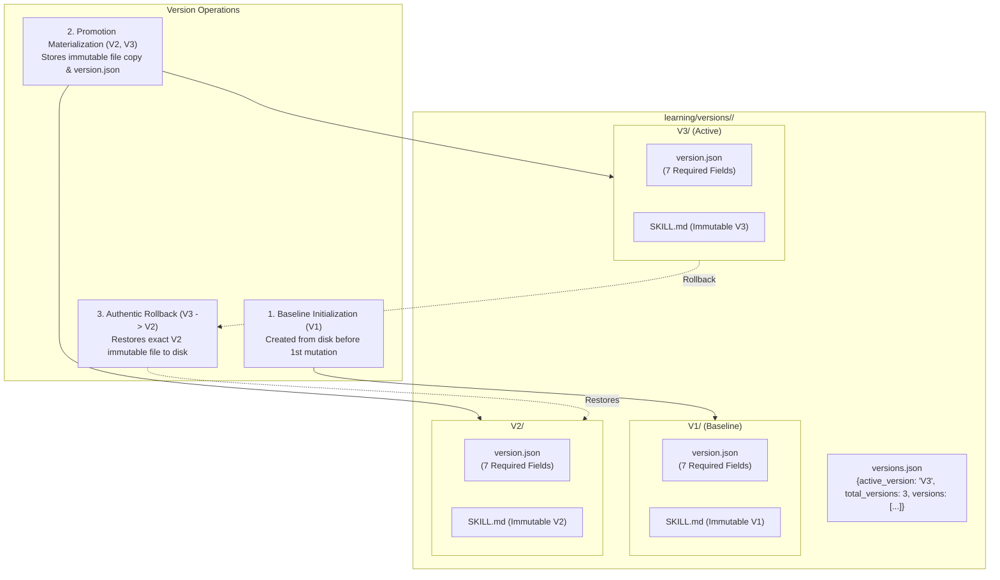

Each version $V_1, V_2, V_3$ is stored in its own directory containing:
1. `version.json`: Machine-verifiable version metadata satisfying `contracts/evolution/component_version.schema.json`.
2. Target File Copy: The exact, byte-for-byte immutable file copy (e.g. `SKILL.md`, `agent.md`) at that version.

### 27.2 The 7-Field Version Contract Schema (`contracts/evolution/component_version.schema.json`)
Every component version record must contain exactly the seven required architectural fields:

| Field | Type | Description |
| :--- | :--- | :--- |
| `version_id` | `string` (`^V\d+$`) | Sequential immutable version identifier (e.g. `V1`, `V2`, `V3`). |
| `parent_version` | `string` or `null` | Identifier of parent version (`null` for baseline `V1`, `V1` for `V2`, `V2` for `V3`). |
| `content_hash` | `string` (`^[a-f0-9]{64}$`) | SHA-256 cryptographic hash of the raw text content. |
| `artifact_hash` | `string` (`^[a-f0-9]{64}$`) | SHA-256 cryptographic hash of the physical immutable file on disk. |
| `evaluation_id` | `string` | Identifier of the evaluation that verified this version. |
| `promotion_id` | `string` | Identifier of the promotion record that activated this version. |
| `timestamp` | `string` (ISO 8601) | Exact UTC timestamp of version creation and materialization. |

### 27.3 Promotion Version Materialization (`AcademicVersionStore`)
- **Baseline Initialization (`initialize_baseline_version`)**: Before applying the very first candidate mutation, `AcademicVersionStore` reads the existing disk file and creates `V1/` as the immutable baseline version with `parent_version: null`.
- **Sequential Version Creation (`create_version`)**: Upon successful promotion of candidate $N$:
  1. Determines the next sequential version tag ($V_{N+1}$).
  2. Normalizes the parent version to the previous active version ($V_N$).
  3. Writes `V<N+1>/<filename>` and `V<N+1>/version.json`.
  4. Updates `versions.json` with the new active version pointer and history.
  5. Computes and validates `artifact_hash == content_hash`.
- **Target Hash Invariant**: Promotion writes the new version to the canonical active file (`target_path`) and verifies `sha256(active_file) == content_hash`.

### 27.4 Authentic $V_3 \rightarrow V_2$ Rollback
Rollback is no longer an ad-hoc string replacement from metadata snapshots. It is a deterministic, fail-closed physical restoration:
1. **Target Version Retrieval**: Loads immutable file `learning/versions/<component_id>/V2/<filename>` and its `version.json`.
2. **Cryptographic Tamper Detection**: Computes `sha256(immutable_file)` and asserts equality with `v_record["content_hash"]`. If tampered or corrupt, raises `PromotionFailureError` and blocks deployment.
3. **Physical Disk Restoration**: Overwrites active `target_path` with the verified immutable content of $V_2$.
4. **Post-Restoration Hash Verification**: Reads back `target_path` from disk and verifies `sha256(restored_content) == v_record["content_hash"]`.
5. **State Update & Audit**: Updates `active_version: "V2"` in `versions.json` and appends an audit record to `rollback_history`.

### 27.5 Integration with Behavioral Drift Monitoring (`AcademicBehaviorDriftMonitor`)
When `AcademicBehaviorDriftMonitor` detects behavioral degradation or regression exceeding drift thresholds:
1. Queries `AcademicVersionStore` for the active version and its `parent_version`.
2. Executes `version_store.rollback(comp_id, target_version=parent_version)`.
3. Validates that the active disk file has been physically restored to the parent immutable version.
4. Falls back to snapshot restoration only if the component predates Phase 22 version storage.

