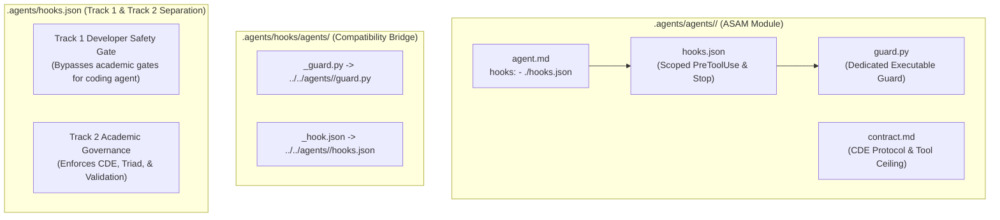

# Rule Inventory & Constitutional Governance Audit

**Document Version:** 2.0.0 (Antigravity 2.17 Architecture Audit)  
**Governance Hierarchy:** Global Constitutional Directives -> Domain Rules -> Plugin Rules -> Machine Enforcement Hooks  

---

## 1. Executive Summary

Rules in the Academic Suite are non-negotiable architectural invariants designed to prevent LLM hallucinations, enforce authentic academic rigor, protect client deliverables, and guarantee reproducible research.

Governance operates on three levels:
1. **Constitutional Directives (`AGENTS.md`)**: 24 global principles binding on all agents.
2. **Modular Domain Rule Specifications (`.agents/rules/`)**: 10 concise declarative specifications for typography, file naming, Git automation, honesty, and statistical reporting.
3. **Machine Enforcement Hooks (`.agents/agents/<name>/hooks.json`)**: Dedicated 1:1 real-time lifecycle intercepts (`PreToolUse`, `Stop`) backed by individual agent guards (`guard.py`) co-located within each agent's ASAM directory and declared via `hooks: - ./hooks.json`.

---

## 2. Global Constitutional Directives (`AGENTS.md`)

| Directive | Name | Core Mandate | Primary Enforcement Anchor |
|---|---|---|---|
| **Directive 0** | **Radical Honesty & Anti-Deception** | Compliance queries ("Did you check X?") MUST begin with "Yes" or "No" as the very first word. Multi-agent execution claims strictly require physical `invoke_subagent` calls. | `Stop` hook / `transcript_and_rule_guard.py` |
| **Directive 1** | **Mandatory Pre-Flight Gate & Skill Spec Mandate** | View skill specification (`view_file` on `SKILL.md`) and emit Pre-Flight Pipeline Declaration before CLI execution. | `PreToolUse` hook / `<agent>_guard.py` |
| **Directive 2** | **Deterministic Calculation Invariant** | Zero mental arithmetic or hallucinated statistics in memory. Compute via bundled Python/R CLI scripts on real datasets. | `Stop` hook / `statistics_agent_guard.py` |
| **Directive 3** | **Artifact-Gated Stages & Triad Invariant** | Every micro-stage and individual hypothesis must produce a synchronized on-disk triad: `.docx` (Word), `.md` (Markdown), and `.json` (Data/Stats). | `Stop` hook / `academic_orchestrator_guard.py` |
| **Directive 3.1** | **Chapter 5 Prose-Only Invariant** | Chapter 5 (Discussion & Conclusion) must strictly contain zero tables (Markdown `\|---\|` or Word `<w:tbl>`). 100% continuous narrative prose. | `Stop` hook / `academic_writer_guard.py` |
| **Directive 4** | **Strict APA 7th Edition Typography & Persian Leading Zeros** | Italicize Latin statistical symbols (*M, SD, t, F, p*); 2 decimals for statistics, 3 for $p$. In Persian text, never omit the leading zero (`۰.۰۰۱`, `۰.۰۵`). Ban $p = .000$. Exactly 3 horizontal table borders. | `Stop` hook / `results_auditor_guard.py` |
| **Directive 4.1** | **Presentation Visual Standards & Academic Sobriety** | Zero emojis in deliverables/slides. Zero English words in Persian slides. DrawingML dual-slot font binding (`B Titr` / `B Nazanin` / `Times New Roman`). Decoupled LTR numbers ($-0.32$). | `Stop` hook / `persian_defense_presentation_builder` |
| **Directive 5** | **Persian Academic Typography & OpenXML Standards** | RTL paragraph properties (`<w:bidi w:val="1"/>`), justified text (`<w:jc w:val="both"/>`), genuine font binding (`B Nazanin` body, `B Titr` headings, `Times New Roman` stats). Zero manual line breaks (`<w:br/>`). Native footnotes (`word/footnotes.xml`). Zero regex on OpenXML (`re.sub` prohibited). | `PreToolUse` & `Stop` hooks / `academic_writer_guard.py` |
| **Directive 6** | **English Primary Interaction & Mandatory ASCII Filenames** | Agents communicate and report strictly in English. Every file, script, dataset, or directory on disk MUST strictly use English ASCII characters (`^[a-zA-Z0-9_.-]+$`). | `PreToolUse` hook / `safety_hooks.py` |
| **Directive 7** | **Digital Twin Persona & Deterministic Pricing** | Scholarly Persian register with half-spaces (`\u200c`). Eliminate AI clichés. Deterministic pricing via `proposal_price_estimator.py` in Tomans. High-stakes quotations require Human Gate approval (`124911145`). | `Stop` hook / `digital_saber_guard.py` |
| **Directive 8** | **Mandatory Git Lifecycle** | Automatically stage changed files, create conventional semantic commit messages (`feat:`, `fix:`, `docs:`, `refactor:`), and keep the working tree clean. | Turn completion invariant |
| **Directive 9** | **Realistic Decimal Noise in Psychometric Simulation** | Zero synthetic whole-integer means. Inject bounded empirical decimal noise ($\mu_{\text{empirical}} = \mu_{\text{target}} + \delta, \delta \sim \text{Uniform}(\pm 0.08, \pm 0.25)$). | `Stop` hook / `data_agent_guard.py` |
| **Directive 10** | **Multi-Signal Anomaly Scoring (MSAI)** | Never diagnose data fabrication on a single metric ($d > 1.40$). Evaluate composite Multi-Signal Anomaly Index (MSAI) combining effect size, variance deflation, group overlap, and alpha. | `Stop` hook / `statistical_auditor_guard.py` |
| **Directive 11** | **Interactive Stage-Gate Protocol** | Emit Stage Completion Report (what was done, what is next) and HALT for user confirmation before advancing. Autonomous multi-stage runaway is prohibited. | `Stop` hook / `academic_orchestrator_guard.py` |
| **Directive 12** | **Hybrid Multi-Agent Deliberation Architecture** | 31 registered agents across `.agents/agents/`, 45 skills across `.agents/skills/`. The Brains decide; The Hands compute. Generation and audit strictly separated. Worker agents forbidden from spawning secondary subagents. | `PreToolUse` hook / `<agent>_guard.py` |
| **Directive 12.1** | **Sole Orchestrator Mandate** | Antigravity is the sole agent conductor via `invoke_subagent`. Standalone Python dispatch loops or agent emulators are strictly prohibited. | `Stop` hook / `transcript_and_rule_guard.py` |
| **Directive 13** | **Uncompromising Epistemic Honesty & Anti-Sycophancy** | Zero flattery. Report non-significant findings ($p > .05$), assumption violations, and high AI detection risks candidly without sugarcoating. | `Stop` hook / `advisory_agents_guard.py` |
| **Directive 14** | **Anti-Hallucination & Zero Ghost Citations** | Never invent citations. External claims must be verified against CrossRef/PubMed/SID, with bibliographic records or PDFs in `04_references_and_lit/papers/`. | `Stop` hook / `evidence_auditor_guard.py` |
| **Directive 15** | **Temporal Reality Anchor: 2026 (1405 SH)** | Operative calendar year is strictly **2026** (1405 SH). Recent empirical literature window is **2021–2026**. | `Stop` hook / `research_agent_guard.py` |
| **Directive 16** | **EndNote CWYW Compatibility** | English journal manuscripts require `.enw` and `.ris` libraries and native OpenXML `ADDIN EN.CITE` field codes. | `journal-submission-assistant` |
| **Directive 17** | **Antigravity Lifecycle Hook Machine Gate** | System integrity mechanically enforced by hook guards across `PreToolUse`, `PreInvocation`, `PostToolUse`, and `Stop`. | Antigravity Engine |
| **Directive 18** | **Skill Modularity & Context Budget Standard** | Maximum **500 lines** and **40,000 bytes** per `SKILL.md` and `agent.md` to guarantee 100% single-view ingestion. | `skill_size_guard.py` |
| **Directive 19** | **The Six-Part Functional Separation Invariant** | Agent decides \| Skill instructs \| Script computes \| Hook enforces \| State machine authorizes \| Artifact manifest defines. | Architecture contract |
| **Directive 20** | **The Orchestrator Architectural Invariants** | `academic-orchestrator` possesses `invoke_subagent` and strictly lacks execution tools (`run_command`, `write_to_file`, `replace_file_content`). Pure conductor. | `PreToolUse` hook / `academic_orchestrator_guard.py` |
| **Directive 21** | **Proactive Human Mentorship Graduation** | Human mentor guidance immediately codified into `.agents/learning/knowledge/`. Universal procedural invariants graduated into `SKILL.md` / `rules/AGENTS.md`. | `academic_graduation_compiler.py` |
| **Directive 22** | **Fail-Closed Mechanical Validation Gate Invariant** | Reject verbal "PASS"; require verified physical `validation_report.json` on disk with `overall_verdict == "PASS"` and `checks_failed == 0`. | `Stop` hook / `validation_agent_guard.py` |
| **Directive 23** | **Clean Workspace Root Standard** | Writing or dropping executable/analysis scripts directly into repository root is strictly prohibited. Route scripts strictly to: scratch, `02_analysis_code/`, `.agents/scripts/`, or `tests/`. | `PreToolUse` hook / `safety_hooks.py` |

---

## 3. Modular Domain Rules Directory (`.agents/rules/`)

The `.agents/rules/` directory houses 10 lean declarative specifications:

1. **`academic-integrity.md`**: Directives 0, 13, 14. Binary honesty, epistemic candor, and verified bibliographic records.
2. **`data-integrity.md`**: Directives 2, 9, 10. Deterministic script computation, decimal noise injection, and MSAI anomaly detection.
3. **`project-conventions.md`**: Directives 4, 5, 6, 8. APA 7 typography, OpenXML BiDi standards, ASCII filenames, and clean working tree invariant.
4. **`radical_honesty_and_pipeline_enforcement.md`**: Directives 0, 1, 3, 11, 13. Binary honesty protocol, pre-flight gate declaration, triad artifact requirement, interactive stage-gate pause, and error recovery sequence.
5. **`persian_font_rules.md`**: Directives 4, 4.1, 5. Persian font hierarchy (`B Titr`, `B Nazanin`, `Times New Roman`), OpenXML font-binding python helpers, zero manual breaks, and PowerPoint DrawingML legibility.
6. **`chapter4_hypothesis_and_sem_structure_rules.md`**: Directives 3, 3.1, 4. 3-table regression suite, macro-to-micro SEM protocol, master decision matrix, and strict empirical boundary (zero literature in Ch 4; zero tables in Ch 5).
7. **`digital_twin_rules.md`**: Directives 6, 7, 11, 12, 19. Saber Ghaderi's persona, deterministic Tomans pricing, Human Gate approval card (`124911145`), and 5-layer cognitive architecture.
8. **`file_naming_rules.md`**: Directives 6, 23. ASCII English naming taxonomy (`^[a-zA-Z0-9_.-]+$`) and clean workspace root routing.
9. **`git_lifecycle_rules.md`**: Directive 8. Semantic conventional commits, automated push, and clean working tree invariant.
10. **`antigravity_agent_and_skill_development_rules.md`**: Directives 12, 18, 19, 20. Dual-track dropdown taxonomy (Main Agent vs. Orchestrator), 1:1 dedicated hook architecture, and single-view context budget ceilings (< 500 lines, < 40KB).

---

## 4. Plugin Rules (`.agents/plugins/academic-suite/rules/AGENTS.md`)

The `academic-suite` plugin consolidates domain rules loaded globally across all sessions:
1. **Radical Honesty & Pipeline Enforcement**: Directives 0, 1, 2, 3, 3.1, 4.1, 7.1, 11, 12.1, 19, 20, 21, 22.
2. **Interaction & File Naming Standards**: Directive 6.
3. **Persian Academic Typography & Font Standards**: Directives 4, 5.
4. **Git Lifecycle & Clean Working Tree**: Directives 8, 23.

---

## 5. Antigravity 2.17 ASAM Co-Located Hook Architecture

Mechanical rule enforcement is handled via Atomic Self-Contained Agent Modules (ASAM):

### Architecture Details:
- **Atomic Self-Contained Agent Modules (ASAM)**: All 31 subagent directories (`.agents/agents/<name>/`) contain `agent.md`, `contract.md`, `guard.py`, and `hooks.json`.
- **Native Engine Scoping (`hooks: - ./hooks.json`)**: In Antigravity 2.17, relative hook paths resolve directly to the agent directory, eliminating centralized dispatcher bottlenecks.
- **Dual-Track Decoupled Gate**: Global `.agents/hooks.json` cleanly separates Track 1 (Main Developer Agent safety) and Track 2 (Academic Orchestrator and specialist subagent governance).
- **Backward-Compatible Symlink Bridge**: Relative symlinks in `.agents/hooks/agents/` preserve 100% interoperability with legacy test harnesses and external tooling.
- **Fail-Closed Mechanical Gate**: Ensures zero execution runaway, zero synthetic statistics, and 100% verified disk deliverables.
