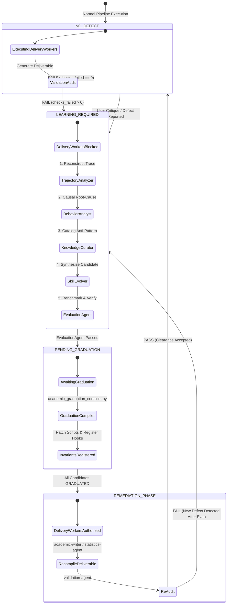
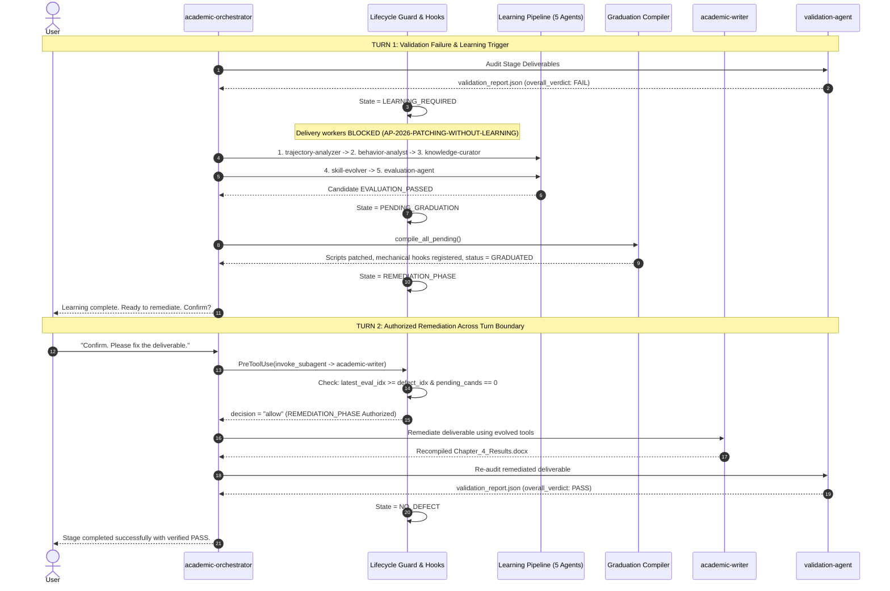

# Continuous Learning, Graduation & Remediation Lifecycle Specification

This specification documents the **state machine, lifecycle contracts, and turn-boundary continuity architecture** governing how defects (validation failures and user critiques) trigger the autonomous 5-stage continuous learning cascade, graduate tool mutations, and unlock the **Remediation Phase** in AcademicSuite.

---

## 1. Executive Summary & Core Invariants

Under AcademicSuite's Constitutional Directives, ad-hoc patching without tool evolution is strictly forbidden:
- **Directive 21 (Autonomous Continuous Learning & Tool Evolution)**: When a validator emits `FAIL` or a human reports a critique, the system must diagnose root causes and evolve canonical tools rather than performing isolated, conversational edits.
- **Directive 21.1 (Anti-Pattern AP-2026-PATCHING-WITHOUT-LEARNING)**: Delivery workers (`academic-writer`, `data-agent`, `statistics-agent`) are **mechanically blocked** from modifying deliverables until the learning cascade finishes and candidate improvements are graduated.
- **Directive 22 (Fail-Closed Mechanical Validation Gate)**: All deliverables must pass validation checks on disk (`overall_verdict: "PASS"`, `checks_failed: 0`).
- **Directive 24 (Main Agent Codification Boundary & Non-Interference)**: Autonomous learning and rule synthesis belong exclusively to the continuous learning pipeline (`trajectory-analyzer` $\to$ `behavior-analyst` $\to$ `knowledge-curator` $\to$ `skill-evolver` $\to$ `evaluation-agent` $\to$ `academic_graduation_compiler.py`).
- **Directive 25 (Universal Anti-Shortcut & No-Rush Invariant)**: Zero fastpaths, zero shortpaths, zero placeholders. Every learning step and validation check runs thoroughly and deterministically.

---

## 2. End-to-End State Machine Diagram



---

## 3. Multi-Turn Interaction Sequence

The lifecycle operates cleanly across turn boundaries without conversational amnesia or deadlocks:



---

## 4. The 4 Lifecycle States

| State | Trigger / Condition | Permitted Agents | Blocked Actions | Guard Response |
| :--- | :--- | :--- | :--- | :--- |
| **`NO_DEFECT`** | Zero active user critiques and validation reports on disk are `PASS` (`checks_failed == 0`). | All Delivery Workers & Validators | None | `{"decision": "allow"}` |
| **`LEARNING_REQUIRED`** | Validator emits `FAIL` or user provides a meaningful critique. `latest_eval_idx < defect_idx`. | Only Learning Agents (`trajectory-analyzer`, `behavior-analyst`, `knowledge-curator`, `skill-evolver`, `evaluation-agent`) | Delivery Workers (`academic-writer`, `data-agent`, `statistics-agent`) & Session Stop | Denies delivery workers with `AP-2026-PATCHING-WITHOUT-LEARNING`; blocks `Stop` (`decision: "continue"`) |
| **`PENDING_GRADUATION`** | `evaluation-agent` passed, but candidates in `.agents/learning/candidates/` have `graduation_status != GRADUATED`. | Graduation Compiler (`academic_graduation_compiler.py`) | Delivery Workers (`academic-writer`, etc.) | Denies delivery workers with `Premature Remediation Without Invariant Graduation` |
| **`REMEDIATION_PHASE`** | `latest_eval_idx >= defect_idx` across conversation and **zero** ungraduated candidates remain. | Delivery Workers & Validators | Phantom Learning Loop Triggers | **Authorizes** delivery workers to recompile deliverables; suppresses duplicate learning triggers |

---

## 5. Architectural Invariants & Implementation Details

### 5.1 Anti-Amnesia Temporal Indexing
- **Location**: [`.agents/agents/academic-orchestrator/guard.py`](../../.agents/agents/academic-orchestrator/guard.py) (`get_defect_and_learning_lifecycle_state`)
- **Mechanism**:
  - `defect_idx = max(latest_critique_idx, latest_validation_failure_idx)`
  - When `latest_eval_idx >= defect_idx` and zero pending candidates exist in `.agents/learning/candidates/`:
    $$\text{State} = \text{REMEDIATION\_PHASE}$$
  - Turn boundaries (`records[last_user_idx + 1:]`) no longer erase earlier evaluation accomplishments.

### 5.2 Anti-Phantom False Positive Suppression
- **Location**: [`.agents/hooks/learning_hooks.py`](../../.agents/hooks/learning_hooks.py) (`detect_recent_validation_failure`)
- **Mechanism**:
  - Suppresses ephemeral learning prompt injections (`CONTINUOUS LEARNING TRIGGER ACTIVE`) when in `REMEDIATION_PHASE`.
  - Filters out `EPHEMERAL_MESSAGE`, `SYSTEM_SDK`, and code preview (`File Path: \`file:///`) records so viewing failing reports does not trigger false defects.

### 5.3 Protojson Schema Safety (Zero `"message"` Field)
- **Location**: [`.agents/hooks/track2_academic_dispatcher.py`](../../.agents/hooks/track2_academic_dispatcher.py) & [`.agents/hooks/safety_hooks.py`](../../.agents/hooks/safety_hooks.py)
- **Mechanism**:
  - Antigravity's HookResult protobuf schema defines `decision`, `reason`, etc., but strictly lacks a `message` field.
  - All hooks and dispatchers strictly emit:
    ```json
    {
      "decision": "deny",
      "reason": "Detailed constitutional violation message"
    }
    ```
  - Eliminates protobuf unmarshaling errors (`via protojson: unknown field "message"`).

### 5.4 High-Precision Critique Detection
- **Location**: [`.agents/contracts/critique_detection_contract.py`](../../.agents/contracts/critique_detection_contract.py)
- **Mechanism**:
  - Distinguishes authentic error reports (*"The table numbers are wrong"*) from conversational instructions (*"Please fix the document now"*).
  - Eliminates false-positive cascade resets during turn 2 remediation confirmations.

---

## 6. Verification Test Suite

This lifecycle is continuously verified by automated tests in `tests/test_validation_failure_learning_loop.py`:
1. `test_04_orchestrator_guard_blocks_delivery_worker_under_validation_failure`: Confirms delivery workers are blocked during `LEARNING_REQUIRED`.
2. `test_07_orchestrator_guard_allows_delivery_worker_after_evaluation_and_graduation`: Confirms workers are allowed once learning graduates.
3. `test_12_orchestrator_guard_allows_delivery_worker_across_turn_boundary_after_learning_and_graduation`: Confirms state persistence across multi-turn interactions.
4. `test_13_orchestrator_guard_returns_clean_protojson_payload_without_message_field`: Confirms strict protojson schema conformance.
5. `test_14_ephemeral_and_code_previews_do_not_trigger_phantom_validation_failure`: Confirms immunity against preview false positives.
6. `test_15_safety_hooks_allow_delivery_worker_in_remediation_phase_without_message_field`: Confirms safety hook alignment in `REMEDIATION_PHASE`.
