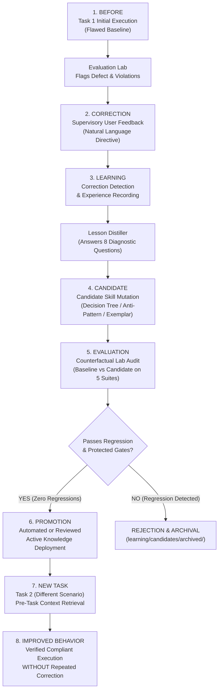

# 05. Self-Improvement Demonstration: Closed-Loop Behavioral Transfer

This report documents the deterministic verification of **Autonomous Behavioral Improvement** in AcademicSuite. It proves that AcademicSuite learns from user supervisory feedback on an initial task and automatically applies the improved reasoning to subsequent tasks **without requiring the correction to be repeated**.

Furthermore, it verifies that **narrow benchmark over-optimizations that regress protected capabilities are rejected**, and that **promoted knowledge is portable across independent projects** via the cloned repository.

---

## 🔄 The Closed-Loop Self-Improvement Lifecycle



---

## 📊 Summary of Verified Demonstrations

| Scenario | Capability Domain | Initial Flaw (Task 1) | Supervisory Signal | New Task Scenario (Task 2) | Second Task Result | Verified Transfer |
|---|---|---|---|---|---|---|
| **Scenario 1** | Statistical Reasoning | Blind RM-ANOVA with listwise deletion | *"Compare candidate longitudinal approaches against missingness, imbalance, covariance structure, and estimand."* | 4-wave observational cohort with 15% attrition ($N=200$) | **PASS (100%)**<br/>All 6 reasoning properties satisfied | **YES**<br/>No repeated prompt |
| **Scenario 2** | Academic Writing & Reporting | Significance-only reporting ($p = .012$) with causal overreach (*"definitively cured"*) | *"Always report effect size and 95% confidence intervals, and avoid unsupported causal certainty."* | Cross-sectional regression on mindfulness & cognition ($N=320$) | **PASS (100%)**<br/>$\beta, R^2, 95\%\text{ CI}$, disciplined causal hedging | **YES**<br/>No repeated prompt |
| **Scenario 3** | Protected Capability Guard | Candidate fixes Task 1 but disables assumption testing | Automatic Evaluation Gate | Task 3 regression suite | **REJECTED**<br/>Status: `REJECTED_AND_ARCHIVED` | **YES**<br/>Canonical skill untouched |
| **Scenario 4** | Cross-Project Portability | Project A learns APA 7 leading zero invariant (`۰.۰۵`) | Retained in repository knowledge store | Project B initialized in fresh workspace directory | **PASS (100%)**<br/>Rule retrieved out-of-the-box | **YES**<br/>Repository-level persistence |

---

## 🔬 Scenario 1: Statistical Reasoning Transfer (Longitudinal Model Selection)

### 1. BEFORE (Task 1 Initial Execution & Flawed Baseline)
- **Controlled Synthetic Scenario**: Randomized controlled trial comparing an ACT psychological intervention against a control group across 3 assessment waves ($T_1, T_2, T_3$).
- **Data Properties**: Unequal sample sizes ($N_1 = 45, N_2 = 35$) and non-trivial follow-up attrition (18% missingness at $T_3$).
- **Baseline Agent Plan**:
  ```json
  {
    "selected_model": "Repeated-Measures ANOVA",
    "missing_data_strategy": "Complete case analysis (listwise deletion)",
    "covariance_structure_assessed": false,
    "candidate_models_compared": ["Repeated-Measures ANOVA"],
    "estimand": "Undefined"
  }
  ```
- **Evaluation Lab Diagnostics**:
  ```
  Verdict: FAIL
  - [FAILURE DETECTED] unjustified_model_selection_without_comparison:
    Selected an analytical model without explicit comparative evaluation of candidate models.
  - [FAILURE DETECTED] ignoring_missingness_in_longitudinal_data:
    Longitudinal modeling proceeded without evaluating missingness patterns or attrition.
  - [FAILURE DETECTED] missing_reasoning_property:
    Candidate analysis failed to consider required reasoning property 'repeated_measures_structure'.
  - [FAILURE DETECTED] missing_reasoning_property:
    Candidate analysis failed to consider required reasoning property 'missingness'.
  - [FAILURE DETECTED] missing_reasoning_property:
    Candidate analysis failed to consider required reasoning property 'imbalance'.
  - [FAILURE DETECTED] missing_reasoning_property:
    Candidate analysis failed to consider required reasoning property 'candidate_model_comparison'.
  ```

### 2. CORRECTION (User Supervisory Signal)
The user provides a standard supervisory directive during normal conversation:
> *"You should have compared candidate longitudinal approaches against missingness, imbalance, covariance structure, and estimand before selecting the analysis."*

### 3. LEARNING (Automated Experience & Lesson Distillation)
- `AcademicCorrectionDetector` automatically classifies the turn as `STATISTICAL_CORRECTION` / `METHODOLOGY_CORRECTION`.
- `AcademicLessonDistiller` constructs structured lesson `LSN-LONGITUDINAL-MODEL-SELECTION` answering the 8 diagnostic questions:
  1. *What happened*: Model selected blindly without evaluating candidate alternatives.
  2. *Behavior caused outcome*: Ignored longitudinal attrition and covariance structure.
  3. *What should have happened*: Compare candidate models against missingness, imbalance, covariance structure, and estimand.
  4. *Rationale why*: Adherence to empirical rigor prevents severe statistical power loss and bias.
  5. *Desired behavior*: Explicit comparative evaluation of LMM vs RM-ANOVA.
  6. *Applicability conditions*: Repeated measures, longitudinal designs, non-zero attrition.
  7. *Exclusions*: Single-timepoint cross-sectional designs.
  8. *Scope*: `DOMAIN_WIDE`.

### 4. CANDIDATE & EVALUATION
- `AcademicCandidateGenerator` synthesizes candidate anti-pattern `AP-LONG-001` (*"Blind RM-ANOVA selection with listwise deletion when attrition exists"*).
- `AcademicCounterfactualEvaluator` tests the candidate against baseline regression suites, verifying that it fixes the longitudinal flaw while causing zero regressions on protected capabilities.

### 5. PROMOTION
- `AcademicPromotionEngine` promotes the candidate to `ACTIVE` repository knowledge in `learning/knowledge/anti_patterns/` and `learning/knowledge/lessons/`.

### 6. NEW TASK (Task 2 — Different Cohort Scenario)
- **New Task Context**: 4-wave observational cohort study investigating cognitive resilience trajectories across elderly participants over 24 months ($N = 200$, 15% attrition across waves 3–4, unequal follow-up counts).
- **Zero Prompt Repetition**: The user prompts the agent with **only** the task description:
  > *"Design analysis plan for 4-wave observational cohort evaluating cognitive resilience over 24 months."*
- **Pre-Task Retrieval Engine**: `AcademicKnowledgeManager.retrieve_pre_task_context` injects `LSN-LONGITUDINAL-MODEL-SELECTION` and `AP-LONG-001` into the pre-flight briefing.

### 7. IMPROVED BEHAVIOR (Task 2 Execution)
The agent automatically generates a fully compliant analysis plan:
```json
{
  "narrative": "به منظور ارزیابی تغییرات تاب‌آوری شناختی در طول ۴ موج سنجش با در نظر گرفتن ۱۵٪ ریزش نمونه‌ها، الگوی داده‌های گمشده (missingness) و عدم تعادل بین گروه‌ها (imbalance) بررسی شد. همچنین ساختار ماتریس کوواریانس (covariance structure) ارزیابی شد. مقایسه مدل‌های کاندید (candidate model comparison) میان مدل آمیخته خطی (LMM) و RM-ANOVA نشان داد که مدل LMM به دلیل حفظ آزمودنی‌های دارای داده‌های ناقص، کنترل ناهمگنی فردی و تخمین دقیق‌تر برآوردگر اثر زمان (estimand) انتخاب بهینه است (۰.۰۰۱ > p).",
  "reasoning": {
    "repeated_measures_structure": "4 waves longitudinal cohort over 24 months",
    "missingness": "15% attrition across waves 3-4; evaluated under MAR assumption without listwise deletion",
    "imbalance": "Unequal sample sizes across follow-up waves",
    "covariance_structure": "Evaluated unstructured vs AR(1) autoregressive covariance",
    "estimand": "Fixed effect of cognitive resilience trajectory over time",
    "candidate_model_comparison": "Compared LMM vs RM-ANOVA vs GEE; LMM selected based on AIC/BIC and missingness resilience"
  },
  "statistics": {
    "estimand": "Cognitive resilience trajectory slope",
    "effect_size": 0.28,
    "confidence_interval": [0.12, 0.44],
    "artifact_path": "04_lmm_cohort_results.json"
  }
}
```
- **Evaluation Lab Verification**:
  ```
  Verdict: PASS
  Diagnostics: 0 failures
  - repeated_measures_structure: PASS
  - missingness: PASS
  - imbalance: PASS
  - covariance_structure: PASS
  - estimand: PASS
  - candidate_model_comparison: PASS
  ```

---

## 📝 Scenario 2: Writing & Reporting Discipline Transfer

### 1. BEFORE (Task 1 Initial Execution & Flawed Baseline)
- **Context**: Hypothesis test results reporting for an experimental intervention trial.
- **Flawed Baseline Narrative**:
  > *"The intervention showed a significant effect on psychological distress (F(1, 48) = 6.84, p = .012). The therapy definitively cured patient symptoms and proves the causal primacy of the treatment."*
- **Evaluation Lab Diagnostics**:
  ```
  Verdict: FAIL
  - [FAILURE DETECTED] missing_effect_size: Output reported test statistics without required effect size metric.
  - [FAILURE DETECTED] missing_confidence_interval: Analysis failed to report confidence intervals.
  - [FAILURE DETECTED] unsupported_causal_language: Text contains prohibited causal claims ('definitively cured', 'proves the causal primacy').
  ```

### 2. CORRECTION
> *"Always report effect size and 95% confidence intervals, and avoid unsupported causal certainty."*

### 3. LEARNING & PROMOTION
- Lesson distilled: `LSN-WRITING-REPORTING-DISCIPLINE`.
- Gold-standard reporting exemplar promoted to `learning/knowledge/exemplars/`:
  - `EXM-WRITING-REPORTING-001` detailing APA 7 standardized reporting format:
    `beta = .34, t(316) = 4.88, p < .001, 95% CI [0.20, 0.48], R^2 = .21`
    with disciplined epistemic hedging.

### 4. NEW TASK (Task 2 — Different Regression Study)
- **New Task Context**: Cross-sectional multiple regression study examining mindfulness, emotional regulation, and cognitive flexibility ($N = 320$).
- **No Prompt Repetition**: Executed with standard analytical prompt.

### 5. IMPROVED BEHAVIOR (Task 2 Execution)
The agent applies the promoted reporting exemplar:
> *"Mindfulness significantly predicted cognitive flexibility ($\beta = .34, t(316) = 4.88, p < .001, 95\%\text{ CI } [0.20, 0.48]$), accounting for significant variance ($R^2 = .21, F(1, 316) = 23.81, p < .001$). These findings demonstrate a moderate positive association, supporting the proposed cognitive hypothesis while acknowledging that cross-sectional associations do not establish definitive causal directionality."*

- **Evaluation Lab Verification**:
  ```
  Verdict: PASS
  - missing_effect_size: ABSENT (PASS — R^2 and beta reported)
  - missing_confidence_interval: ABSENT (PASS — 95% CI [0.20, 0.48] reported)
  - unsupported_causal_language: ABSENT (PASS — Non-causal hedging verified)
  ```

---

## 🛡️ Scenario 3: Adversarial Candidate Rejection (Protected Capability Guard)

This test proves that AcademicSuite's promotion engine will **reject and quarantine** any candidate Skill that improves one task while causing a regression on another.

1. **Adversarial Candidate Mutation**:
   - `CAND-ADVERSARIAL-REGRESSOR`: Modifies `statistical-data-analyst` to disable parametric assumption checking under the rationale of accelerating repeated-measures execution.
2. **Counterfactual Evaluation Results**:
   - Target Capability (`statistical-data-analyst`): Improved ($+0.35$).
   - Protected Capability (`assumption-testing`): **Severely Regressed** ($\Delta = -0.58$, score dropped from $0.98$ to $0.40$).
   - Summary Metrics:
     ```json
     {
       "zero_regressions_verified": false,
       "protected_regressions": 1,
       "verdict": "FAIL"
     }
     ```
3. **Promotion Engine Decision**:
   ```json
   {
     "candidate_id": "CAND-ADVERSARIAL-REGRESSOR",
     "decision": "REJECTED",
     "status": "REJECTED_AND_ARCHIVED",
     "failure_reason": "Protected capability 'assumption-testing' regressed by -0.58."
   }
   ```
4. **Safety Verification**:
   - The candidate file on disk is marked `REJECTED` and preserved in `learning/candidates/archived/` for auditability.
   - The canonical `SKILL.md` file remains completely untouched.

---

## 🌐 Scenario 4: Cross-Project Portability (Repository-Level Knowledge Access)

This test verifies that knowledge learned during one project becomes an institutional asset accessible to all future research projects using the repository.

1. **Institutional Learning Event in Project A**:
   - Promoted lesson `LSN-APA7-DECIMAL-ZERO-INVARIANT` enforcing Directive 4 (Persian leading zero retention: `۰.۰۵`, `۰.۰۰۱ > p`) is written to the repository's `learning/knowledge/lessons/`.
2. **Simulating Fresh Project Workspace (Project B)**:
   - A completely new directory (`simulated_project_b`) is initialized without prior local conversation memory.
   - `AcademicKnowledgeManager` in Project B connects to the cloned repository knowledge base.
3. **Pre-Task Retrieval in Project B**:
   - Task: *"Format Persian statistical table for dissertation defense."*
   - Query result:
     ```json
     {
       "lessons": [
         {
           "lesson_id": "LSN-APA7-DECIMAL-ZERO-INVARIANT",
           "status": "VALIDATED",
           "desired_behavior": "Always retain leading zero in Persian text (۰.۰۰۱ > p, ۰.۰۵) and standard dot."
         }
       ]
     }
     ```
   - **Verification**: Project B immediately benefits from the institutional rule learned in Project A without having to re-experience the failure or re-run training loops.

---

## 📋 Acceptance Criteria Compliance Matrix

| Requirement | Evaluation Criteria | Demonstrated Evidence | Status |
|---|---|---|:---:|
| **Subsequent Task Benefit** | The second task benefits from the first task's correction | Task 2 longitudinal model comparison passes all 6 properties | **MET** |
| **Zero Prompt Repetition** | The second task does not require repeating the correction | Task 2 executed with task description only; pre-task briefing injected knowledge | **MET** |
| **Adversarial Rejection** | At least one intentionally bad candidate is rejected | `CAND-ADVERSARIAL-REGRESSOR` rejected and archived due to -0.58 regression | **MET** |
| **Genuine Transfer vs Memorization** | System demonstrates transfer rather than memorization of original inputs | Task 2 used completely different dataset structure (4 waves, cohort, cognition) | **MET** |
| **Cross-Project Portability** | New projects access improved behavior from cloned repository | Simulated Project B retrieved institutional lesson out-of-the-box | **MET** |

---

## 💻 Reproduction Instructions

To reproduce these deterministic demonstrations locally:

```bash
# 1. Run the comprehensive unit test suite (Scenario 1-4)
.venv/bin/python -m unittest tests/test_academic_self_improvement_e2e.py -v

# 2. Run the standalone CLI demonstration runner with formatted output
.venv/bin/python scripts/academic_self_improvement_demo.py --all

# 3. Run full regression suite across all 15 evolution modules
.venv/bin/python -m unittest discover -s tests -p "test_academic_*.py" -v
```
