# AcademicSuite Target Dependency Graph & Invocation Topology (06_TARGET_DEPENDENCY_GRAPH.md)

**Document Version:** 1.0.0  
**Status:** AUTHORITATIVE SPECIFICATION  
**Operative Temporal Reality:** 2026 (1405 SH)  

---

## 1. High-Level Invocation Tree (Strict Directed Acyclic Graph)

The target architecture replaces the tangled mesh of the baseline with a strict, directed, bounded invocation tree. Subagents cannot invoke durable agents, and circular handoff loops are eliminated.

```mermaid
flowchart TD
    %% Layer 1: Durable Principal & Conductor
    DS["digital-saber\n(Principal Authority / Digital Twin)"] --> AO["academic-orchestrator\n(Master Execution Conductor)"]

    %% Conductor delegates to Domain Authorities
    AO --> ME["methodology-expert\n(Research Design Authority)"]
    AO --> SE["statistical-expert\n(Statistical Modeling Authority)"]
    AO --> AW["academic-writer\n(Drafter & Rhetoric Authority)"]
    AO --> EA["evidence-auditor\n(Epistemic Integrity Authority)"]
    AO --> FJ["final-judge\n(Defense Committee Simulator)"]

    %% Methodology Expert Sub-tree
    ME --> RA["research-agent\n(Empirical Lit Extraction)"]
    ME --> LE["literature-expert\n(Database Harvest & Science Mapping)"]
    ME --> MA["meta-analyst\n(PRISMA & Meta-Analysis)"]
    ME --> QA["qualitative-analyst\n(Thematic & Grounded Theory)"]
    ME --> PE["psychometric-expert\n(Scale Validation & CTT/IRT)"]
    ME --> LME["longitudinal-modmed-expert\n(3-Wave Longitudinal SEM)"]
    ME --> ID["intervention-designer\n(Clinical & Protocol Builder)"]
    ME --> AC1["academic-challenger\n(Design Vulnerability Stress-Tester)"]

    %% Statistical Expert Sub-tree
    SE --> DA["data-agent\n(Ingestion & Scale Scoring)"]
    SE --> DC["data-curator\n(Outlier Screening & Imputation)"]
    SE --> SA["statistics-agent\n(Deterministic Script Runner)"]
    SE --> SAU["statistical-auditor\n(Assumptions, df & MSAI Critic)"]
    SE --> AC2["academic-challenger\n(Statistical Assumption Stress-Tester)"]

    %% Academic Writer Sub-tree
    AW --> JS["journal-strategist\n(Publication Packaging)"]
    AW --> RAU["results-auditor\n(APA 7 & OMML Equation Critic)"]
    AW --> VA1["validation-agent\n(Deterministic Artifact Validator)"]

    %% Evidence Auditor Sub-tree
    EA --> RA2["research-agent\n(Citation Verification Extraction)"]
    EA --> LE2["literature-expert\n(DOI & CrossRef Reconciliation)"]
    EA --> VA2["validation-agent\n(Cross-Chapter Reference Auditor)"]

    %% Final Judge Sub-tree
    FJ --> EA_LINK["evidence-auditor\n(Epistemic Clearance)"]
    FJ --> SAU_LINK["statistical-auditor\n(Statistical Clearance)"]
    FJ --> RAU_LINK["results-auditor\n(Formatting Clearance)"]
    FJ --> AC3["academic-challenger\n(Harsh Viva Voce Cross-Examiner)"]
```



---

## 2. Inbound & Outbound Invocation Specifications

### 2.1 Durable Agent Invocation Boundaries

| Caller (Agent) | Permitted Outbound Callee Subagents | Prohibited Invocations | Return Payload / Deliverable |
| :--- | :--- | :--- | :--- |
| **`digital-saber`** | `academic-orchestrator` | Must NEVER invoke specialist subagents directly; all work breaks through the conductor. | High-level project brief, pricing quote, executive approval card. |
| **`academic-orchestrator`** | `methodology-expert`, `statistical-expert`, `academic-writer`, `evidence-auditor`, `final-judge` | Must NEVER invoke execution subagents directly (`statistics-agent`, `data-agent`, etc.); delegates to domain authorities. | Context Delegation Envelope, stage execution manifest. |
| **`methodology-expert`** | `research-agent`, `literature-expert`, `meta-analyst`, `qualitative-analyst`, `psychometric-expert`, `longitudinal-modmed-expert`, `intervention-designer`, `academic-challenger` | Cannot invoke data cleaning or drafting subagents. | Research design blueprint, G*Power sampling report (`analysis_plan.json`). |
| **`statistical-expert`** | `data-agent`, `data-curator`, `statistics-agent`, `statistical-auditor`, `academic-challenger` | Cannot invoke literature searchers or narrative drafters. | Statistical model configuration, assumption audit payload. |
| **`academic-writer`** | `journal-strategist`, `results-auditor`, `validation-agent` | Cannot invoke raw statistical script runners or data cleaners. | Synchronized chapter triads (`.docx`, `.md`, `.json`). |
| **`evidence-auditor`** | `research-agent`, `literature-expert`, `validation-agent` | Cannot invoke statistical modeling agents. | Citation resolution ledger, Irandoc similarity certificate. |
| **`final-judge`** | `evidence-auditor`, `statistical-auditor`, `results-auditor`, `academic-challenger` | Cannot invoke generators (`academic-writer`, `statistics-agent`). | Viva Voce interrogation dossier, defense readiness index. |

---

## 3. Documented Refinements to the User's Recommended Graph

The baseline audit confirmed the user's recommended hierarchy with four necessary domain refinements:

### Refinement 1: Placement of `meta-analyst` and `qualitative-analyst` under `methodology-expert`
- **User Hypothesis**: Subagents were listed without explicit parent assignment.
- **Resolution**: Both roles represent foundational empirical research designs. `methodology-expert` is the natural authority governing qualitative thematic designs and quantitative PRISMA meta-analyses.

### Refinement 2: Placement of `data-curator` alongside `data-agent` under `statistical-expert`
- **Resolution**: `data-curator` is a specialized data hygiene worker focusing on multivariate outlier detection (Mahalanobis $D^2$, Cook's distance) and Little's MCAR patterns. It operates directly under `statistical-expert` alongside `data-agent`.

### Refinement 3: Placement of `journal-strategist` under `academic-writer`
- **Resolution**: `journal-strategist` packages completed thesis chapters into target journal formats (Scopus/WoS), cover letters, and author responses. It directly consumes drafts from `academic-writer`.

### Refinement 4: The Cross-Cutting Role of `academic-challenger`
- **Resolution**: `academic-challenger` serves as an adversarial stress-tester. While its primary parent is `final-judge` (for oral defense cross-examination), it can also be invoked as a critic by `methodology-expert` (to challenge research designs) and `statistical-expert` (to attack marginal statistical effects).

---

## 4. Elimination of Circular Loops & Broken Paths

### 4.1 Resolution of `academic-orchestrator` $\rightleftarrows$ `validation-agent` Loop
- **Legacy Issue**: `validation-agent` handed off directly back to `academic-orchestrator`, creating a potential infinite loop if tests failed.
- **Target Resolution**:
  - `validation-agent` reports strictly to `academic-writer`.
  - If validation returns `FAIL`, `academic-writer` must resolve the discrepancies before reporting stage completion to `academic-orchestrator`.
  - The return path is strictly data-driven via `validation_report.json` with a maximum retry ceiling (`max_retries = 2`).

### 4.2 Decoupling of Verification Quad from Conductor
- Conductor (`academic-orchestrator`) does not poll individual critics.
- Critics (`results-auditor`, `statistical-auditor`, `evidence-auditor`) are dispatched by their respective Domain Authorities or by `final-judge`, consolidating feedback into structured audit cards before reaching the conductor.

---

## 5. End-to-End Micro-Stage Dataflow Pipeline

```
[Stage 4.0: Data Ingestion & Curation]
  statistical-expert ──► data-agent ──► python3 clean_dataset.py
  Output: data_cleaned.xlsx + data_quality.json
       │
       ▼
[Stage 4.3: Parametric Assumptions]
  statistical-expert ──► statistical-auditor ──► python3 verify_assumptions.py
  Output: 03_parametric_assumptions.json + .md + .docx
       │
       ▼
[Stage 4.5: Macro Model Estimation]
  statistical-expert ──► statistics-agent ──► python3 run_sem.py / psychology_stats.py
  Output: stats_results.json + 05_macro_model triads
       │
       ▼
[Stage 4.6.1: Hypothesis 1 Testing & Narrative]
  academic-writer ──► python3 generate_apa_docx.py
  Output: 06_hypothesis_1.docx + 06_hypothesis_1.md + 06_hypothesis_1.json
       │
       ├─► results-auditor (APA 7 & leading zero verification)
       └─► statistical-auditor (df and parameter concordance check)
       │
       ▼
[Stage 4.10: Master Chapter Validation Sweep]
  academic-writer ──► validation-agent ──► python3 run_all_validators.py
  Output: validation_report.json (overall_verdict: PASS)
       │
       ▼
[Stage 4.11: Chapter Assembly]
  academic-orchestrator ──► python3 compile_full_thesis.py
  Output: Chapter_4_Results.docx + Chapter_4_Results.md
       │
       ▼
[Stage 4.12: Viva Voce Defense Clearance]
  final-judge ──► academic-challenger (10 defense traps & cross-examination)
  Output: 06_defense_committee_simulation.docx + Defense Readiness >= 95%
       │
       ▼
[Human Approval Gate (decisions.json)]
  digital-saber (Admin Desk Clearance) ──► Deliverable Release to Client
```
