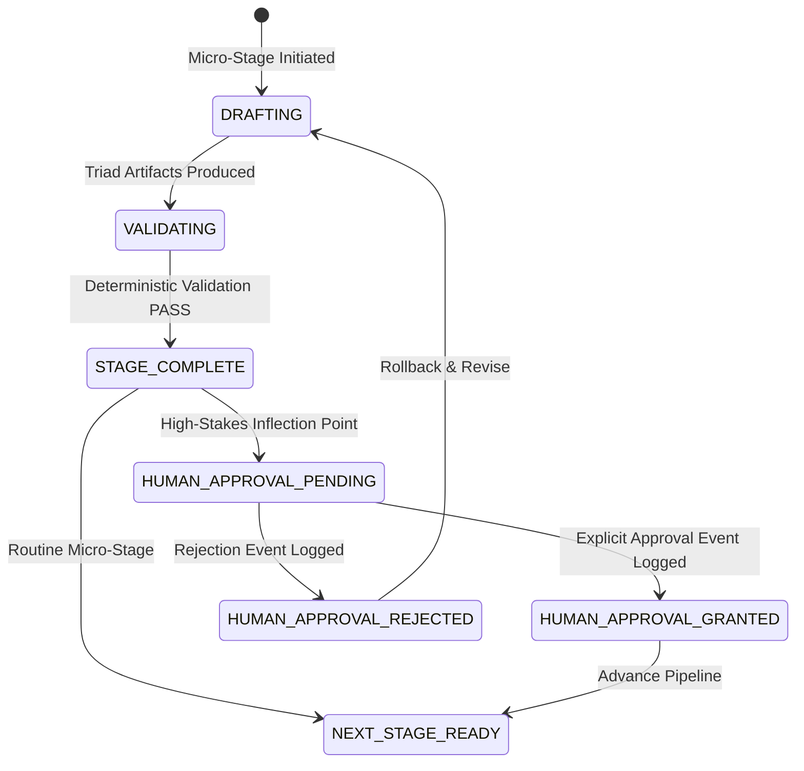

# AcademicSuite Tool, Permission & Sandboxing Matrix (07_TOOL_AND_PERMISSION_MATRIX.md)

**Document Version:** 1.0.0  
**Status:** AUTHORITATIVE SPECIFICATION  
**Operative Temporal Reality:** 2026 (1405 SH)  

---

## 1. Principles of Least Privilege & Security Topology

In Google Antigravity, agent capabilities are strictly bounded by declarative YAML frontmatter. If an agent does not explicitly declare a tool in its `tools: [...]` array, it cannot execute that tool.

### Four Permission Tiers:
1. **Tier 1 (Master Conductor & Principal)**:
   - Full orchestration permissions (`invoke_subagent`, `manage_subagents`, `send_message`, `ask_question`).
   - File authoring and deterministic CLI tool execution.
2. **Tier 2 (Durable Domain Authorities)**:
   - Subagent invocation permissions scoped strictly to their allowed subagent tree.
   - File modification and command execution for domain scripts.
3. **Tier 3 (Execution & Drafting Subagents)**:
   - Zero agent invocation permissions.
   - File creation and deterministic CLI execution (`run_command`, `write_to_file`).
4. **Tier 4 (Pure Adversarial Critics & Read-Only Workers)**:
   - Zero command execution permissions (or limited to validator runners).
   - Zero file replacement on deliverables (may only write audit/QC reports).

---

## 2. Authoritative Permission Matrix (22 Roles)

| Role Name | Category | Model | mainAgent | subagent | Modify Files | Run Command | Invoke Subagents | Whitelisted Tools |
| :--- | :--- | :---: | :---: | :---: | :---: | :---: | :---: | :--- |
| **`digital-saber`** | Durable Agent | `pro` | True | False | ✅ | ✅ | ✅ | `invoke_subagent`, `manage_subagents`, `send_message`, `view_file`, `list_dir`, `grep_search`, `find_by_name`, `write_to_file`, `run_command`, `ask_question` |
| **`academic-orchestrator`** | Durable Agent | `pro` | True | False | ✅ | ✅ | ✅ | `invoke_subagent`, `manage_subagents`, `send_message`, `view_file`, `list_dir`, `grep_search`, `find_by_name`, `write_to_file`, `run_command`, `ask_question` |
| **`methodology-expert`** | Durable Agent | `pro` | True | False | ✅ | ✅ | ✅ | `invoke_subagent`, `manage_subagents`, `send_message`, `view_file`, `list_dir`, `grep_search`, `find_by_name`, `write_to_file`, `run_command` |
| **`statistical-expert`** | Durable Agent | `pro` | True | False | ✅ | ✅ | ✅ | `invoke_subagent`, `manage_subagents`, `send_message`, `view_file`, `list_dir`, `grep_search`, `find_by_name`, `write_to_file`, `run_command` |
| **`academic-writer`** | Durable Agent | `pro` | True | False | ✅ | ✅ | ✅ | `invoke_subagent`, `manage_subagents`, `send_message`, `view_file`, `list_dir`, `grep_search`, `find_by_name`, `write_to_file`, `replace_file_content`, `run_command` |
| **`evidence-auditor`** | Durable Agent | `pro` | True | False | ✅ | ✅ | ✅ | `invoke_subagent`, `manage_subagents`, `send_message`, `view_file`, `list_dir`, `grep_search`, `find_by_name`, `write_to_file`, `run_command` |
| **`final-judge`** | Durable Agent | `pro` | True | False | ✅ | ✅ | ✅ | `invoke_subagent`, `manage_subagents`, `send_message`, `view_file`, `list_dir`, `grep_search`, `find_by_name`, `write_to_file`, `run_command` |
| **`research-agent`** | Subagent | `flash` | False | True | ✅ | ✅ | ❌ | `view_file`, `list_dir`, `grep_search`, `find_by_name`, `write_to_file`, `run_command` |
| **`literature-expert`** | Subagent | `flash` | False | True | ✅ | ✅ | ❌ | `view_file`, `list_dir`, `grep_search`, `find_by_name`, `write_to_file`, `run_command` |
| **`journal-strategist`** | Subagent | `pro` | False | True | ✅ | ✅ | ❌ | `view_file`, `list_dir`, `grep_search`, `find_by_name`, `write_to_file`, `run_command` |
| **`meta-analyst`** | Subagent | `flash` | False | True | ✅ | ✅ | ❌ | `view_file`, `list_dir`, `grep_search`, `find_by_name`, `write_to_file`, `run_command` |
| **`data-agent`** | Subagent | `flash` | False | True | ✅ | ✅ | ❌ | `view_file`, `list_dir`, `grep_search`, `find_by_name`, `write_to_file`, `run_command` |
| **`data-curator`** | Subagent | `flash` | False | True | ✅ | ✅ | ❌ | `view_file`, `list_dir`, `grep_search`, `find_by_name`, `write_to_file`, `run_command` |
| **`statistics-agent`** | Subagent | `flash` | False | True | ✅ | ✅ | ❌ | `view_file`, `list_dir`, `grep_search`, `find_by_name`, `write_to_file`, `run_command` |
| **`psychometric-expert`**| Subagent | `flash` | False | True | ✅ | ✅ | ❌ | `view_file`, `list_dir`, `grep_search`, `find_by_name`, `write_to_file`, `run_command` |
| **`longitudinal-modmed-expert`** | Subagent | `flash` | False | True | ✅ | ✅ | ❌ | `view_file`, `list_dir`, `grep_search`, `find_by_name`, `write_to_file`, `run_command` |
| **`intervention-designer`**| Subagent | `pro` | False | True | ✅ | ❌ | ❌ | `view_file`, `list_dir`, `grep_search`, `find_by_name`, `write_to_file` |
| **`qualitative-analyst`**| Subagent | `pro` | False | True | ✅ | ✅ | ❌ | `view_file`, `list_dir`, `grep_search`, `find_by_name`, `write_to_file`, `run_command` |
| **`validation-agent`** | Subagent | `flash` | False | True | ✅ | ✅ | ❌ | `view_file`, `list_dir`, `grep_search`, `find_by_name`, `write_to_file`, `run_command` |
| **`results-auditor`** | Subagent | `flash` | False | True | ✅ | ❌ | ❌ | `view_file`, `list_dir`, `grep_search`, `find_by_name`, `write_to_file` |
| **`statistical-auditor`**| Subagent | `flash` | False | True | ✅ | ✅ | ❌ | `view_file`, `list_dir`, `grep_search`, `find_by_name`, `write_to_file`, `run_command` |
| **`academic-challenger`**| Subagent | `pro` | False | True | ✅ | ❌ | ❌ | `view_file`, `list_dir`, `grep_search`, `find_by_name`, `write_to_file` |

---

## 3. Sandboxing & Operational Boundaries

### 3.1 Raw Data Immutability Policy
- Any file in a path containing `01_raw_inputs/`, `raw/`, `raw_data/`, or matching `raw.xlsx`, `raw.csv`, `raw.sav` is **strictly immutable**.
- Tools `write_to_file` and `replace_file_content` targeting these paths are blocked by the PreToolUse hook.
- Subagents (e.g. `data-agent`) must write transformed datasets to distinct files (e.g. `data_cleaned.xlsx`, `data_scored.xlsx`).

### 3.2 English-Only ASCII Filename Standard (Directive 6)
- File paths containing characters with code points $> 127$ are blocked mechanically in `PreToolUse`.
- All generated artifacts on disk must match `^[a-zA-Z0-9_.-]+$`.

### 3.3 Command Execution Sandboxing
- Only deterministic python and R scripts in `.agents/skills/<skill>/scripts/`, `scripts/`, `validators/`, or `factory/` may be executed.
- Destructive shell operations (`rm -rf`, disk wipes, git force pushes) are rejected by the hook guard.

---

## 4. Human Approval State Machine vs. Hook Architecture

A major architectural principle of the target architecture is that **Human Approval is represented as an explicit State and Event model, rather than an interactive Stop-hook block**.



### State-Event Implementation Details:
1. **Event Recording**: When `digital-saber` or `academic-orchestrator` reaches an approval gate (pricing, supervisor override, dissertation release), it writes an auditable event to `academic-state/decisions.json`:
   ```json
   {
     "event": "APPROVAL_REQUESTED",
     "category": "dissertation_release",
     "target_artifact": "Chapter_4_Results.docx",
     "status": "PENDING",
     "timestamp": "2026-09-18T07:45:00Z"
   }
   ```
2. **Interactive Stage-Gate Protocol (Directive 11)**: The agent emits the Stage Completion Report and halts its turn cleanly, prompting the user for approval.
3. **No Reactive Stop Loops**: The `Stop` lifecycle hook does NOT spin or poll. It simply inspects that any released master deliverable has a corresponding `APPROVAL_GRANTED` entry logged on disk before allowing execution to complete.
