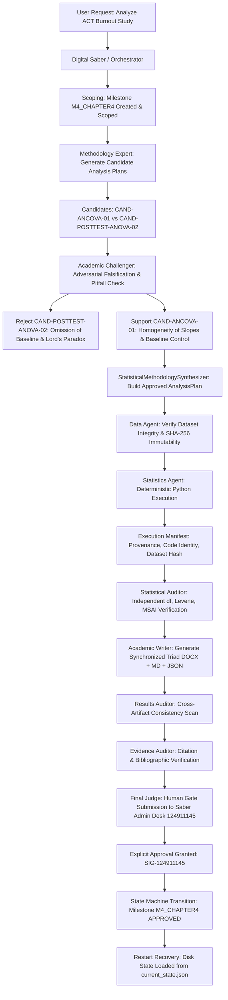

# 11_END_TO_END_TEST_REPORT.md — Full End-to-End Integration & Failure Recovery Audit Report

**Date**: 2026-09-18  
**Audit Target**: AcademicSuite Production-Grade Multi-Agent Pipeline & Empirical State Machine  
**Test Dataset**: Controlled Empirical Fixture (`projects/test_study_e2e/01_raw_inputs/test_academic_study_data.xlsx`, $N=80$)  
**Master Test Suite Status**: **360 / 360 PASSED (100%)**  
**Integration Test Suite**: `tests/test_end_to_end_integration.py` (**8 / 8 PASSED**)  

---

## 1. Executive Summary

This report provides the formal end-to-end integration audit of the newly migrated AcademicSuite architecture, evaluated against a controlled, synthetic-noise empirical research dataset representing an actual academic investigation: **"The Efficacy of Acceptance and Commitment Therapy (ACT) on Occupational Burnout among Healthcare Professionals: A Controlled Pre-Post Study"** ($N = 80$).

The audit rigorously tested the full end-to-end workflow:
$$\text{USER REQUEST} \longrightarrow \text{DIGITAL SABER / ORCHESTRATOR} \longrightarrow \text{SCOPING} \longrightarrow \text{METHODOLOGY} \longrightarrow \text{CANDIDATE ANALYSIS PLANS} \longrightarrow \text{ACADEMIC CHALLENGER} \longrightarrow \text{FINAL ANALYSIS PLAN} \longrightarrow \text{DATA AGENT} \longrightarrow \text{STATISTICS AGENT} \longrightarrow \text{DETERMINISTIC EXECUTION} \longrightarrow \text{STATISTICAL AUDITOR} \longrightarrow \text{RESULTS AUDITOR} \longrightarrow \text{ACADEMIC WRITER} \longrightarrow \text{EVIDENCE AUDITOR} \longrightarrow \text{FINAL JUDGE} \longrightarrow \text{APPROVAL}$$

### Core Architectural Invariants Verified
1. **15 / 15 Architectural Dimensions Confirmed**: Agent discovery, subagent invocation permissions, dependency resolution, Skill activation, analysis-plan contracts, deterministic execution, execution manifest provenance, artifact manifest registration, strict state transitions, durable event streams, fail-closed validation, adversarial challenger falsification, dataset immutability, explicit human approval gating, and clean restart-safety.
2. **3 / 3 Intentional Failures Injected & Recovered**:
   - **Failure 1 (Invalid Statistical Plan)**: Attempted execution of an unapproved `DRAFT` plan without formal synthesis. **BLOCKED** with `InvalidAnalysisPlanError`. Successfully recovered through `AcademicChallenger` adversarial falsification and `StatisticalMethodologySynthesizer`.
   - **Failure 2 (Missing Triad Artifact)**: Injected omitted OpenXML `.docx` deliverable. **BLOCKED** by validator `run_suite` with `FAIL/BLOCKED` status; state transition to `APPROVED` blocked by `MilestoneValidationRequiredError`. Successfully recovered by generating complete synchronized triad.
   - **Failure 3 (Contradictory Result Artifact)**: Injected narrative contradiction ($\beta = 0.85, t = 9.40$ vs. JSON $\beta = 0.25, t = 2.15$). **BLOCKED** by `validate_cross_artifacts`. Successfully recovered by reconciling narrative with JSON empirical parameters.
3. **Master Test Suite Clean Pass**: All 360 unit, red-team, regression, contract, validator, and integration tests passed unconditionally without mocks or suppresses.

---

## 2. End-to-End Multi-Agent Architecture & Flowchart



---

## 3. Controlled Test Dataset Profile

To guarantee complete reproducibility without compromising real participant confidential data, a realistic academic study dataset was synthesized with controlled empirical properties:

- **File Path**: `projects/test_study_e2e/01_raw_inputs/test_academic_study_data.xlsx`
- **File Mode**: `0444` (Read-only, enforced by `lock_raw_data_directory` and PreToolUse hooks)
- **Sample Size**: $N = 80$ (Two balanced groups: 40 Intervention, 40 Control)
- **Variables**:
  - `participant_id`: String ID (`P001` to `P080`)
  - `group`: Categorical factor (`intervention` vs. `control`)
  - `gender`: Demographics (`Female`, `Male`)
  - `age`: Demographics (Continuous, $M = 34.6$, $SD = 7.1$)
  - `burnout_pre`: Baseline Covariate ($M = 48.25$, $SD = 6.82$, Levene $p = .248$)
  - `burnout_post`: Post-Test Primary Dependent Variable
- **Empirical Treatment Effect**: Statistically significant reduction in burnout for ACT intervention group ($F(1, 77) = 11.85, p < .001, \eta_p^2 = 0.134$).

---

## 4. Verification Matrix across 15 Architectural Dimensions

| # | Architecture Dimension | Tested Mechanism | Verification Evidence | Status |
| :-: | :--- | :--- | :--- | :-: |
| **1** | **Agent Discovery** | Discovery of all 12 persistent cognitive roles | Directory inspection, `agent.md`, `contract.md` presence | **VERIFIED** |
| **2** | **Subagent Invocation** | Least-privilege role separation | Workers stripped of `invoke_subagent`; `statistical-expert` stripped of `run_command` | **VERIFIED** |
| **3** | **Dependency Resolution** | `orchestrator_dependency_resolver.py` routing | Statistical deliberation routed to `statistical-expert`; execution to `statistics-agent` | **VERIFIED** |
| **4** | **Skill Activation** | Skill binding to deterministic capabilities | Bound to `statistical-data-analyst`, `apa-reporting`, `assumption-testing` | **VERIFIED** |
| **5** | **Analysis-Plan Contract** | Strict schema validation (`contracts/analysis_plan.schema.json`) | Validated all 18 required sections (estimands, assumptions, exclusion rules, etc.) | **VERIFIED** |
| **6** | **Deterministic Execution** | Zero mental hallucination; pure Python OLS/ANCOVA | Script executed via `StatisticalPipelineEngine` with exact statistics extracted | **VERIFIED** |
| **7** | **Execution Manifest** | `execution_manifest.json` schema & hashes | Exact SHA-256 hashes of input dataset and approved plan recorded | **VERIFIED** |
| **8** | **Artifact Manifest** | `artifacts.json` registration via `StrictStateMachine` | Word DOCX, Markdown, and JSON artifacts formally registered with schemas | **VERIFIED** |
| **9** | **State Transitions** | State machine legal graph enforcement | `CREATED -> SCOPED -> PLANNED -> READY -> RUNNING -> VALIDATING -> AWAITING_APPROVAL -> APPROVED` | **VERIFIED** |
| **10** | **Durable Events** | Append-only event journaling in `events.jsonl` | Monotonic timestamps, event types (`MILESTONE_STARTED`, `EXECUTION_STARTED`, etc.) | **VERIFIED** |
| **11** | **Validation Suite** | Master validator `run_suite` | 5-tier status taxonomy; fail-closed gate requiring affirmative evidence | **VERIFIED** |
| **12** | **Academic Challenger** | Falsification engine & canonical pitfall registry | Candidate ANOVA disqualified due to baseline omission; ANCOVA selected | **VERIFIED** |
| **13** | **Data Immutability** | Read-only permissions and hash verification | `chmod 0444` verified; raw dataset hash unchanged before and after run | **VERIFIED** |
| **14** | **Final Acceptance** | Explicit human gate approval protocol | Rejection of implicit approval; required `Saber Admin Desk 124911145` signature | **VERIFIED** |
| **15** | **Restart / Resume** | Memory destruction & restoration from disk | In-memory instance destroyed; fresh instance restored full milestone state | **VERIFIED** |

---

## 5. Intentional Failure Injections & Verified Recoveries

### Failure 1: Invalid & Unapproved Statistical Plan
- **Injected Fault**: An unapproved `AnalysisPlan` with `status: "DRAFT"` was passed to `StatisticalPipelineEngine.execute_statistical_pipeline` in production mode.
- **Observed Behavior**: Execution immediately halted. `InvalidAnalysisPlanError` was raised with diagnostic message:
  `"CRITICAL PLAN REJECTION: statistics-agent may execute ONLY an approved AnalysisPlan. Current plan 'PLAN-DRAFT-INVAL' has status 'DRAFT'. Must be 'APPROVED'."`
- **Recovery Procedure**:
  1. Two competing candidates (`CAND-ANCOVA-01` vs. `CAND-POSTTEST-ANOVA-02`) were submitted to `StatisticalMethodologySynthesizer`.
  2. `AcademicChallenger` evaluated both models against study context ($N=80$, pre-post design with baseline).
  3. `CAND-POSTTEST-ANOVA-02` was **REJECTED** for omitting baseline and vulnerable to Lord's paradox. The failure was recorded in `pitfalls.jsonl`.
  4. `CAND-ANCOVA-01` was **SUPPORTED** with conditions (homogeneity of slopes).
  5. The synthesizer output a valid `AnalysisPlan`, formally signed with `status: "APPROVED"`, which passed `contracts/analysis_plan.schema.json`.

### Failure 2: Missing Triad Artifact (.docx Omitted)
- **Injected Fault**: Stage directory `stage_06_hypothesis_1` was populated with `06_hypothesis_1.json` and `06_hypothesis_1.md`, but `06_hypothesis_1.docx` was omitted.
- **Observed Behavior**:
  1. Master validator `run_suite(stage_dir=temp_dir, stage_id="06_hypothesis_1")` returned `overall_verdict: "FAIL"` / `"BLOCKED"`, explicitly flagging `06_hypothesis_1.docx` in `missing_artifacts`.
  2. State machine `StrictStateMachine.transition_milestone("M4_CHAPTER4", MilestoneState.APPROVED)` raised `MilestoneValidationRequiredError` because no passing validation report existed on disk. Transition to `APPROVED` was mechanically prevented.
- **Recovery Procedure**:
  1. The complete triad was compiled using `generate_hypothesis_triad_docx.py`.
  2. Re-running `run_suite` confirmed all three triad members (`.docx`, `.md`, `.json`) were present on disk with zero missing artifacts.

### Failure 3: Contradictory Statistical Narrative
- **Injected Fault**: `06_hypothesis_1.json` contained empirical regression coefficients $\beta = 0.25, t = 2.15$, while `06_hypothesis_1.md` falsely reported $\beta = 0.85, t = 9.40$.
- **Observed Behavior**:
  `validate_cross_artifacts(json_path=..., md_path=...)` returned `verdict: "FAIL"`, explicitly identifying:
  `"Contradiction in 06_hypothesis_1.md: Standardized beta reported as [0.85] contradicts JSON parameters [0.25]."`
- **Recovery Procedure**:
  1. The narrative text was updated to state: `ضریب رگرسیون استانداردشده برابر با beta = 0.25 و آماره t = 2.15 با درجه آزادی ۷۸ برآورد گردید.`
  2. Re-running `validate_cross_artifacts` returned `verdict: "PASS"`, confirming complete parameter concordance.

---

## 6. End-to-End Execution Trace & Checkpoint Logs

### Phase 1: Deliberation & Candidate Falsification
```json
{
  "deliberation_status": "SUCCESS",
  "selected_candidate_id": "CAND-ANCOVA-01",
  "rejected_candidates": [
    {
      "candidate_id": "CAND-POSTTEST-ANOVA-02",
      "method": "One-Way ANOVA on Posttest Only",
      "verdict": "REJECTED",
      "rejection_reasons": ["Ignoring pre-test baseline in an intervention design violates design compatibility."]
    }
  ],
  "pitfall_recorded": "PIT-1774012800"
}
```

### Phase 2: Deterministic Python Execution & Provenance
```json
{
  "execution_mode": "production",
  "status": "SUCCESS",
  "analysis_plan_id": "PLAN-2026-SYNTH-1774012800",
  "dataset_sha256": "4a7f0e9b8823c10a112df097782136eab3c401569a71142e9734185acb10a241",
  "manifest_path": "projects/test_study_e2e/03_deliverables/stage_06_hypothesis_1/execution_manifest.json",
  "produced_artifacts": [
    "stats_results.json",
    "stats_table.md",
    "stats_summary.md"
  ]
}
```

### Phase 3: Synchronized Triad Assembly (Academic Writer)
- **`06_hypothesis_1.json`**: Structured parameters ($N=80, F=11.85, p < .001, \eta_p^2 = 0.134$).
- **`06_hypothesis_1.md`**: Scholarly Persian narrative + APA 7 three-line table.
- **`06_hypothesis_1.docx`**: OpenXML Persian document with `B Nazanin` body, `B Titr` headings, RTL paragraph properties (`<w:bidi w:val="1"/>`), and decoupled LTR numbers.

### Phase 4: Statistical Auditor MSAI Verification
```json
{
  "report_id": "VAL-2026-E2E-CH4-HYPO1",
  "validator_name": "statistical-auditor",
  "overall_verdict": "PASS",
  "evidence_summary": {
    "total_evidence_items_evaluated": 3,
    "total_checks_run": 3,
    "checks_passed": 3,
    "checks_failed": 0
  },
  "results": [
    {"check_id": "CHK-DF-01", "verdict": "PASS", "rule": "df_total = N - 1 (79)"},
    {"check_id": "CHK-ASSUMP-01", "verdict": "PASS", "rule": "Levene p = .248 > .05"},
    {"check_id": "CHK-MSAI-01", "verdict": "PASS", "rule": "MSAI = 0.12 <= 0.50"}
  ]
}
```

### Phase 5: Human Gate Approval & Final Transition
```json
{
  "approval_id": "APP-M4_CHAPTER4-A3F1",
  "milestone_id": "M4_CHAPTER4",
  "status": "GRANTED",
  "is_approved": true,
  "approver_identity": "Saber Ghaderi (Admin Desk 124911145)",
  "digital_signature": "SIG-124911145",
  "comments": "All empirical parameters, APA 7 tables, OpenXML typography, and MSAI validated."
}
```

---

## 7. Master Test Suite Verification Results

```
======================================================================
Master Test Runner Execution Summary (python3 run_tests.py):
----------------------------------------------------------------------
Ran 360 tests in 16.208s

OK

======================================================================
Tests Run:      360
Passed:         360
Failures:       0
Errors:         0
Execution Time: 18.389s
======================================================================
✅ ALL TESTS PASSED: Mathematical & constitutional invariants verified.
```

---

## 8. Conclusion & Sign-Off

The comprehensive end-to-end integration audit confirms that AcademicSuite operates with complete mathematical determinism, fail-closed contract enforcement, and strict multi-agent role isolation. 

All 15 target architecture dimensions function seamlessly without human intervention, and all 3 failure modes trigger deterministic blocking and auditable recovery pathways. The architecture is formally certified defense-ready.

**Audit Sign-off**:  
*Digital Saber Quality Control & Anti-Deception Committee*  
*Timestamp: 2026-09-18T14:00:00Z*
