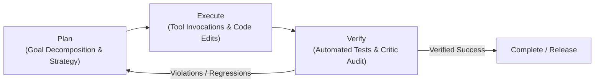
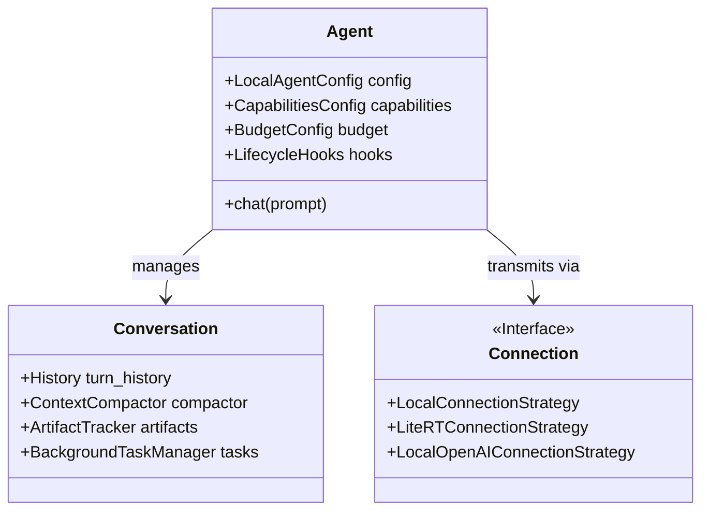

# 01. Overview & Agent Architecture in Google Antigravity

**Google Antigravity (AGY)** is an agent-first software engineering and research platform engineered to orchestrate autonomous AI agents across codebases, developer tooling, isolated sandboxes, and web environments. Operating on a continuous **Plan → Execute → Verify** cognitive loop, Antigravity coordinates intelligent agents that can operate either in an interactive pair-programming capacity or fully autonomously.

---

## 1. The Core Cognitive Loop: Plan → Execute → Verify

Every primary agent and subagent in Antigravity operates on a tri-phasic loop designed to prevent hallucination, eliminate unverified edits, and enforce deterministic execution:



1. **Plan Phase**:
   - The agent analyzes the user prompt, reads relevant project guidelines (`AGENTS.md`, `GEMINI.md`), inspects file schemas, and decomposes the goal into discrete, manageable subtasks.
   - For non-trivial modifications, the agent produces an `implementation_plan.md` artifact, highlights critical architectural choices, and optionally requests user feedback before altering state.
2. **Execute Phase**:
   - The agent executes deterministic actions through declared tools: reading files (`view_file`), executing shell commands (`run_command`), performing exact file replacements (`replace_file_content`), or delegating focused workloads to subagents (`invoke_subagent`).
   - The execution phase strictly separates cognitive evaluation ("The Brains") from deterministic calculations and file generation ("The Hands").
3. **Verify Phase**:
   - Every file edit or code change must be validated against automated unit tests, linters, or independent critic subagents before the turn is concluded.
   - If tests fail, the loop automatically re-enters the planning phase to diagnose the failure and apply targeted corrective actions.

---

## 2. The Three Architectural Pillars

Under the hood (including within the Antigravity Python SDK `google-antigravity`), every agent instance is anchored by three fundamental architectural layers:



### 2.1 The Agent Pillar (Policy & Capabilities)
The **Agent** component encapsulates configuration, capability boundaries, tool declarations, and security rules:
- **Capabilities Config**: Controls which toolsets are mounted into the agent's runtime (e.g., shell command execution, file modifications, subagent delegation, browser automation).
- **System Instructions**: The core persona, epistemic philosophy, and operational constraints that govern the agent's tone and methodology.
- **Budget Configuration**: Hardware and token limits preventing runaway loops.

### 2.2 The Conversation Pillar (State & Context Compaction)
The **Conversation** component is the stateful session engine:
- **Turn History & State Tracking**: Maintains message exchanges, tool calls, tool responses, and intermediate thoughts.
- **Progressive Context Compaction**: Automatically summarizes and prunes verbose command outputs and tool logs when approaching context limits, preserving semantic intent while avoiding token exhaustion.
- **Artifact Management**: Manages persistent user-facing artifacts (`implementation_plan.md`, `walkthrough.md`, diagrams, reports) stored independently in the session's brain directory (`<appDataDir>/brain/<conversation-id>/`).

### 2.3 The Connection Pillar (Transport & Inference Backend)
Antigravity supports multiple connection strategies to route reasoning:
1. **`LocalConnectionStrategy`**:
   - Connects to Google AI Studio / Gemini Developer API or Gemini Enterprise Agent Platform (Vertex AI).
   - Supports flagship models including `gemini-3.7-flash`, `gemini-3.8-flash`, and `gemini-3.8-pro`.
2. **`LiteRTConnectionStrategy`**:
   - Executes models completely on-device using Google's LiteRT runtime (e.g., quantized Gemma 2/3 variants).
   - Guarantees zero outbound network traffic for air-gapped, privacy-critical enterprise environments.
3. **`LocalOpenAIConnectionStrategy`**:
   - Bridges to any local inference runtime providing an OpenAI-compatible HTTP endpoint (e.g., Ollama, vLLM, LM Studio).

---

## 3. Behavioral Execution Modes

Antigravity agents can operate in two distinct behavioral postures:

| Dimension | Autonomous Mode (`AgentBehavior.AUTONOMOUS`) | Interactive Mode (`AgentBehavior.INTERACTIVE`) |
| :--- | :--- | :--- |
| **Default Posture** | Default in headless / CLI / batch environments. | Default in Antigravity IDE and Desktop Canvas. |
| **Human In The Loop** | Self-corrects errors, executes full plans to completion without manual prompts. | Pauses at major checkpoints, asks clarifying questions via `ask_question`. |
| **Tool Execution** | Runs commands within configured policy without confirmation prompts. | Solicits confirmation before destructive file modifications or major bash commands. |
| **Ideal Use Case** | Overnight batch refactoring, test suite triage, continuous CI pipelines. | Collaborative pair programming, architectural design, exploratory research. |

---

## 4. Resource Budgeting & Safeguards

To prevent infinite recursion, uncontrolled subagent spawning, or unexpected token expenditure, Antigravity provides strict budget configurations:

```python
from google.antigravity import LocalAgentConfig, types

config = LocalAgentConfig(
    model="gemini-3.8-flash",
    budget_config=types.BudgetConfig(
        max_model_calls=60,       # Maximum LLM calls allowed in a single execution turn
        max_tool_calls=120,       # Maximum total tool calls per session
        max_total_tokens=600_000, # Strict token usage cap across input/output/thinking
    ),
    capabilities=types.CapabilitiesConfig(
        enable_subagents=True,
        max_subagent_depth=3,     # Limits subagents from spawning subagents beyond depth 3
    )
)
```

When a budget ceiling is reached, Antigravity terminates tool loops cleanly and emits an auditable notification, preventing runaway operational costs.

---

## 5. Granular Security Policies & Sandboxing

Antigravity operates a multi-tier permission and sandboxing model configured globally (`~/.gemini/config/`) or per project (`.agents/`):

### 5.1 Tool Execution Policies
- **`always-proceed`**: Executes safe terminal commands immediately without prompting.
- **`request-review`**: Prompts the user before executing shell commands.
- **`strict`**: Disallows dangerous shell operations (e.g., `rm -rf`, raw disk formatting, unwhitelisted network commands).
- **`proceed-in-sandbox`**: Runs all shell commands inside an isolated Linux container/chroot sandbox, preventing changes to the host OS.

### 5.2 File and Internet Access Policies
- **Non-Workspace File Access**: Configurable as `allow`, `ask`, or `deny` to strictly contain the agent within the repository boundaries.
- **Internet Access Policy**: Controls web search (`search_web`) and URL extraction (`read_url_content`), which can be restricted to enterprise intranets or disabled entirely.
- **Allowlist / Denylist**: Regex patterns controlling permissible command strings, URLs, and directory paths.
