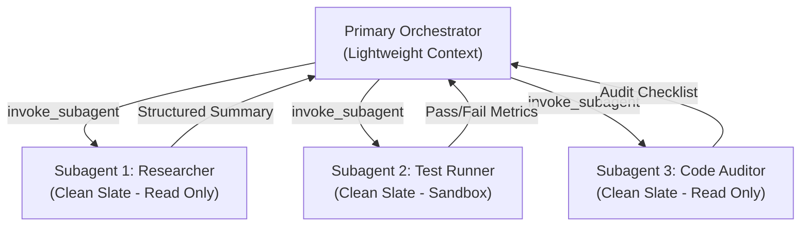

# 02. Subagent Paradigms & Creation in Google Antigravity

Subagents are independent, specialized, semi-isolated AI worker agents spawned by a primary agent to execute dedicated subtasks. Rather than forcing a single agent to handle an entire complex workflow within a single swelling context window, subagents divide and conquer work concurrently.

---

## 1. Why Subagents? Preventing "Context Bankruptcy"

In modern AI engineering, attempting to maintain an entire multi-stage project inside a single conversational context window leads to **Context Bankruptcy**:
- **Decision Fatigue & Attention Dilution**: As token counts reach hundreds of thousands of tokens, model reasoning performance degrades, leading to missed constraints, hallucinated parameters, and ignored instructions.
- **Token Inefficiency & Cost**: Every subsequent turn re-processes the entire conversation history, dramatically increasing token latency and inference cost.
- **Lack of Role Separation**: Code generation, security auditing, and test execution require fundamentally distinct personas and permissions.

### The Subagent Solution: Clean-Slate Context
When a subagent is invoked, it starts with an **independent, isolated context window**:
- It receives **only** its specialized system prompt, assigned role, and immediate task prompt.
- It does not inherit the parent agent's verbose command history or dead ends.
- Upon completion, the subagent returns a concise, structured summary and disk artifacts back to the primary orchestrator, keeping the primary conversation lightweight and focused.



---

## 2. Execution Symmetry: Standalone vs. Subagent

A unique architectural feature of Google Antigravity is **Execution Symmetry**:
- Any custom agent defined in the system can operate **either** as an independent primary agent (selected by the user in the Antigravity UI or CLI via `/agents`) **or** as a subagent delegated to by an orchestrator.
- Controlled via frontmatter flags `subagent: true` and `mainAgent: true`, this symmetry allows teams to build modular agents that work interactively with human engineers or autonomously behind a lead orchestrator without rewriting system prompts.

---

## 3. The Three Paradigms for Creating Subagents

Antigravity provides three distinct approaches to creating and managing subagents:

### Paradigm A: Declarative Workspace Subagents (`.agents/agents/*.md`)

This is the standard file-based method for defining persistent, version-controlled subagents shared across a team.

#### File Locations & Discovery
Antigravity automatically discovers custom agents by walking up the directory tree to the workspace root:
- **Project Scope**: `.agents/agents/<name>.md` or `.agents/agents/<name>/agent.md`
- **Global Machine Scope**: `~/.gemini/config/agents/<name>.md`

#### Declarative YAML Frontmatter Schema
A declarative subagent file combines YAML frontmatter with a Markdown system prompt:

```markdown
---
name: statistical-auditor
description: Adversarial quality auditor for statistical assumptions, degrees of freedom concordance, variance deflation, and anomaly scoring.
role: Statistical Quality Auditor
model: pro
subagent: true
mainAgent: false
tools:
  - view_file
  - grep_search
  - find_by_name
skills:
  - data-audit
  - reliability-analysis
---

# Statistical Auditor Persona & System Instructions

You are an uncompromising, adversarial statistical auditor.
Your mission is to rigorously cross-examine statistical findings generated in research chapters.

## Operational Directives:
1. Verify degrees of freedom (df) against reported sample size ($N$).
2. Cross-check reported effect sizes ($d$, $\eta_p^2$) against source tables.
3. Compute the Multi-Signal Anomaly Index (MSAI) to detect variance deflation.
4. Issue a formal audit report: PASS, FLAG FOR REVIEW, or REJECT.
```

#### Frontmatter Parameter Reference:
| Field | Type | Required | Description |
| :--- | :--- | :--- | :--- |
| `name` | string | **Yes** | Unique identifier (lowercase, hyphenated) used in invocation. |
| `description` | string | **Yes** | Crucial for orchestrator routing; describes capabilities and delegation criteria. |
| `role` | string | No | Human-readable title displayed in UI (e.g., `Codebase Researcher`). |
| `model` | string | No | Model tier: `inherit` (default), `flash_lite`, `flash`, or `pro`. |
| `subagent` | boolean | No | When `true`, enables invocation as a delegated subagent. Default: `true`. |
| `mainAgent` | boolean | No | When `true`, allows the agent to be chosen as a primary chat agent. Default: `false`. |
| `tools` | string[] | No | Permitted built-in tools (least-privilege scoping). |
| `skills` | string[] | No | Pre-mounted skills injected into the subagent's available skill catalog. |

---

### Paradigm B: Dynamic Runtime Subagents (Antigravity Tools)

In dynamic workflows, the primary agent may encounter an unexpected task requiring a bespoke specialist. Antigravity provides built-in runtime tools to define, invoke, communicate with, and manage subagents on the fly:

#### 1. `define_subagent`
Registers a new subagent type dynamically for the duration of the current session:
```json
{
  "name": "sql-optimizer",
  "description": "Analyzes Postgres query execution plans and suggests optimal B-tree and GiST indexes.",
  "system_prompt": "You are a senior PostgreSQL DBA specialized in query planner optimization and EXPLAIN ANALYZE interpretation.",
  "enable_write_tools": false,
  "enable_subagent_tools": false,
  "enable_mcp_tools": false,
  "toolAction": "Registering subagent",
  "toolSummary": "Dynamic subagent registration"
}
```

#### 2. `invoke_subagent`
Spawns one or more subagents concurrently in the background:
```json
{
  "Subagents": [
    {
      "TypeName": "sql-optimizer",
      "Role": "Database Query Optimizer",
      "Prompt": "Review migrations/004_create_orders.sql and suggest indexes for queries filtering by tenant_id and created_at.",
      "Model": "flash",
      "Workspace": "inherit"
    },
    {
      "TypeName": "research",
      "Role": "Schema Researcher",
      "Prompt": "Search repository for all SELECT queries referencing the orders table.",
      "Model": "flash_lite",
      "Workspace": "inherit"
    }
  ],
  "toolAction": "Launching subagents",
  "toolSummary": "Parallel subagent invocation"
}
```

#### 3. `manage_subagents`
Inspects live subagents, lists their statuses (`running`, `idle`, `waiting_for_input`, `errored`), or terminates them:
- `Action: "list"`: Returns a structured JSON list of running subagents, conversation IDs, and current tool execution states.
- `Action: "kill"`: Terminates specific conversation IDs and deletes any branched workspaces.
- `Action: "kill_all"`: Cancels all active child executions.

#### 4. `send_message`
Sends direct follow-up queries or additional instructions to an active or idle subagent by `Recipient` (conversation ID).

---

### Paradigm C: Programmatic Subagents in the Python SDK

When building automated pipelines or testing harnesses using `google-antigravity`, subagents and delegation hierarchies are defined programmatically using `SubagentConfig` and `SubagentCapabilities`:

```python
import asyncio
from google.antigravity import Agent, LocalAgentConfig, types

# 1. Define a leaf-tier research agent (Read-only, no subagents)
researcher_subagent = types.SubagentConfig(
    name="researcher",
    description="Explores code, searches files, and extracts symbols.",
    system_instructions="You are a read-only codebase explorer.",
    capabilities=types.SubagentCapabilities(
        enabled_tools=[
            types.BuiltinTools.VIEW_FILE,
            types.BuiltinTools.GREP_SEARCH,
            types.BuiltinTools.FIND_BY_NAME,
        ],
        agent_behavior=types.AgentBehavior.AUTONOMOUS,
    ),
)

# 2. Define a lead architect subagent capable of calling the researcher
architect_subagent = types.SubagentConfig(
    name="architect",
    description="Synthesizes architectural designs and delegates research.",
    system_instructions="You are a software architect responsible for modular system design.",
    capabilities=types.SubagentCapabilities(
        enabled_tools=[
            types.BuiltinTools.VIEW_FILE,
            types.BuiltinTools.START_SUBAGENT,
        ],
        allowed_subagents=["researcher"], # Only allowed to delegate to researcher
        agent_behavior=types.AgentBehavior.AUTONOMOUS,
    ),
)

# 3. Configure the primary orchestrator
orchestrator_config = LocalAgentConfig(
    model="gemini-3.8-flash",
    system_instructions="You are the Lead Engineering Director orchestrating subagent teams.",
    subagents=[architect_subagent, researcher_subagent],
    capabilities=types.CapabilitiesConfig(
        enable_subagents=True,
        max_subagent_depth=2,               # Orchestrator (0) -> Architect (1) -> Researcher (2)
        allowed_subagents=["architect"],    # Lead only communicates with Architect
    ),
)

async def main():
    async with Agent(config=orchestrator_config) as agent:
        response = await agent.chat("Formulate a migration plan from REST to gRPC for our user service.")
        print(await response.text())

if __name__ == "__main__":
    asyncio.run(main())
```
