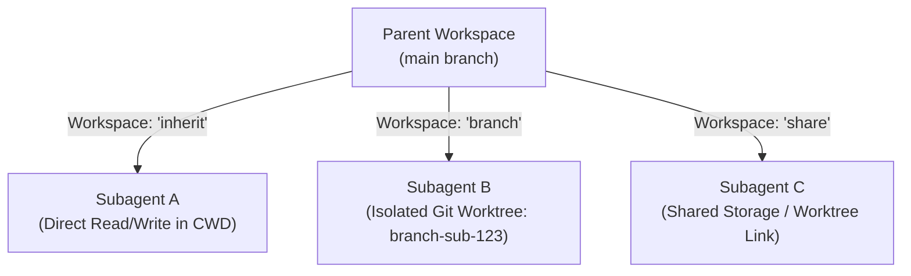
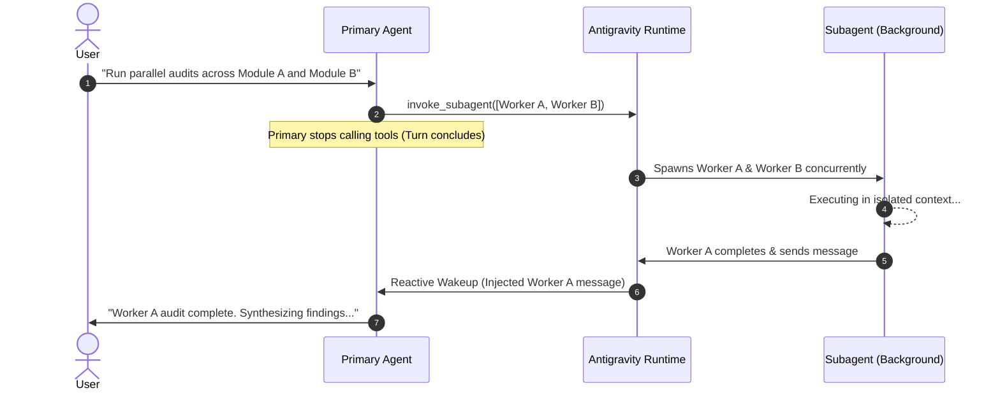

# 03. Workspace Isolation & Execution Modes

When delegating tasks across multiple subagents, two critical architectural dimensions determine system safety and performance: **Filesystem Workspace Isolation** and **Model Tier Allocation**. Antigravity provides native mechanisms to sandbox filesystem modifications and optimize compute budgets.

---

## 1. Workspace Isolation Modes

When invoking a subagent via `invoke_subagent`, the orchestrator specifies the `Workspace` argument to control how the child agent interacts with the filesystem.



### 1.1 `inherit` (Shared In-Place Workspace)
- **Mechanics**: The subagent runs directly within the parent agent's current working directory (`Cwd`) and filesystem state.
- **When to Use**:
  - Read-only inspection tasks (e.g., codebase research, symbol extraction, documentation lookup).
  - Strictly sequential file editing where the parent coordinates one step at a time.
- **Trade-offs**: Fastest startup time (zero disk cloning or worktree initialization overhead); however, concurrent subagents writing to the same file in `inherit` mode can cause race conditions or conflicting edits.

### 1.2 `branch` (Isolated Git Worktree)
- **Mechanics**: Antigravity automatically creates a dedicated, isolated Git worktree branched from the current repository state into a temporary workspace folder.
- **When to Use**:
  - Parallel feature development (e.g., Subagent A rewrites the database layer while Subagent B develops the frontend UI).
  - Experimental refactoring, destructive testing, or risky dependency upgrades.
- **Advantages**:
  - **Zero Collision Risk**: Each agent has its own private working copy of the filesystem.
  - **Clean Diffing**: Changes made in the branch can be reviewed as a unified Git diff before being merged into the main branch.
  - **Automatic Teardown**: When the subagent is terminated via `manage_subagents` (`Action: "kill"`), its branched workspace is safely cleaned up while its logs and generated artifacts are preserved.

### 1.3 `share` (Shared Repository Storage)
- **Mechanics**: The subagent creates an isolated branch that shares the parent's underlying Git object storage (utilizing `git worktree` or Mercurial `hg share` mechanics).
- **When to Use**:
  - Large monorepos (gigabytes in size) where full directory cloning would exhaust disk space or introduce latency.
  - Collaborative workflows requiring independent branch tracking without duplicating object storage.

---

## 2. Model Tier Allocation: Optimizing Cost and Speed

Not every subtask requires a frontier reasoning model. Antigravity allows setting the `Model` parameter dynamically per subagent invocation, enabling significant latency and cost optimization:

| Model Tier | Model Identifier | Typical Latency | Best Use Cases | Anti-Patterns (Avoid) |
| :--- | :--- | :--- | :--- | :--- |
| **`flash_lite`** | `gemini-3.7-flash-lite` | Ultra-low (~150–300 ms) | Keyword searching, file filtering, schema validation, quick regex parsing. | Complex architectural reasoning, multi-file refactoring. |
| **`flash`** | `gemini-3.8-flash` | Low (~400–800 ms) | Standard code writing, test generation, running deterministic scripts, APA formatting. | High-stakes theoretical proofs or subtle logical synthesis. |
| **`pro`** | `gemini-3.8-pro` | Medium (~1.5–3.0 s) | Deep architectural planning, complex bug diagnosis, adversarial quality audits, thesis defense simulation. | Simple file scans or repetitive data reformatting (wastes budget). |
| **`inherit`** | *(Parent Model)* | Variable | Default behavior. Ensures consistency when subagent role mirrors parent. | Blindly inheriting expensive models for simple read-only tasks. |

### Smart Allocation Example:
```json
{
  "Subagents": [
    {
      "TypeName": "research",
      "Role": "Log File Parser",
      "Prompt": "Scan logs/app.log and find all error codes starting with 500.",
      "Model": "flash_lite",
      "Workspace": "inherit"
    },
    {
      "TypeName": "statistical-expert",
      "Role": "SEM Modeler",
      "Prompt": "Fit a 3-wave longitudinal structural equation model and calculate 11 Hu & Bentler fit indices.",
      "Model": "pro",
      "Workspace": "inherit"
    }
  ]
}
```

---

## 3. Asynchronous Execution & The Reactive Wakeup Architecture

A common failure mode in legacy multi-agent frameworks is **tight-loop polling**: writing an agent loop that calls `status` or `sleep` repeatedly while waiting for background tasks to complete. This consumes unnecessary API tokens, pollutes conversation history, and degrades responsiveness.

### 3.1 The Reactive Wakeup Event Loop
Antigravity operates on a purely **reactive event loop**:
1. When the primary agent launches subagents or background tasks, it can immediately continue other work or stop calling tools to conclude its turn.
2. The Antigravity runtime tracks running child processes, subagents, and scheduled timers in the background.
3. When any subagent emits a completion message or background task terminates, the Antigravity engine **automatically wakes up the primary agent** with the incoming message pre-injected into context.



### 3.2 Scheduled Timers & Cron Tasks (`schedule`)
For workflows requiring delayed execution or periodic monitoring, Antigravity integrates the `schedule` tool:
- **One-Shot Timers**: Configured with `DurationSeconds` and an optional `TimerCondition`:
  - `TimerCondition: "never"`: Unconditionally triggers after duration.
  - `TimerCondition: "any"`: Early-terminates if *any* subagent or task responds before the timer expires (acts as a liveness watchdog).
  - `TimerCondition: "<sender-id>"`: Early-terminates specifically when the assigned subagent reports back.
- **Recurring Cron**: Configured with standard 5-field cron syntax (`CronExpression: "*/5 * * * *"`), allowing long-running background tasks to trigger periodic status reports or health checks.
