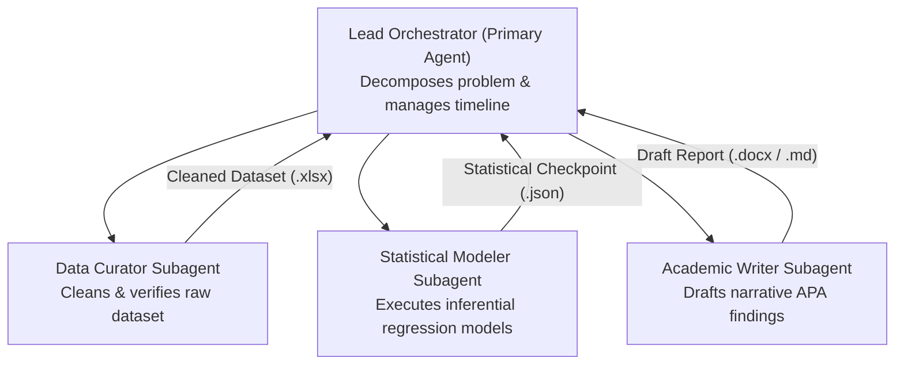
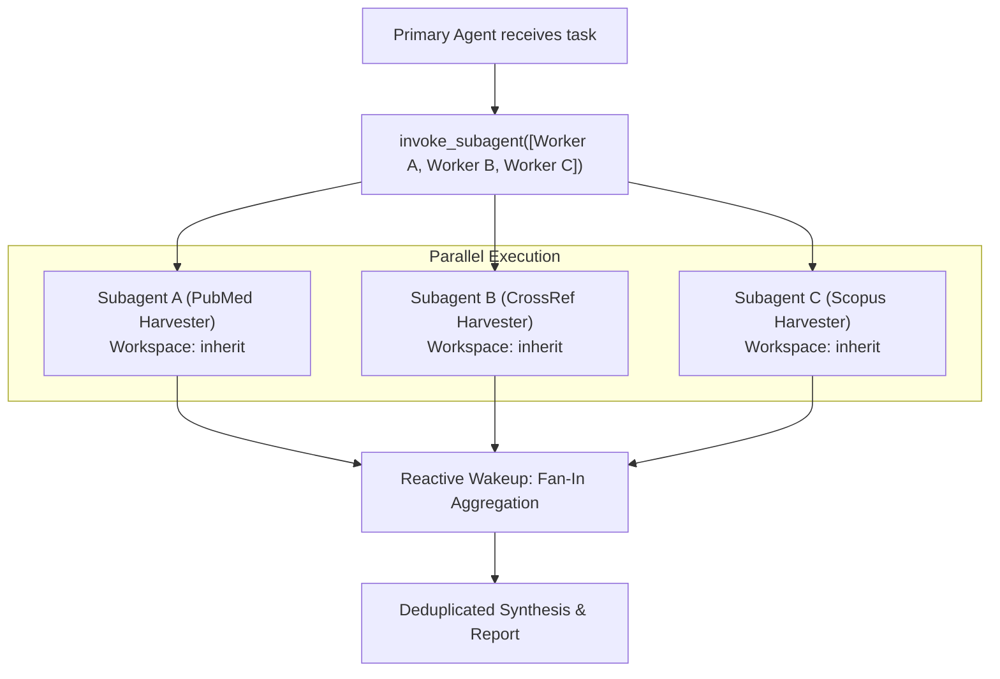
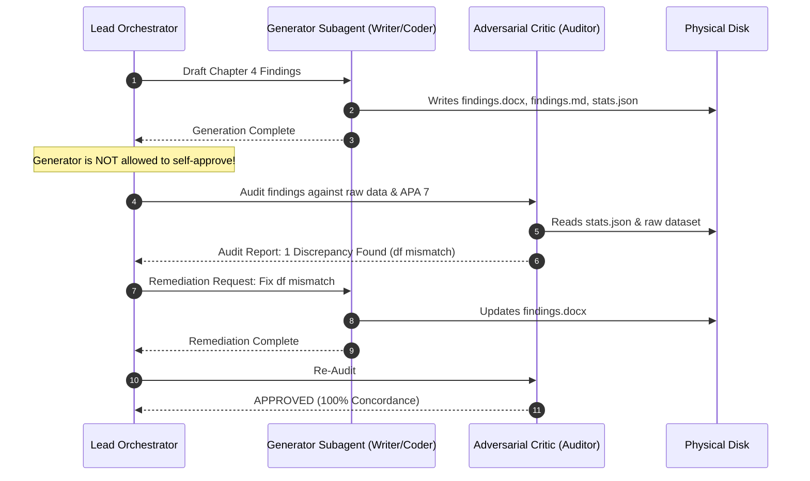
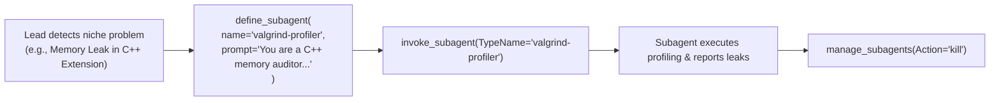

# 04. Cutting-Edge Multi-Agent Patterns (2026)

As agentic software systems have matured throughout 2026, standard single-agent loops have given way to sophisticated multi-agent topologies. Antigravity provides first-class primitives to implement cutting-edge agentic design patterns that maximize epistemic rigor, prevent hallucinations, and scale across distributed workloads.

---

## 1. Pattern 1: Hierarchical Orchestrator-Worker

In this topology, a single Primary Orchestrator acts as the engineering director or research lead. The orchestrator never performs low-level file manipulations or raw calculations directly; instead, it delegates discrete subtasks to specialized leaf subagents.



### Key Principles:
- **Depth Control**: Subagent trees can be limited using `max_subagent_depth` (e.g., depth 2 or 3) to prevent runaway nesting.
- **Allowed Subagents**: Subagents can be constrained to only communicate with authorized child roles (e.g., `allowed_subagents=["researcher"]`).

---

## 2. Pattern 2: Parallel Fan-Out / Fan-In Delegation

When evaluating multiple independent modules, conducting multi-database literature harvesting, or triaging test failures across microservices, sequential execution wastes valuable developer time. The Parallel Fan-Out / Fan-In pattern dispatches concurrent subagents simultaneously.



### Implementation Rules:
1. Provide completely self-contained prompts to each subagent in the `invoke_subagent` call.
2. Rely on Antigravity's reactive wakeup; do not implement polling loops.
3. If concurrent agents modify files, set `Workspace: "branch"` to avoid write collisions.

---

## 3. Pattern 3: Adversarial Generator-Critic (Defense Committee)

One of the most dangerous failure modes in LLM workflows is "self-evaluation bias": an agent that writes a piece of code or drafts a research chapter is biased toward validating its own assumptions and overlooking subtle errors.

The **Generator-Critic Pattern** establishes strict organizational separation between creation and verification:



### Core Tenet: Independent Critic Roles
- The critic agent is provided an adversarial persona (e.g., `"You are an uncompromising, skeptical thesis defense committee examiner"`).
- The critic has read-only access (`enable_write_tools: false`), ensuring it cannot silently fix errors on behalf of the generator.

---

## 4. Pattern 4: Dynamic Swarm & On-Demand Specialization

Rather than maintaining static configurations for every conceivable edge case, modern Antigravity systems use dynamic runtime specialization. The lead agent identifies an unanticipated problem, synthesizes a dedicated specialist using `define_subagent`, invokes it, and tears it down once resolved.



---

## 5. Pattern 5: The "Hands vs. Brains" Invariant

In high-reliability engineering and scientific computing, **large language models must NEVER calculate mathematical, statistical, or cryptographic outputs in their heads**. Mental hallucinations of $p$-values, effect sizes, or floating-point sums degrade reliability.

```text
┌────────────────────────────────────────────────────────┐
│                   THE BRAINS (LLMs)                    │
│  - Primary Agent & Cognitive Subagents                 │
│  - Epistemic reasoning, strategy & narrative synthesis │
│  - Orchestrates via invoke_subagent                    │
└──────────────────────────┬─────────────────────────────┘
                           │ Dispatches deterministic tasks
┌──────────────────────────▼─────────────────────────────┐
│                   THE HANDS (Scripts)                  │
│  - Deterministic Python, R, Bash, Node tools           │
│  - NumPy, SciPy, statsmodels, OpenXML, BiDi formatters │
│  - Executed via run_command; outputs physical JSON/disk│
└────────────────────────────────────────────────────────┘
```

### Directives of the Invariant:
1. **Antigravity is the Sole Orchestrator**: The native agent runtime coordinates workflows. Writing standalone Python scripts that simulate agent loops is strictly prohibited.
2. **Deterministic Scripts as The Hands**: Pure Python scripts in `.agents/skills/<skill>/scripts/` perform matrix calculations, hypothesis testing, and OpenXML packaging.
3. **Data Extraction**: The cognitive subagents read physical JSON outputs emitted by the scripts and write them into the human-readable markdown and DOCX deliverables.

---

## 6. Pattern 6: Artifact-Gated Stage Execution & Triad Invariant

To ensure verifiable progress and reproducibility across multi-agent workflows, execution is divided into discrete micro-stages. 

### The Triad Artifact Invariant
Every stage must produce a synchronized triad of physical disk artifacts before the system is permitted to advance to subsequent stages:

1. **Structured Data / Statistics (`.json`)**: Exact numerical parameters, test statistics, and auditable verification checklists.
2. **Markdown Narrative & Tables (`.md`)**: Human-readable scholarly narrative, APA 7 tables, and interpretations for immediate preview and git diffing.
3. **Institutional Document (`.docx` / `.pptx`)**: Polished presentation with strict typography, proper BiDi text direction, and native math equations.

Jumping stages without verifying that checkpoint artifacts physically exist on disk is strictly forbidden.

---

## 7. Pattern 7: Epistemic & Forensic Integrity Auditing

In scientific research and compliance-critical systems, outputs are evaluated against multi-signal anomaly metrics:
- **Degrees of Freedom Concordance**: Verifying that reported $df$ precisely equals $N - k$.
- **Multi-Signal Anomaly Index (MSAI)**: Evaluating variance deflation, effect size plausibility ($d > 1.40$ threshold flags), and sample distribution anomalies.
- **Citation-to-Bibliography Reification**: Cross-checking every in-text citation against persistent bibliographic databases (CrossRef, PubMed, SID) to eliminate "ghost citations."
