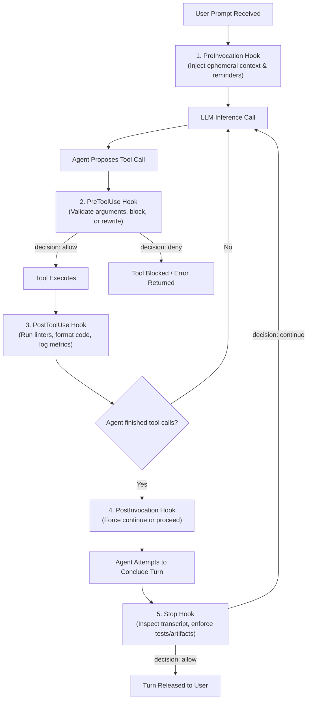

# 05. Lifecycle Hooks & Governance

While system prompts and instructions guide agent behavior, mission-critical environments demand deterministic, machine-enforced governance. Antigravity provides the **Lifecycle Hooks Engine (`hooks.json`)** to mechanically intercept agent tool executions, inject dynamic constraints, and block premature task termination.

---

## 1. The Lifecycle Hook Pipeline

Lifecycle hooks are deterministic shell commands or Python scripts executed automatically at five key transition points during an agent's execution loop:



---

## 2. Configuration Schema (`hooks.json`)

Hooks are declared in `.agents/hooks.json` (for project-specific governance) or `~/.gemini/config/hooks.json` (for global machine governance).

```json
{
  "filename-security-guard": {
    "PreToolUse": [
      {
        "matcher": "write_to_file|replace_file_content|run_command",
        "hooks": [
          {
            "type": "command",
            "command": "python3 .agents/verification/pre_tool_guard.py",
            "timeout": 10
          }
        ]
      }
    ]
  },
  "quality-assurance-gate": {
    "Stop": [
      {
        "hooks": [
          {
            "type": "command",
            "command": "python3 .agents/verification/stop_transcript_guard.py",
            "timeout": 30
          }
        ]
      }
    ]
  }
}
```

### Hook Structure:
- **Group Key**: A logical name (e.g., `"filename-security-guard"`, `"quality-assurance-gate"`).
- **Lifecycle Event**: `PreToolUse`, `PostToolUse`, `PreInvocation`, `PostInvocation`, or `Stop`.
- **`matcher`**: A regex string matching tool names (e.g., `run_command|write_to_file`). If omitted, applies to all tools.
- **`hooks` array**:
  - `type`: `"command"` (runs shell/script).
  - `command`: Command to execute. Receives input payload on `stdin` and writes decisions to `stdout` in JSON.
  - `timeout`: Maximum execution time in seconds.
  - `enabled`: Boolean (`true` by default).

---

## 3. Detailed Hook Reference

### 3.1 `PreToolUse` (Interception & Argument Rewriting)
Executes immediately before a proposed tool is invoked.
- **Payload on `stdin`**: Tool name and proposed argument object.
- **Possible Decisions on `stdout`**:
  - `{"decision": "allow"}`: Permits the tool to run unmodified.
  - `{"decision": "deny", "reason": "Command rm -rf is strictly prohibited."}`: Halts the tool call and returns the error message to the agent.
  - `{"decision": "allow", "overwrite": { "CommandLine": "safe_command" }}`: Dynamically rewrites tool arguments before execution.

#### Use Cases:
- Enforcing English-only ASCII filenames across all disk operations.
- Intercepting dangerous shell commands (`git push --force`, `rm -rf /`).
- Enforcing read-only bounds on subagents.

---

### 3.2 `Stop` (The Quality & Verification Gate)
Executes when the agent attempts to stop calling tools and present its final response to the user.
- **Payload on `stdin`**: Conversation metadata and transcript references (`transcript.jsonl`).
- **Enforcement Mechanics**:
  - If the hook emits `{"decision": "continue", "message": "Unit tests failed. You must fix tests before stopping."}`, the agent is **mechanically blocked from concluding its turn** and re-enters the execution loop with the injected message.
  - If the hook emits `{"decision": "allow"}` (or empty JSON), the agent is permitted to conclude.

#### Use Cases:
- Verifying that physical artifacts (`.docx`, `.md`, `.json`) exist on disk before allowing Chapter completion.
- Ensuring the git working tree is clean (`git status --porcelain`).
- Checking that unit test suites pass with zero regressions.

---

### 3.3 `PreInvocation` & `PostInvocation`
- **`PreInvocation`**: Injects dynamic prompt reminders into the system context right before the LLM generates a response (e.g., current date anchors, memory precedents, active constitutional rules).
- **`PostInvocation`**: Evaluates model output after tool generation. Can set `"terminationBehavior": "force_continue"` to force an agent to keep iterating.

---

## 4. Principle of Least Privilege for Subagents

When designing multi-agent teams, granting full tool access to every subagent is a major architectural vulnerability. Antigravity enforces the **Principle of Least Privilege**:

| Subagent Role | `enable_write_tools` | `enable_subagent_tools` | `enable_mcp_tools` | Recommended Tools |
| :--- | :---: | :---: | :---: | :--- |
| **Research Subagent** | ❌ False | ❌ False | ❌ False | `view_file`, `grep_search`, `find_by_name` |
| **Auditor / Critic** | ❌ False | ❌ False | ❌ False | `view_file`, `grep_search`, `read_url_content` |
| **Builder / Drafter** | ✅ True | ❌ False | ❌ False | `replace_file_content`, `write_to_file`, `run_command` |
| **Lead Orchestrator** | ✅ True | ✅ True | ✅ True | All tools + `invoke_subagent`, `manage_subagents` |

By isolating capabilities, subagents cannot accidentally modify files, spawn infinite child loops, or call unauthorized external services.
