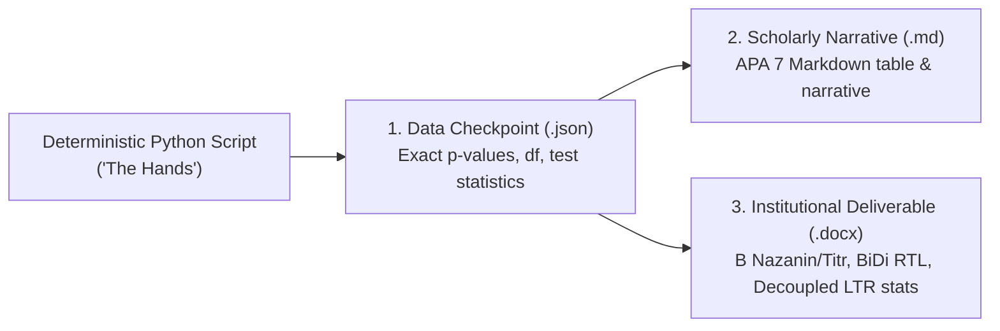

# 07. AcademicSuite Repository Structure & Creation Guide

This document defines the exact repository structure, conventions, and quality standards for creating **Agents**, **Subagents**, and **Skills** inside the **AcademicSuite** repository (`GhaderiSaber/AcademicSuite`).

Every new agent, subagent, or skill contributed to this codebase must seamlessly adhere to the repository's 5 cognitive layers and constitutional directives.

---

## 🏛️ The 5 Cognitive Layers of AcademicSuite

```text
AcademicSuite/
├── .agents/
│   ├── identity/          # [Layer 1] Digital Saber Persona, Statistical Philosophy, Research Ethics
│   ├── memory/            # [Layer 2] Case Memory Engine (cases/) & Decision Journal (decisions/)
│   ├── reasoning/         # [Layer 3] Statistical, Epistemic, Methodology, and Writing Reasoners
│   ├── skills/            # [Layer 4: The Hands] 53+ Deterministic Python/R Skills & Scripts
│   ├── agents/            # [Layer 4: The Brains] 15 Persistent Cognitive Subagent Roles
│   ├── verification/      # [Layer 5: Quality Control] MSAI Guard, Defense Simulator, Rule Guards
│   ├── rules/             # Project-wide and domain-specific rules (AGENTS.md, git, fonts)
│   ├── architecture/      # Architectural blueprints (HYBRID_MULTI_AGENT_SPEC.md)
│   ├── references/        # Deep reference manuals (SKILL_ACTIVATION_MATRIX.md, CLI guides)
│   └── hooks.json         # Antigravity Lifecycle Hook configuration
├── AGENTS.md              # Global Agent Constitution & 18 Mandatory Directives
└── markdown/              # Comprehensive Documentation & Architecture Guides
```

---

## 1. Structure for Creating Subagents in AcademicSuite

All persistent subagents live in `.agents/agents/`. In this repository, each cognitive role follows a dual-entry structure:

```text
.agents/agents/<agent-name>/
├── agent.md              # [REQUIRED] Full subagent prompt, directives, and operational modes
└── contract.md           # [OPTIONAL] Execution contract, input/output artifacts, critic barriers
.agents/agents/<agent-name>.md # [REQUIRED] Root-level entrypoint (or symlink) for Antigravity discovery
```

### 1.1 Agent Header Schema (`agent.md` / `<agent-name>.md`)
The YAML frontmatter must declare the name, description, role, and pre-mounted skills:

```markdown
---
name: statistical-auditor
description: Adversarial quality auditor for statistical assumptions, degrees of freedom concordance, variance deflation, and anomaly scoring.
role: Statistical Quality Auditor
skills:
  - data-audit
  - reliability-analysis
  - assumption-testing
---

# Statistical Auditor Subagent

## 🛑 Mandatory Constitutional Directives (AGENTS.md Compliance)
All subagents in this workspace operate under strict adherence to `AGENTS.md`:
1. **Directive 0 (Binary Honesty & Anti-Deception)**: Zero defensive rationalization. If asked a compliance question, start with an unambiguous "Yes" or "No".
2. **Directive 2 (Deterministic Calculations)**: Never calculate statistics, p-values, or effect sizes mentally. Execute deterministic Python scripts in `.agents/skills/<skill>/scripts/` on the actual dataset.
3. **Directive 4 (APA 7 & Persian Leading Zero Standard)**: Italicize Latin statistical symbols (*M, SD, t, F, p, r, R², β, z*). NEVER omit leading zeros in Persian (`۰.۰۵`, `۰.۰۰۱`). Report p < .001 or ۰.۰۰۱ > p (never .000). Zero emojis.
4. **Directive 5 (BiDi OpenXML & Persian Font Binding)**: Enforce RTL paragraph `<w:bidi/>`. Bind Persian fonts to `B Nazanin` (body) and `B Titr` (headings), with Latin in `Times New Roman`. Preserve Word OMML math equations (`<m:oMath>`).
5. **Directive 6 (English-Only Filenames)**: Every file and directory on disk MUST use English ASCII characters only (`[a-zA-Z0-9_.-]`).
6. **Directive 14 (Anti-Hallucination & Zero Ghost Citations)**: Never invent bibliographic references. All citations must be verified against real academic databases.
7. **Directive 15 (Temporal Anchor: 2026)**: Current operative year is 2026 (1405 SH).

---

## 🎯 Primary Role & Cognitive Responsibilities
<Define the agent's exact role, input artifacts inspected, and output artifacts generated>

## 🔬 Operational Modes & Protocols
<Define step-by-step procedures, evaluation criteria, and output formatting>
```

### 1.2 The 15 Persistent Cognitive Roles in AcademicSuite
When adding a new subagent or delegating work, it must align with or complement the 15 standard roles:
- `digital-saber` (Project Lead & Cognitive Twin)
- `methodology-expert` (Research Design & G*Power Sampling)
- `statistical-expert` (Inferential Analysis & Modeling)
- `statistical-auditor` (Adversarial Assumptions & MSAI Scoring)
- `results-auditor` (APA 7th Edition & OpenXML Typography QC)
- `academic-writer` (5-Part Epistemic Paragraphs & Persian Academic Narrative)
- `literature-expert` (Multi-Database Literature Harvesting)
- `evidence-auditor` (Citation Concordance & Irandoc Similarity)
- `final-judge` (Defense Committee Viva Voce Simulator)
- `psychometric-expert` (Scale Resolution & CFA/IRT Validation)
- `qualitative-analyst` (Thematic Analysis & Grounded Theory)
- `meta-analyst` (PRISMA 2020 & Effect Size Pooling)
- `journal-strategist` (IMRaD Journal Submission Packaging)
- `intervention-designer` (Standardized Clinical Manuals)
- `data-curator` (Data Cleaning & Missingness Screening)

---

## 2. Structure for Creating Skills in AcademicSuite

Skills reside strictly in `.agents/skills/<skill-name>/` and represent **"The Hands"** (deterministic execution tools).

```text
.agents/skills/<skill-name>/
├── SKILL.md            # [REQUIRED] Single-view skill specification (Directive 18)
├── scripts/            # [REQUIRED for Hands] Deterministic Python/R calculation scripts
├── references/         # [OPTIONAL] Extended documentation, schemas, and exemplars
└── examples/           # [OPTIONAL] Sample inputs, data files, and outputs
```

### 2.1 The Single-View Invariant (Directive 18)
To prevent tool context truncation and ensure that an agent can ingest 100% of the skill in a single `view_file` call:
- **Maximum Lines**: $\le 500$ lines (Antigravity tool buffer is 800 lines).
- **Maximum File Size**: $\le 40,000$ bytes (Antigravity tool buffer is 46,080 bytes).
- **Modularization**: If a skill needs large data dictionaries or background literature, save them in `references/` and link them via relative markdown links.

### 2.2 Standard `SKILL.md` Template for AcademicSuite
```markdown
---
name: <skill-name>
description: <Clear, concise description of the skill and precise conditions for when the agent should activate it>
---

# <Skill Title>

## Overview
<Brief theoretical and methodological context>

## 🛫 Pre-Flight Pipeline Declaration
Before running any script in this skill, the agent MUST emit this pre-flight block:
```markdown
### 🛫 Pre-Flight Pipeline Declaration
- **Target Skill**: `.agents/skills/<skill-name>/SKILL.md`
- **Current Pipeline Stage**: Stage X of Y — `<Stage Name>`
- **Official Script & CLI Command**: `python3 .agents/skills/<skill-name>/scripts/<script.py> [args]`
- **Official Input Artifact**: `<path/to/input>`
- **Expected Checkpoint Output**: `<path/to/output.json>`
- **Justification for Deviations**: None (Strict Adherence)
```

## Deterministic Execution Sequence

### Stage 1: Data Ingestion & Parameter Verification
Run the calculation engine:
```bash
python3 .agents/skills/<skill-name>/scripts/<script_name>.py \
  --input "data/dataset.xlsx" \
  --output ".agents/output/<output_name>.json"
```

### Stage 2: Artifact Extraction & Triad Generation
1. Inspect `.agents/output/<output_name>.json` using `view_file`.
2. Generate the synchronized triad on disk:
   - Structured JSON: `.agents/output/<output_name>.json`
   - Markdown Preview: `.agents/output/<output_name>.md`
   - Word Document: `.agents/output/<output_name>.docx`

## References
- For full statistical formulas and cutoffs, see `references/statistical_formulas.md`.
```

### 2.3 Registering the Skill in `SKILL_ACTIVATION_MATRIX.md`
Whenever a new skill is added to `.agents/skills/`, it must be registered in `.agents/references/SKILL_ACTIVATION_MATRIX.md` with:
1. Activation Triggers
2. Required Inputs
3. Generated Outputs (Triad artifacts)
4. Primary Subagent Role responsible

---

## 3. The Triad Artifact Invariant (Directive 3)

In the AcademicSuite repo, multi-stage pipelines and hypothesis evaluations **never output raw text in the chat only**. Every stage must produce a synchronized triad of disk artifacts:



1. **Structured Data / Statistics (`.json`)**: Contains exact machine-readable numbers ($F, t, p, \eta_p^2$, sample sizes).
2. **Markdown Narrative (`.md`)**: Human-readable scholarly narrative and APA 7 markdown tables for immediate preview, inspection, and git diffing.
3. **OpenXML Word Document (`.docx`)**: Institutional document with genuine Persian font bindings (`B Nazanin` / `B Titr`), decoupled LTR numbers, and OMML native math equations.

---

## 4. Architectural Separation: Hands vs. Brains (Directive 12 & 12.1)

```text
┌──────────────────────────────────────────────────────────────┐
│                  THE BRAINS & CRITICS                        │
│  Location: .agents/agents/                                   │
│  Executed by: Antigravity native 'invoke_subagent'           │
│  Responsibility: Epistemic evaluation, adversarial critique,  │
│  APA 7 checking, 5-part epistemic paragraph drafting        │
└──────────────────────────────┬───────────────────────────────┘
                               │ Orchestrates via invoke_subagent
┌──────────────────────────────▼───────────────────────────────┐
│                     THE HANDS                                │
│  Location: .agents/skills/<skill>/scripts/                   │
│  Executed by: run_command (Terminal Python/R)                │
│  Responsibility: 100% deterministic matrix math, ANCOVA,      │
│  regression, OpenXML packaging, BiDi XML formatting          │
│  PROHIBITION: No Python classes simulating subagents!        │
└──────────────────────────────────────────────────────────────┘
```

---

## 5. Summary Checklist for Adding New Skills & Subagents

- [ ] **English-Only ASCII Filenames** (`Directive 6`): Every script, folder, and markdown file strictly uses `[a-zA-Z0-9_.-]`.
- [ ] **Single-View Invariant** (`Directive 18`): `SKILL.md` is $\le 500$ lines and $\le 40,000$ bytes.
- [ ] **Dual-Entry for Agents**: Created `.agents/agents/<name>/agent.md` and `.agents/agents/<name>.md`.
- [ ] **AGENTS.md Constitutional Directives**: Agent prompt includes mandatory directives (Directives 0, 2, 4, 5, 6, 14, 15).
- [ ] **Deterministic Hands in `scripts/`**: Math and OpenXML generation are implemented in standalone Python scripts, not LLM prompts.
- [ ] **Triad Artifact Production**: Stages produce synchronized `.docx`, `.md`, and `.json` artifacts on disk.
- [ ] **Clean Working Tree** (`Directive 8`): Changes are committed with semantic conventional commit messages (`feat:`, `docs:`, `fix:`).
